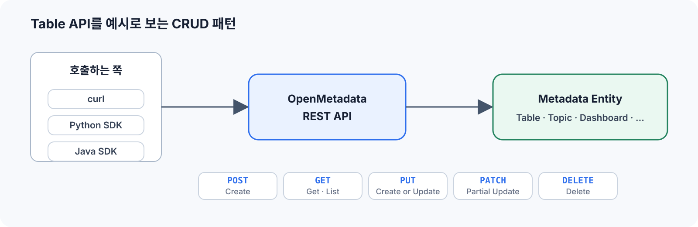
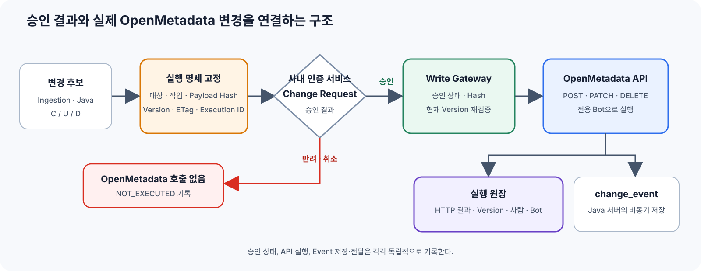

# 8회. API & Event System

> OpenMetadata와 프로그래밍적으로 통신하는 방법 이해

## 학습 범위

| 섹션 | 다룰 내용 |
|---|---|
| REST API 설계 규칙 | CRUD, JSON Patch, 식별자, pagination, versioning, 오류 처리 |
| 인증 & SDK | 인증과 권한, JWT·Bot, curl·Python·Java SDK |
| Event System | 이벤트 생성·저장·구독·소비, Filter, 커스텀, Webhook·Slack |
| Activity Feed & Thread | Thread와 Post, Task, Announcement, @mention, Conversation |
| Change Request 연계 | 승인 결과를 C/U/D와 Event 기록에 연결할 때의 기술 고려 사항 |

---

## 1. REST API 설계 규칙

OpenMetadata의 Table, Topic, Dashboard 같은 주요 메타데이터는 엔티티다. 이 엔티티 API들은 비슷한 CRUD 패턴을 많이 공유하지만, 모든 `/api/v1/*` API가 아래 기능을 전부 제공한다는 뜻은 아니다. 이 절에서는 **Table을 예시**로 사용한다.



### 1.1 CRUD 패턴

요청 주소는 **서버 기본 주소**와 **리소스 경로**를 이어서 읽는다.

```text
OM_API      = http://<호스트>:8585/api
리소스 경로 = /v1/tables                 # Table을 든 예시
전체 URL    = ${OM_API}/v1/tables
```

그래서 아래 표에는 반복되는 `/api`를 생략하고 `/v1/tables`만 적는다. `/api/v1/{collection}`은 주요 엔티티 API에서 흔히 보는 형태이며, `tables` 대신 `topics`, `dashboards` 등 각 엔티티 컬렉션이 들어간다.

| 작업 | HTTP 요청 | 의미 |
|---|---|---|
| Create | `POST /v1/tables` | 새로운 Table 생성 |
| Get | `GET /v1/tables/{id}` | ID로 Table 한 건 조회 |
| Get by name | `GET /v1/tables/name/{fqn}` | FQN으로 Table 한 건 조회 |
| List | `GET /v1/tables` | Table 목록 조회 |
| Create or Update | `PUT /v1/tables` | 동일 FQN 엔티티가 없으면 생성, 있으면 갱신 |
| Partial Update | `PATCH /v1/tables/{id}` | 지정한 필드만 변경 |
| Delete | `DELETE /v1/tables/{id}` | Table 삭제 |
| Restore | `PUT /v1/tables/restore` | Soft Delete된 Table 복구 |

#### 1.1.1 POST Create와 PUT Create or Update의 차이

`POST`와 `PUT`은 같은 `CreateTable` 형태의 요청 본문을 사용하지만, 이미 같은 FQN의 Table이 있을 때 동작이 다르다.

| 상황 | `POST /v1/tables` | `PUT /v1/tables` |
|---|---|---|
| 같은 FQN이 없음 | 새 Table 생성, `201 Created` | 새 Table 생성, `201 Created` |
| 같은 FQN이 있음 | `409 Conflict`로 실패 | 기존 Table 갱신, `200 OK` |
| 같은 FQN이 Soft Delete 상태 | `409 Conflict`. 기존 엔티티를 복구하지 않음 | 기존 엔티티를 복구하면서 갱신 |
| 호출 의도 | 반드시 새로 생성 | 있으면 맞추고, 없으면 생성 |

여기서 `PUT`은 OpenMetadata가 이 엔드포인트에 정의한 Upsert 동작이다. 모든 REST API의 `PUT`이 자동으로 Create or Update를 뜻하는 것은 아니다.

```bash
# Create only: 이미 있으면 실패한다.
curl -i -X POST \
  -H "Authorization: Bearer ${OM_TOKEN}" \
  -H "Content-Type: application/json" \
  --data @create-table.json \
  "${OM_API}/v1/tables"

# Create or Update: 같은 FQN이 있으면 갱신한다.
curl -i -X PUT \
  -H "Authorization: Bearer ${OM_TOKEN}" \
  -H "Content-Type: application/json" \
  --data @create-table.json \
  "${OM_API}/v1/tables"
```

그렇다면 항상 `PUT`만 사용해도 되는가? 기술적으로 동기화 작업에는 편하지만, 작업 의도를 구분해야 할 때는 그렇지 않다.

- Ingestion처럼 원본 상태에 맞춰 반복 동기화할 때는 `PUT`이 적합하다. 같은 요청을 다시 보내도 생성 또는 갱신으로 수렴하기 때문이다.
- 사용자가 “새 Table 생성”만 요청한 경우에는 `POST`가 안전하다. 기존 Table을 실수로 갱신하지 않고 충돌로 알려준다.
- “기존 Table 수정”만 허용된 경우에는 대상을 먼저 조회하고 `PATCH`로 필요한 필드만 바꾸는 편이 명확하다.
- Change Request에서 Create와 Update를 별도로 승인한다면 `PUT`의 실제 결과가 어느 쪽인지 반드시 확인해야 한다.

`PUT` 응답은 새로 만들면 `201`, 기존 항목을 처리하면 `200`이다. `X-OpenMetadata-Change` 응답 헤더에서는 `entityCreated`, `entityUpdated`, `entityNoChange`를 구분할 수 있다.

권한 검사도 실행 시점의 결과를 따른다. 대상이 없으면 Create 권한을, 대상이 있으면 Update에 필요한 권한을 검사하므로 `PUT` 호출 권한 하나만 따로 존재한다고 보면 안 된다.

#### 1.1.2 Soft, Hard, Recursive Delete의 관계

삭제는 두 개의 독립된 옵션으로 이해해야 한다.

| 옵션 | `false` | `true` |
|---|---|---|
| `hardDelete` | Soft Delete: `deleted=true`로 표시하고 복구 가능 | Hard Delete: 저장 정보와 관계를 영구 삭제 |
| `recursive` | 대상만 삭제. 삭제되지 않은 하위 엔티티가 있으면 실패 | 포함 관계의 하위 엔티티도 함께 삭제 |

따라서 Recursive Delete는 세 번째 삭제 방식이 아니라 삭제 범위다. 두 옵션을 조합하면 다음 네 가지가 된다.

| `hardDelete` | `recursive` | 결과 |
|---:|---:|---|
| `false` | `false` | 대상만 Soft Delete |
| `false` | `true` | 대상과 하위 엔티티를 모두 Soft Delete |
| `true` | `false` | 대상만 Hard Delete. 하위 엔티티가 있으면 실패 |
| `true` | `true` | 대상과 하위 엔티티를 모두 Hard Delete |

기본값은 두 옵션 모두 `false`다.

##### Table을 Soft Delete하고 확인하기

```bash
curl -i -X DELETE \
  -H "Authorization: Bearer ${OM_TOKEN}" \
  "${OM_API}/v1/tables/${TABLE_ID}"

# 일반 조회에서는 제외되므로 deleted 항목을 포함해 조회한다.
curl -sS \
  -H "Authorization: Bearer ${OM_TOKEN}" \
  "${OM_API}/v1/tables/${TABLE_ID}?include=deleted"
```

Soft Delete 응답의 엔티티에는 `deleted: true`가 표시된다. 일반 목록 조회에서는 보이지 않지만 `include=deleted` 또는 `include=all`로 조회할 수 있다.

##### Soft Delete된 Table 복구하기

```bash
curl -i -X PUT \
  -H "Authorization: Bearer ${OM_TOKEN}" \
  -H "Content-Type: application/json" \
  --data "{\"id\":\"${TABLE_ID}\"}" \
  "${OM_API}/v1/tables/restore"
```

##### Table을 Hard Delete하기

```bash
curl -i -X DELETE \
  -H "Authorization: Bearer ${OM_TOKEN}" \
  "${OM_API}/v1/tables/${TABLE_ID}?hardDelete=true"
```

Hard Delete는 `/restore`로 되돌릴 수 없다. 같은 FQN을 다시 사용하면 복구가 아니라 새로운 ID를 가진 엔티티 생성이 된다.

##### 계층 전체를 Recursive Delete하기

Database Service처럼 하위에 Database, Schema, Table을 포함하는 엔티티에서 차이가 분명하다.

```bash
# 하위 엔티티까지 Soft Delete
curl -i -X DELETE \
  -H "Authorization: Bearer ${OM_TOKEN}" \
  "${OM_API}/v1/services/databaseServices/${SERVICE_ID}?recursive=true"

# 하위 엔티티까지 Hard Delete
curl -i -X DELETE \
  -H "Authorization: Bearer ${OM_TOKEN}" \
  "${OM_API}/v1/services/databaseServices/${SERVICE_ID}?recursive=true&hardDelete=true"
```

`recursive=false`인데 삭제되지 않은 하위 엔티티가 있으면 서버는 “entity is not empty” 오류로 요청을 거절한다. Recursive Hard Delete는 영향 범위가 크고 복구할 수 없으므로 대상 계층과 예상 삭제 건수를 실행 전에 확인해야 한다.

##### 삭제된 계층을 함께 복구하기

Restore 요청에는 `recursive=true`를 보내지 않는다. 삭제된 상위 엔터티를 복구하면, 그 엔터티가 `CONTAINS` 관계로 포함하던 삭제된 하위 엔터티를 서버가 함께 복구한다.

```bash
# Soft Delete된 Database Service와 그 안의 삭제된 하위 엔터티 복구
curl -i -X PUT \
  -H "Authorization: Bearer ${OM_TOKEN}" \
  -H "Content-Type: application/json" \
  --data "{\"id\":\"${SERVICE_ID}\"}" \
  "${OM_API}/v1/services/databaseServices/restore"
```

이는 모든 관계를 무조건 되돌리는 기능이 아니라, 삭제된 `CONTAINS` 하위 엔터티를 복구하는 동작이다. Hard Delete한 항목은 이 요청으로 복구할 수 없다.

모든 엔티티가 Soft Delete, Restore, Recursive 옵션을 지원하는 것은 아니다. 실제 엔드포인트가 해당 query parameter와 `/restore`를 제공하는지 확인해야 한다.

### 1.2 JSON Patch

POST와 PUT도 JSON을 요청 본문으로 사용한다. 다만 보통의 JSON 객체를 보내는 것과 달리, `PATCH`는 **무엇을 어떻게 바꿀지**를 표현하는 JSON Patch 연산 배열을 보낸다. `JSON POST`나 `JSON PUT`은 별도 형식 이름이 아니다.

| 요청 | Content-Type·본문 형식 | 예 |
|---|---|---|
| `POST`, `PUT` | `application/json`의 일반 요청 객체 | `{"name":"orders","description":"..."}` |
| `PATCH` | `application/json-patch+json`의 변경 연산 배열 | `[{"op":"replace","path":"/description","value":"..."}]` |

이 JSON Patch 형식은 Table처럼 `PATCH` 엔드포인트가 `application/json-patch+json`을 명시한 경우에만 적용된다. HTTP 메서드가 아니라 **해당 엔드포인트의 계약**이 본문 형식을 결정한다.

```http
PATCH /api/v1/tables/{table-id}
Content-Type: application/json-patch+json
If-Match: <현재 ETag>
```

```json
[
  {
    "op": "replace",
    "path": "/description",
    "value": "주문 데이터를 저장하는 테이블"
  }
]
```

주요 연산은 다음과 같다.

| 연산 | 사용 예 |
|---|---|
| `add` | Tag나 Owner 추가 |
| `replace` | Description 변경 |
| `remove` | 기존 Tag 제거 |

조회 응답의 `ETag`를 `If-Match`에 넣으면, 조회 이후 다른 사용자가 먼저 수정한 경우 오래된 데이터로 덮어쓰는 것을 막을 수 있다. 이때 서버는 `412 Precondition Failed`를 반환한다.

### 1.3 `fields` 파라미터

목록과 상세 조회는 기본 필드만 반환한다. Owner, Tag, Column처럼 관계 조회가 필요한 정보는 `fields`로 선택한다.

```http
GET /api/v1/tables/{table-id}?fields=owners,tags,columns
```

`fields`에 넣을 수 있는 이름은 엔티티마다 다르다. 자동화에서는 해당 엔드포인트가 제공하는 필드 중 실제로 사용하는 값만 요청한다. `fields=*`처럼 관계를 한꺼번에 읽으면 응답 크기뿐 아니라 관계 조회 비용도 커진다.

### 1.4 ID와 FQN 중 무엇을 사용할 것인가

대부분의 주요 엔티티는 UUID와 FQN 두 방식으로 조회할 수 있다.

```http
GET /api/v1/tables/{id}
GET /api/v1/tables/name/{fqn}
```

| 식별자 | 적합한 용도 | 주의할 점 |
|---|---|---|
| UUID | 시스템 간 매핑, 반복 수정·삭제, 실행 이력 | Soft Delete 복구·PUT 갱신은 기존 UUID를 유지하지만, Hard Delete 후 재생성하면 UUID가 달라짐 |
| FQN | 사람이 읽는 이름, 최초 탐색, 설정 파일 | 상위 이름 변경의 영향을 받고 URL 경로에서는 인코딩이 필요할 수 있음 |

Soft Delete 상태에서 같은 FQN으로 `POST`하면 충돌하고, `PUT` 또는 `/restore`는 삭제된 **기존 엔터티와 UUID를 되살린다**. UUID가 둘 생기지 않는다. Hard Delete 뒤에 같은 FQN을 새로 만들 때만 새 UUID가 생긴다.

연계 데이터에는 UUID를 기준키로 저장하고 FQN을 표시·검색용으로 함께 남기는 구성이 안정적이다. 최초 요청이 FQN으로 들어오더라도 실행 직전에 UUID로 해석해 기록하면 같은 이름의 재생성과 기존 엔티티 복구를 구분할 수 있다.

### 1.5 Pagination

목록 API는 한 번에 전체 결과를 주지 않는다. OpenMetadata 1.13에는 엔드포인트에 따라 두 가지 방식이 있다.

| 방식 | 파라미터 | 주로 사용되는 위치 |
|---|---|---|
| Cursor 방식 | `limit`, `after`, `before` | Table 같은 최상위 엔티티 목록 |
| Offset 방식 | `limit`, `offset` | Column 같은 일부 하위 리소스와 특수 목록 |

```http
GET /api/v1/tables?limit=100
GET /api/v1/tables?limit=100&after=<다음 커서>

GET /api/v1/tables/{table-id}/columns?limit=100&offset=0
GET /api/v1/tables/{table-id}/columns?limit=100&offset=100
```

Cursor 방식에서는 응답의 `paging.after`를 그대로 다음 요청에 사용하고, 값이 없어지면 순회를 끝낸다. Cursor를 직접 만들거나 offset처럼 계산하지 않는다. Offset 방식에서는 같은 필터와 정렬 조건을 유지한 채 `offset`을 증가시킨다.

대량 순회 중 데이터가 바뀔 수 있으므로 한 실행 안에서는 필터를 고정하고, 각 항목을 UUID 기준으로 처리하며, 재실행해도 같은 결과가 되도록 만든다.

### 1.6 Versioning과 동시 수정

엔티티가 변경되면 버전과 변경 이력이 남는다.

```http
GET /api/v1/tables/{table-id}/versions
GET /api/v1/tables/{table-id}/versions/{version}
```

버전 조회에는 변경 전후 버전과 `changeDescription`이 포함되어 어떤 필드가 바뀌었는지 추적할 수 있다. 다만 버전 이력은 승인 요청과 같은 업무 식별자를 자동으로 보관하는 기능은 아니다.

GET 응답의 `ETag`를 PATCH의 `If-Match`로 보내면 읽은 이후 값이 바뀌지 않았을 때만 수정된다.

```http
GET /api/v1/tables/{table-id}
ETag: "<entity-etag>"

PATCH /api/v1/tables/{table-id}
If-Match: "<entity-etag>"
Content-Type: application/json-patch+json
```

다른 변경이 먼저 반영되었다면 `412 Precondition Failed`가 반환된다. 이는 재시도로 덮어쓸 오류가 아니라, 승인하거나 계산한 변경의 기준 상태가 오래되었다는 뜻이다.

### 1.7 응답 코드와 재시도 기준

자동화는 성공·실패만 나누지 않고 HTTP 상태의 의미에 따라 처리해야 한다.

| 상태 | 의미 | 처리 기준 |
|---:|---|---|
| `200` | 조회·수정 성공 | 응답 엔티티와 버전을 기록 |
| `201` | 새 엔티티 생성 | 생성된 UUID와 FQN을 기록 |
| `202` | 비동기 작업 접수 | 완료가 아니므로 작업 상태를 별도로 추적 |
| `400` | 본문·파라미터 오류 | 요청을 수정하기 전에는 재시도하지 않음 |
| `401` | Token 누락·만료·검증 실패 | Token과 발급 키를 복구한 뒤 재호출 |
| `403` | 인증은 됐지만 권한 부족 | Bot의 Role·Policy를 수정 |
| `404` | 대상 없음 | Create인지 잘못된 대상인지 작업 의도와 비교 |
| `409` | 중복 생성 또는 삭제 잠금 등 충돌 | 현재 엔티티 상태를 읽고 요청을 다시 판단 |
| `412` | ETag 불일치 | 기존 승인을 그대로 재사용하지 않고 변경안을 다시 계산 |
| `413` | Bulk 요청 크기 초과 | 요청을 더 작은 단위로 분할 |
| `429`, `5xx` | 제한 초과 또는 일시적 서버 오류 | Backoff와 Jitter를 적용해 제한 횟수만 재시도 |

쓰기 요청이 timeout이나 `5xx`로 끝나면 응답을 못 받았어도 서버에는 반영됐을 수 있다. 같은 요청을 곧바로 반복하지 않고 UUID·FQN으로 현재 상태를 다시 읽은 뒤 재시도 여부를 결정한다.

### 1.8 API는 엔드포인트별 계약으로 읽는다

앞의 CRUD 표는 Table을 예시로 한 빠른 지도다. 실제 API는 “공통 규칙을 외우는 것”보다 다음 다섯 가지를 한 묶음으로 읽어야 한다.

1. 서버 기본 주소와 전체 경로
2. HTTP 메서드와 요청·응답 스키마
3. `Content-Type`, Path·Query Parameter
4. 지원하는 상태 코드, ETag·재시도 규칙
5. 삭제·복구·목록 조회처럼 그 엔드포인트에만 있는 옵션

같은 `PUT`이라도 경로에 따라 의미와 본문이 다르다.

| API | 의미 | 요청 본문 |
|---|---|---|
| `PUT /v1/tables` | Table Create or Update | `CreateTable` JSON |
| `PUT /v1/tables/{id}/sampleData` | Sample Data 저장 | `TableData` JSON |
| `PUT /v1/tables/name/{fqn}/import` | CSV로 Table Column 갱신 | CSV 문자열 |
| `PUT /v1/tables/{id}/followers` | Follower 추가 | User ID |

따라서 동작의 기준은 HTTP 메서드 하나가 아니라 **메서드 + 전체 경로 + 요청 Content-Type + query parameter + 요청·응답 스키마**다. SDK도 이 계약을 감싼 클라이언트일 뿐이다.

#### 새 API를 만들 때의 최소 확인 항목

| 확인 항목 | 결정할 내용 |
|---|---|
| 리소스와 식별자 | 복수형 리소스 경로, UUID·FQN 중 기준 식별자, 상위 리소스와의 관계 |
| 메서드와 본문 | Create 전용은 `POST`, 명시적으로 Upsert할 때만 `PUT`, 부분 변경 계약이 있을 때만 JSON Patch `PATCH` |
| 삭제와 동시성 | Soft·Hard·Recursive 지원 여부, ETag·`If-Match`, `409`·`412` 처리 |
| 목록과 응답 | 필터·pagination 방식, 필요한 `fields`, 표준 오류 응답 |
| 권한과 후속 처리 | Role·Policy, 민감 정보 마스킹, ChangeEvent 발생과 소비자 영향 |

새 API는 기존 Table API를 그대로 복사하기보다, 위 항목을 API 문서와 테스트로 먼저 고정해야 한다.

---

## 2. 인증 & SDK

### 2.1 인증과 권한은 서로 다른 단계다

인증은 “누가 호출했는가”를 확인하고, 권한은 “그 호출자가 이 리소스에 이 작업을 해도 되는가”를 판단한다.

```text
로그인 또는 Token 발급
  → Authorization: Bearer <token>
  → Token 서명·만료·사용자 검증
  → User/Bot의 Role·Policy 조회
  → 대상 리소스와 작업 권한 평가
  → API 실행 또는 401·403 반환
```

| 결과 | 의미 |
|---|---|
| `401 Unauthorized` | Token이 없거나, 만료됐거나, 서명을 신뢰할 수 없음 |
| `403 Forbidden` | 호출자는 식별됐지만 해당 리소스·작업 권한이 없음 |

로그인 Provider는 사람의 신원을 확인하는 방식이다. 로그인 이후 UI와 REST API는 Token을 사용하고, 최종 허용 범위는 OpenMetadata의 Role과 Policy가 결정한다.

### 2.2 사람과 자동화의 Token을 분리한다

API 호출은 다음 헤더를 공통으로 사용한다.

```http
Authorization: Bearer <token>
```

| 호출 주체 | 일반적인 방식 | 용도 |
|---|---|---|
| UI 사용자 | 설정된 로그인 Provider로 로그인한 세션 | 브라우저에서 조회·편집 |
| 개인 개발자·운영자 | Personal Access Token | 개인 권한으로 제한된 CLI·검증 작업 |
| Ingestion | 전용 Bot JWT | 반복 수집과 메타데이터 동기화 |
| Java 연계 서비스 | 별도 Bot JWT | 애플리케이션의 API 호출 |

Bot 생성과 운영 흐름은 다음과 같다.

1. 자동화 용도별 Bot을 만든다.
2. 필요한 리소스와 작업만 허용하는 Role·Policy를 연결한다.
3. Bot JWT를 발급해 Secret Manager에 저장한다.
4. 만료·회전 정책과 사용처를 함께 관리한다.

Ingestion과 Java가 서로 다른 Bot을 사용하면 `updatedBy`와 ChangeEvent의 `userName`만으로도 실행 경로를 구분할 수 있다. 공용 관리자 Token 하나를 여러 프로그램이 공유하면 과도한 권한과 추적 불가능성이 동시에 생긴다.

### 2.3 curl, Python SDK, Java SDK의 관계

세 방식 모두 결국 같은 REST API를 호출한다.

| 방식 | 적합한 사용 | 특징 |
|---|---|---|
| curl | API 확인, 장애 분석, 간단한 스크립트 | HTTP 요청과 응답을 그대로 확인 가능 |
| Python SDK | Ingestion, 배치, 데이터 작업 | 엔티티 모델과 `ometa` 편의 메서드 제공 |
| Java SDK | Java 서비스 내부 연동 | Java 모델과 API 클라이언트 사용 |

SDK를 사용해도 HTTP의 의미는 바뀌지 않는다.

| 작업 | REST API | Python SDK에서의 형태 | Java에서의 형태 |
|---|---|---|---|
| Create | `POST` | `create(...)` | Create 요청 모델을 API 클라이언트로 전송 |
| Create or Update | `PUT` | `create_or_update(...)` | Create or Update API 호출 |
| Partial Update | `PATCH` | `patch(...)`, `patch_tags(...)`, `patch_description(...)` | JSON Patch와 필요 시 ETag 전달 |
| Delete | `DELETE` | `delete(...)` | Delete API 호출 |

같은 Table 목록 조회를 세 방식으로 표현하면 다음과 같다. `OM_API`에는 이미 `/api`가 포함돼 있으므로 세 예시 모두 리소스 경로를 `/v1/tables`로 이어 붙인다.

```bash
# curl: HTTP 요청을 그대로 확인
curl -sS \
  -H "Authorization: Bearer ${OM_TOKEN}" \
  "${OM_API}/v1/tables?limit=10"
```

```python
# Python SDK: curl과 같은 한 페이지의 Table 목록 조회
from metadata.generated.schema.entity.data.table import Table

page = metadata.list_entities(entity=Table, limit=10)
for table in page.entities:
    print(table.fullyQualifiedName)
```

```java
// Java SDK: 연결 설정 후 같은 Table 목록을 조회
import org.openmetadata.sdk.OM;
import org.openmetadata.sdk.client.OpenMetadataClient;
import org.openmetadata.sdk.config.OpenMetadataConfig;
import org.openmetadata.sdk.fluent.Tables;

OpenMetadataConfig config = OpenMetadataConfig.builder()
    .baseUrl(System.getenv("OM_API"))
    .accessToken(System.getenv("OM_TOKEN"))
    .build();
OM.init(new OpenMetadataClient(config));

Tables.list().limit(10).forEach(table -> System.out.println(table.get().getName()));
```

서버와 SDK의 모델이 달라지면 필드 직렬화나 API 호환 문제가 생길 수 있으므로 버전을 함께 맞춰야 한다. SDK의 메서드 이름보다 API 버전과 요청·응답 계약이 우선이다.

---

## 3. Event System

Event System은 OpenMetadata의 변경 결과를 이벤트로 기록하고, 구독 조건에 맞으면 사용자나 외부 시스템에 전달하는 후처리 구조다. UI, Ingestion, SDK는 변경 요청을 보낼 뿐이고, `ChangeEvent` 생성과 DB 저장은 OpenMetadata Java 서버가 담당한다.


### 3.1 누가 이벤트를 발생시키는가

실제 시작점은 모두 OpenMetadata의 상태를 바꾸는 요청이다.

| 변경 주체 | 실제 동작 | ChangeEvent의 실행 사용자 |
|---|---|---|
| UI 사용자 | 브라우저가 REST API의 POST·PUT·PATCH·DELETE 호출 | 로그인한 사용자 |
| Ingestion | Python Client가 엔티티 Upsert·Patch·Delete 호출 | Ingestion Bot |
| Java 서비스·스크립트 | Java SDK 또는 curl이 같은 REST API 호출 | 해당 Token의 User 또는 Bot |
| OpenMetadata 내부 처리 | Repository가 필드·피드·시계열 변경 이벤트를 직접 기록하는 일부 경로 | 내부 작업을 실행한 주체 |

따라서 “이벤트 시스템을 호출한다”기보다 “변경 API가 성공하면 서버가 이벤트를 남긴다”가 정확하다. GET 요청, API 검증 실패, 권한 실패에서는 변경 이벤트가 만들어지지 않는다.

### 3.2 실제 DB Writer와 저장 위치

`change_event` 테이블에 실제로 INSERT하는 실행 주체는 OpenMetadata Java 서버다. Python Ingestion, Java SDK, UI, curl은 변경 요청만 보내며 이 테이블에 직접 접속하지 않는다.

| Java 구성 요소 | 실제 역할 |
|---|---|
| `EventFilter` | 성공한 POST·PUT·PATCH·DELETE 뒤에 Event Handler 실행을 비동기로 예약하는 Java Response Filter |
| `ChangeEventHandler` | 일반 REST 변경의 사용자, EventType, 버전, 변경 내용을 조합하고 민감 필드를 마스킹하는 Java 처리기 |
| 일부 `Repository`·서버 유틸리티 | Feed, Column, CSV처럼 일반 REST 응답 흐름 밖의 변경에서 이벤트를 직접 만드는 **같은 Java 서버 내부 코드** |
| `CollectionDAO.ChangeEventDAO` | `change_event` 테이블에 이벤트 JSON을 넣는 Java DAO. 내부적으로 `INSERT INTO change_event (json)`을 실행 |

일반 REST C/U/D는 “엔터티 변경 완료 → 성공 응답 감지 → ChangeEvent 구성 → `change_event` 저장 → 구독 작업이 읽음” 순서로 이어진다.

이 흐름은 일반적인 엔터티 변경의 대표 경로다. Event Handler 설정, 응답 엔터티 유무, 엔터티 유형에 따라 모든 `2xx` 요청이 `change_event` 행을 남기는 것은 아니다.

저장 위치는 원본 Table이 있는 업무 DB가 아니라 `conf/openmetadata.yaml`의 `database.url`이 가리키는 OpenMetadata 메타데이터 DB다. 기본 DB 이름을 쓴다면 MySQL의 `openmetadata_db.change_event`, PostgreSQL의 `public.change_event` 테이블에 저장된다.

| `change_event` 컬럼 | 저장 방식과 용도 |
|---|---|
| `json` | ChangeEvent 전체 Payload. MySQL은 `JSON`, PostgreSQL은 이진 JSON 저장 형식인 `JSONB`로 저장 |
| `offset` | Consumer가 마지막 읽은 위치를 기억하는 증가 순번. Event UUID·발생 시각과는 역할이 다름 |
| `eventType`, `entityType`, `userName`, `eventTime` | 이벤트 조회와 인덱스에 사용하는 계산 컬럼 |

`PUT` 요청이 현재 상태와 완전히 같으면 응답은 `entityNoChange`가 될 수 있다. 이는 **변경이 없었다는 내부 응답 분류**이며 구독 이벤트가 아니다. 표준 Event Handler는 이를 `change_event`에 저장하지 않으므로 Event Subscription·Webhook으로 전달되지 않는다.

`ChangeEventHandler`는 성공한 REST 응답 뒤에 비동기로 실행되고 INSERT 예외를 로그로 남긴다. 따라서 **C/U/D 성공은 Event 저장 실패 때문에 롤백되지 않는다.** 아래 세 결과는 서로 따로 확인해야 한다.

| 확인할 상태 | 성공의 의미 | 별도로 실패할 수 있는 예 |
|---|---|---|
| API 변경 | 엔터티 C/U/D가 반영되어 API가 `2xx`를 반환 | Event 저장이 실패하거나 지연됨 |
| Event 저장 | Java 서버가 `change_event` 행을 저장 | 구독 목적지 전달이 실패함 |
| 목적지 전달 | Webhook·Slack 등이 이벤트를 수신 | 이미 성공한 API 변경과 Event 저장에는 영향 없음 |

여기서 Java 클래스 `EventFilter`는 성공한 REST 응답을 Event Handler로 넘기는 Response Filter다. 3.6에서 설명하는 구독 조건의 Event Filter와 이름은 같지만 역할은 다르다.

### 3.3 ChangeEvent 구조

ChangeEvent에는 어떤 엔티티에 어떤 변경이 발생했는지가 들어간다.

```json
{
  "id": "event-uuid",
  "eventType": "entityUpdated",
  "entityType": "table",
  "entityId": "table-uuid",
  "entityFullyQualifiedName": "service.database.schema.orders",
  "previousVersion": 1.2,
  "currentVersion": 1.3,
  "timestamp": 1785110400000,
  "userName": "ingestion-bot",
  "changeDescription": {
    "fieldsUpdated": [
      {
        "name": "description",
        "oldValue": "",
        "newValue": "주문 데이터 테이블"
      }
    ]
  }
}
```

확인할 핵심 필드는 다음과 같다.

| 필드 | 의미 |
|---|---|
| `id` | 이벤트 식별자. Webhook 수신기의 중복 처리 방지 키 |
| `eventType` | 생성·수정·삭제 등 발생한 이벤트 종류 |
| `entityType` | Table, Topic 등 엔티티 종류 |
| `entityId` | 변경된 엔티티 ID |
| `entityFullyQualifiedName` | 변경된 엔티티 FQN |
| `previousVersion`, `currentVersion` | 변경 전후 엔티티 버전 |
| `timestamp` | 이벤트 발생 시각 |
| `userName` | 변경을 실행한 사용자 또는 Bot |
| `impersonatedBy` | Bot이 다른 사용자를 대신해 실행한 경우의 정보 |
| `changeDescription` | 추가·수정·삭제된 필드 정보 |
| `entity` | 이벤트 종류와 경로에 따라 포함되는 엔티티 데이터 |

필드의 존재 여부는 EventType과 엔티티에 따라 다르다. 소비자는 `changeDescription`, `entity`, FQN이 항상 존재한다고 가정하지 않고 `entityType`과 버전에 맞는 스키마로 읽어야 한다.

### 3.4 EventType

주요 EventType은 다음과 같다.

| EventType | 의미 |
|---|---|
| `entityCreated` | 엔티티 생성 |
| `entityUpdated` | Create or Update 또는 직접 수정으로 실제 필드가 변경됨 |
| `entityFieldsChanged` | 사용량 통계처럼 직접 엔티티 편집 외의 필드 변경 |
| `entityNoChange` | 요청은 처리됐지만 현재 상태와 차이가 없음. 이벤트 테이블에는 저장되지 않음 |
| `entitySoftDeleted` | Soft Delete |
| `entityDeleted` | 영구 삭제 |
| `entityRestored` | Soft Delete 상태에서 복구 |
| `threadCreated`, `postCreated` | 대화나 답글 생성 |
| `taskResolved`, `taskClosed` | Task 처리 완료 또는 종료 |
| `userLogin`, `userLogout` | 사용자 로그인·로그아웃 |

새 EventType이 정말 필요하면 UI 설정이 아니라 서버 확장이 필요하다. 먼저 EventType 스키마에 값을 추가하고, Java 서버의 명확한 변경 지점에서 그 값을 생성하며, 구독자·Webhook 수신기도 새 값을 처리하도록 배포한다. 단순한 업무 자동화라면 새 EventType을 만들기보다 기존 `entityUpdated`와 `changeDescription`을 수신기에서 해석하는 편이 안전하다.

### 3.5 이벤트는 어디에서 관리되고 전달되는가

이벤트 관리에는 두 종류의 데이터가 사용된다.

| 데이터 | 저장·관리 내용 |
|---|---|
| ChangeEvent | 서버 DB의 순차 이벤트 스트림. 엔티티와 변경 사실을 저장 |
| Event Subscription | 어떤 이벤트를 어떤 조건으로 누구에게 보낼지 정의하는 엔티티 |

Event Subscription은 관리자 UI의 System Notification 설정이나 `/api/v1/events/subscriptions` API로 생성·수정·비활성화할 수 있다. 구독마다 스케줄러 작업과 읽기 offset이 있으며 다음 순서로 동작한다.

```text
change_event 저장
  → 구독별 pollInterval마다 offset 이후 이벤트 조회
  → Resource와 Filter Rule 평가
  → 수신 대상 계산
  → 목적지로 전달
  → 성공 기록 또는 실패 기록 저장
  → 구독 offset 갱신
```

새 구독은 생성 시점의 최신 offset부터 시작하므로 기본적으로 과거 이벤트를 소급 전달하지 않는다. 구독별로 현재 offset, 최신 offset, 미처리 수, 성공·실패 이벤트와 목적지 상태를 조회할 수 있다.

지원 목적지는 다음과 같다.

| 목적지 | 사용하는 쪽 | 사용 방식 |
|---|---|---|
| Activity Feed | OpenMetadata 사용자 | 제품 안에서 알림 수신 |
| Email | 사용자·팀·관리자·Owner | 메일 알림 |
| Slack·MS Teams·Google Chat | 운영·데이터 팀 | 채널 또는 사용자 알림 |
| Generic Webhook | 사내 애플리케이션 | ChangeEvent JSON을 받아 자동화 수행 |
| Governance Workflow | OpenMetadata 내부 Workflow | 거버넌스 후속 처리 |

외부 프로그램이 Event를 사용하는 방식은 Push와 Pull로 나뉜다.

| 방식 | API | 용도 |
|---|---|---|
| Push | Event Subscription + Webhook | 새 이벤트를 조건에 맞춰 지속 수신 |
| Pull | `GET /api/v1/events` | 특정 시각 이후의 엔티티 Create·Update·Restore·Delete 이벤트 조회 |

```http
GET /api/v1/events?entityUpdated=table&timestamp=1785110400000
```

Pull API는 Event Subscription을 대신하는 범용 스트리밍 API가 아니다. 지속적인 자동화는 Webhook으로 받고, 누락 조사나 제한된 기간 조회에는 Events API를 사용한다.

### 3.6 구독 조건과 수신 대상

구독은 먼저 Table, Task 같은 Resource 한 종류를 정하고, 그 Resource가 지원하는 필터를 Include 또는 Exclude 조건으로 조합한다. 사용 가능한 필터는 Resource마다 다르다.

대표 조건은 다음과 같다.

- EventType
- 특정 FQN
- 변경을 실행한 사용자 또는 Bot 여부
- Domain과 Owner
- Resource가 지원하는 변경 필드·상태 조건

수신 대상은 Admin, Owner, Follower, Team, 특정 사용자 또는 외부 주소로 정할 수 있다. 필터와 수신 대상은 별개다. 필터는 “어떤 이벤트인가”, 수신 대상은 “누가 받는가”를 결정한다.

`Tier`는 데이터 자산의 업무 중요도를 나타내는 상호 배타적 분류 태그다. 예를 들어 매출 정산·결제 지표의 공식 Table은 `Tier1`, 영향 범위가 더 작은 내부 분석용 Table은 `Tier2`로 둘 수 있다. Tier Tag 자체를 필터 조건으로 직접 사용하기 어렵다면 Webhook 수신기가 이벤트의 엔티티를 조회한 뒤 Tier를 확인해야 한다.

### 3.7 어디까지 커스텀할 수 있는가

| 수준 | 커스텀 가능한 내용 | 권장 사용 |
|---|---|---|
| 구독 설정 | Resource, Include·Exclude 필터, 수신자, 목적지, 활성화 여부 | 일반적인 알림 분기 |
| 전달 설정 | Webhook URL, POST·PUT, Header, Query Parameter, Bearer·OAuth2 인증, timeout | 사내 수신기 연결 |
| 메시지 Template | 사용자 Notification Template | 메일·메신저 표현 변경 |
| 수신기 로직 | 이벤트 보관, 추가 API 조회, 업무 조건 판단, 다른 시스템 호출 | 사내 규칙과 자동화 구현 |
| 서버 코드 | Custom Consumer class, 새로운 필터 함수, ChangeEvent 스키마 변경 | 서버 빌드·배포와 버전 유지보수가 가능한 경우에만 사용 |

대부분의 커스텀 요구는 Generic Webhook 뒤의 사내 수신기에서 처리하는 편이 낫다. 서버 코드를 바꾸지 않고도 이벤트 보강, 승인 이력 연결, Slack 메시지 구성, 재처리 정책을 독립적으로 운영할 수 있다.

임의의 HTTP Header를 넣는 것만으로 ChangeEvent에 새 필드가 저장되지는 않는다. Change Request ID처럼 표준 스키마에 없는 업무 값은 외부 실행 원장과 Webhook 수신 기록에서 연결하거나, 강한 결합이 꼭 필요할 때만 서버 스키마를 확장한다.

### 3.8 Event System 사용 시 주의할 점

| 주의점 | 의미와 처리 |
|---|---|
| 사후 이벤트 | 변경 승인이나 API 차단에는 사용할 수 없음 |
| 비동기 전달 | API 성공과 알림 성공을 하나의 상태로 합치지 않음 |
| 과거 이벤트 | 새 구독은 생성 전 이벤트를 기본 재생하지 않음 |
| 중복·재전송 | 수신기는 `event.id`를 고유 키로 저장해 멱등 처리 |
| 지연·순서 | 최종 판단이 중요하면 `entityId`로 현재 엔티티를 다시 조회 |
| 빠른 응답 | Webhook은 원문 저장과 Queue 적재 후 `2xx`를 반환하고 무거운 처리는 Worker가 수행 |
| 실패 이벤트 | 구독 상태, offset 차이, 성공·실패 건수와 실패 원문을 운영 지표로 관리 |
| Payload 변화 | OpenMetadata 버전과 Event 스키마를 맞추고 nullable 필드를 허용 |
| 보존 기간 | ChangeEvent와 전달 기록은 보존 정책으로 정리될 수 있으므로 영구 업무 원장으로 사용하지 않음 |
| 광범위한 구독 | `All` 구독은 부하와 알림량이 커지므로 목적별 Resource와 Filter로 분리 |

### 3.9 Webhook과 Slack 연동

Webhook은 조건에 맞는 이벤트를 외부 HTTP 주소로 전송한다. 수신기는 정상 처리 시 `2xx`를 반환해야 한다.

Slack으로 바로 알릴 수도 있지만, 조건 판단과 중복 제거가 필요하면 중간에 내부 Webhook 수신기를 두는 편이 명확하다.

```text
OpenMetadata
  → Webhook 수신기
  → 이벤트 중복 확인
  → Table 정보와 Tier 확인
  → Slack 메시지 전송
```

수신기는 Event 원문과 처리 상태를 먼저 저장하고, `event.id` 중복 제거, 엔티티 보강 조회, Slack 전송을 별도 작업으로 수행한다. Slack 실패는 OpenMetadata API 변경 실패가 아니므로 수신기 내부에서 재시도하거나 실패 Queue로 보낸다.

---

## 4. Activity Feed & Thread

Activity Feed는 데이터 자산을 중심으로 대화, 작업, 공지를 남기는 기능이다.


### 4.1 Thread와 Post

Thread는 대화의 시작점이고 Post는 해당 Thread에 달리는 답글이다.

```text
Table 또는 특정 Column
└─ Thread
   ├─ 최초 메시지
   ├─ Post 1
   └─ Post 2
```

Thread는 Table 전체뿐 아니라 Description이나 Column 같은 특정 필드에도 연결할 수 있다. 이 때문에 어떤 데이터의 어느 부분에 대한 대화인지 함께 남길 수 있다.

### 4.2 Conversation

일반적인 질문과 답변에 사용한다. 데이터 의미 확인, 담당자 문의, 변경 내용 공유 같은 대화를 한곳에 모을 수 있다.

### 4.3 Task

Description 추가나 Tag 확인처럼 담당자에게 실제 작업을 요청할 때 사용한다. 담당자, 상태, 작업 내용을 함께 관리할 수 있다.

### 4.4 Announcement

일정 기간 노출해야 하는 공지에 사용한다. 스키마 변경 예정, 데이터 사용 중단, 장애 안내처럼 시작 시각과 종료 시각이 있는 메시지에 적합하다.

### 4.5 @mention

메시지에서 사용자나 팀을 언급해 해당 대화로 호출한다. 단순 댓글과 달리 누가 확인해야 하는지 명확하게 전달할 수 있다.

Activity Feed는 협업 기록이고 ChangeEvent는 시스템 변경 기록이다. 둘은 목적이 다르다.

| 구분 | Activity Feed & Thread | ChangeEvent |
|---|---|---|
| 중심 | 사람의 대화와 작업 | 엔티티 변경 사실 |
| 생성 방식 | 사용자가 대화·Task·공지를 작성 | API 변경 성공 후 시스템이 생성 |
| 주요 사용 | 문의, 협업, 담당자 호출 | 자동화, 감사, 외부 알림 |

---

## 5. API와 Event 연결 예시

### 5.1 Python SDK로 Tag와 Description 변경

아래 예시는 `metadata`가 Bot 인증 정보로 초기화된 `OpenMetadata` 클라이언트라고 가정한다. 확정된 Tag와 Description을 실제 엔티티에 반영하는 경우다.

```python
from metadata.generated.schema.entity.data.table import Table
from metadata.generated.schema.type.tagLabel import (
    LabelType,
    State,
    TagFQN,
    TagLabel,
    TagSource,
)

table = metadata.get_by_name(
    entity=Table,
    fqn="service.database.schema.orders",
    fields=["tags"],
)

metadata.patch_tags(
    entity=Table,
    source=table,
    tag_labels=[
        TagLabel(
            tagFQN=TagFQN("Tier.Tier1"),
            labelType=LabelType.Automated,
            state=State.Confirmed,
            source=TagSource.Classification,
        )
    ],
    skip_on_failure=False,
)

metadata.patch_description(
    entity=Table,
    source=table,
    description="주문 데이터를 저장하는 테이블",
    force=True,
    skip_on_failure=False,
)
```

`State.Suggested`는 후보 Tag를 제안만 할 때 사용한다. `skip_on_failure=False`로 두면 수정 실패가 조용히 넘어가지 않고 예외로 드러난다.

### 5.2 Webhook으로 변경 이벤트 확인

1. Table의 Update 이벤트를 받는 Event Subscription을 만든다.
2. 수신할 HTTPS 주소를 Generic Webhook 대상으로 등록한다.
3. Table Description이나 Tag를 변경한다.
4. 수신한 JSON에서 `eventType`, `entityId`, `userName`, `changeDescription`을 확인한다.
5. 정상 처리 후 `2xx`를 반환한다.

수신 로그에는 최소한 이벤트 ID, 엔티티 ID, 이벤트 유형, 처리 결과를 남겨야 중복과 실패를 추적할 수 있다.

---

## 6. Change Request 연계에서 확인할 API·Event System 항목

결재 흐름의 세부와 별개로, 이 절은 승인 결과가 Ingestion과 Java의 OpenMetadata C/U/D로 넘어올 때 API와 Event System에서 확인할 기술 항목을 다룬다.



### 6.1 승인된 변경을 API 요청과 같은 의미로 고정한다

승인 결과에서 다음 값이 실제 API 요청과 일치해야 한다. 그래야 승인 후 대상이나 본문이 바뀐 요청이 그대로 실행되지 않는다.

| 확인 값 | API·Event System에서 필요한 이유 |
|---|---|
| 작업과 대상 | `POST`·`PATCH`·`DELETE`, 엔티티 UUID·FQN을 승인된 작업과 일치시킴 |
| 요청 본문과 Hash | 승인 뒤 Description·Tag·삭제 대상 목록이 달라졌는지 판별 |
| Version·ETag | 승인 후 다른 변경이 있었는지 확인. 다르면 `412`로 다시 판단 |
| 삭제 옵션 | `hardDelete`, `recursive`와 실제 영향 범위를 함께 고정 |
| 실행 식별자 | timeout·재시도에서 같은 쓰기를 중복 실행하지 않도록 결과를 연결 |

Create만 승인됐거나 Update만 승인됐다면 둘을 함께 허용하는 `PUT`보다 해당 작업만 표현하는 API를 쓰는 편이 명확하다. 승인된 변경의 기술적 기록에는 사람의 인증 정보나 Token을 넣지 않는다.

### 6.2 실행 경로와 실행자를 구분한다

Ingestion과 Java 서비스는 변경 후보를 만들고, 실제 API 호출은 해당 연계용 Bot으로 수행한다. 요청자·승인자와 Bot은 역할이 다르므로 기록도 구분한다.

| 구분 | 연결할 값 |
|---|---|
| 승인 결과 | 승인 건 식별자, 승인 시점, 승인된 작업·대상·본문 기준 |
| API 실행 | 실행 식별자, Bot, HTTP 상태, 엔티티 UUID·FQN, 전후 Version·ETag |
| Event 관측 | `ChangeEvent.id`, EventType, `entityId`, `currentVersion`, 발생 시각 |

쓰기 가능한 Bot Token의 사용 경로가 여러 개면 승인 확인을 우회하는 경로가 생긴다. 공통 모듈·클라이언트·인터셉터 등 어떤 형태를 택하든, 승인 확인을 거친 호출과 직접 C/U/D 호출을 구분해 파악하는 것이 먼저다.

### 6.3 ChangeEvent는 승인 기록이 아니라 사후 관측이다

기본 ChangeEvent에는 승인 건 ID나 실행 식별자가 자동으로 들어가지 않는다. 임의 Header를 붙여도 Event Payload에 자동 저장되지 않는다.

따라서 API 실행 결과를 기준 기록으로 두고, Event는 `entityId`, EventType, Version, 실행 Bot, 시간으로 사후 연결한다. 같은 엔티티를 짧은 시간에 여러 번 변경하면 이 연결은 모호할 수 있다. API 성공, `change_event` 저장, Webhook 전달은 별도 상태이므로 하나가 성공했다고 나머지까지 성공한 것은 아니다.

### 6.4 실행 중 자주 만나는 상황

| 상황 | API·Event System 관점의 처리 |
|---|---|
| 반려·취소 상태 | OpenMetadata C/U/D를 호출하지 않음 |
| 승인 후 대상·본문·ETag 변경 | 기존 결과를 재사용하지 않고 변경안을 다시 확인 |
| timeout·일시 오류 | 같은 쓰기를 즉시 반복하지 말고 UUID·FQN으로 실제 반영 여부를 먼저 조회 |
| Bulk 일부 실패 | 항목별 결과를 분리. 성공한 항목을 전체 실패로 다시 실행하지 않음 |
| API 성공·Event 지연 또는 실패 | API 결과는 유지하고 Event 저장·구독 전달 상태를 별도로 추적 |

---

## 7. 대표 연계 상황

### 7.1 Table Description 변경 한 건

승인된 대상이 Table 한 건의 Description 변경이라면, 실행 직전에 Table UUID와 ETag를 다시 읽고 `PATCH`에 `If-Match`를 넣는다. ETag가 같으면 변경을 실행하고, 응답의 Version·HTTP 상태·실행 Bot을 실행 기록에 남긴다. 이후 Webhook의 `entityUpdated`를 같은 `entityId`와 Version으로 연결한다.

중간에 다른 수정이 있었다면 `412 Precondition Failed`가 반환된다. 이때 ETag를 빼고 재호출하지 않고, 현재 상태를 기준으로 변경 내용을 다시 확인한다.

### 7.2 대량 Ingestion

대량 수집에서는 원본과 현재 OpenMetadata를 비교해 실제 C/U/D 후보만 만든 뒤 승인 결과와 연결한다. Create·Update·Delete와 영향 범위가 달라지는 Delete 옵션은 각각 구분한다.

```text
원본 수집 → 현재 상태 비교 → 실제 변경 후보 생성
  → 승인 결과와 대상·본문·Hash 비교 → 항목별 C/U/D
  → 항목별 API 결과 기록 → ChangeEvent·Webhook은 사후 관측
```

한 항목의 timeout이나 충돌이 전체 결과를 덮지 않도록 항목별 실행 식별자와 결과를 남긴다. 다음 회차에는 이미 성공한 항목을 다시 쓰기보다 원본과 현재 상태를 다시 비교한다.

### 7.3 최소 운영 관측값

| 영역 | 최소한 확인할 값 |
|---|---|
| API 실행 | C/U/D별 성공·실패, `409`·`412`, timeout 후 결과 불명 |
| Ingestion | 변경 후보 수, 실제 실행 수, 항목별 성공·실패 |
| Event Subscription | 최신 offset과 처리 offset 차이, 마지막 성공 시각, 실패 이벤트 수 |
| Webhook 수신기 | `event.id` 중복, 처리 지연, 실패·재처리 건수 |
| 연계 완결성 | API 실행 기록과 ChangeEvent 연결 여부, 승인 결과와 실행 대상 불일치 |

이 값들은 결재 절차의 운영 지표가 아니라, 승인된 변경이 OpenMetadata에 정확히 반영되고 이벤트로 관측되는지 확인하기 위한 기술 지표다.
