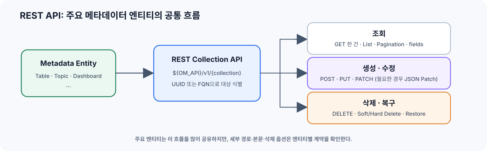
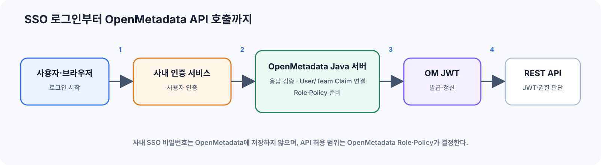
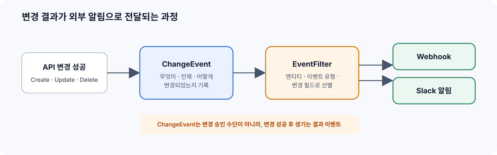
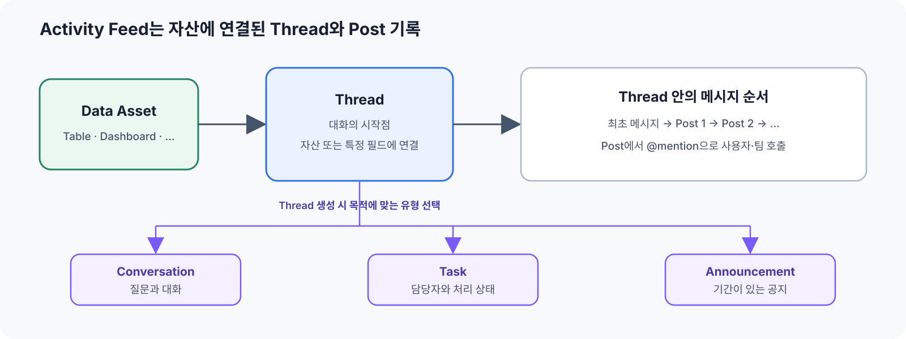

# 8회. API & Event System

## 1. REST API 설계 규칙

OpenMetadata의 Table, Topic, Dashboard 같은 주요 메타데이터는 엔티티다. 이 절에서는 **Table API를 예시**로 REST API의 CRUD 흐름을 살펴본다.



### 1.1 CRUD 패턴

OpenMetadata REST API 주소는 `http://<호스트>:8585/api/v1/tables` 같은 형식으로 구성된다. 아래 표와 이후 예시에서는 서버 주소를 제외하고 리소스 경로만 적는다. `tables` 자리에는 `topics`, `dashboards` 같은 엔티티 컬렉션이 들어간다.

| 작업 | HTTP 요청 | 의미 |
|---|---|---|
| Create | `POST /v1/tables` | 새로운 Table 생성 |
| Get | `GET /v1/tables/{id}` | ID로 Table 한 건 조회 |
| Get by name | `GET /v1/tables/name/{fqn}` | FQN으로 Table 한 건 조회 |
| List | `GET /v1/tables` | Table 목록 조회 |
| Create or Update | `PUT /v1/tables` | 동일 FQN 엔티티가 없으면 생성, 있으면 갱신 |
| Partial Update | `PATCH /v1/tables/{id}` | 지정한 필드만 변경 |
| Delete | `DELETE /v1/tables/{id}` | Table 삭제 |
| Restore | `PUT /v1/tables/restore` | Soft Delete된 Table 복구 |

#### 1.1.1 POST Create와 PUT Create or Update의 차이

`POST`와 `PUT`은 같은 `CreateTable` 형태의 요청 본문을 사용하지만, 이미 같은 FQN의 Table이 있을 때 동작이 다르다.

| 상황 | `POST /v1/tables` | `PUT /v1/tables` |
|---|---|---|
| 같은 FQN이 없음 | 새 Table 생성, `201 Created` | 새 Table 생성, `201 Created` |
| 같은 FQN이 있음 | `409 Conflict`로 실패 | 기존 Table 갱신, `200 OK` |
| 같은 FQN이 Soft Delete 상태 | `409 Conflict`. 기존 엔티티를 복구하지 않음 | 기존 엔티티를 복구하면서 갱신 |
| 호출 의도 | 반드시 새로 생성 | 있으면 맞추고, 없으면 생성 |

여기서 `PUT`은 OpenMetadata가 이 엔드포인트에 정의한 Upsert 동작이다. 모든 REST API의 `PUT`이 자동으로 Create or Update를 뜻하는 것은 아니다.

```bash
# Create only: 이미 있으면 실패한다.
curl -i -X POST \
  -H "Authorization: Bearer ${OM_TOKEN}" \
  -H "Content-Type: application/json" \
  --data @create-table.json \
  "${OM_API}/v1/tables"

# Create or Update: 같은 FQN이 있으면 갱신한다.
curl -i -X PUT \
  -H "Authorization: Bearer ${OM_TOKEN}" \
  -H "Content-Type: application/json" \
  --data @create-table.json \
  "${OM_API}/v1/tables"
```

`PUT` 응답은 새로 만들면 `201`, 기존 항목을 처리하면 `200`이다. `X-OpenMetadata-Change` 응답 헤더에서는 `entityCreated`, `entityUpdated`, `entityNoChange`를 구분할 수 있다.

권한 검사도 실행 시점의 결과를 따른다. 대상이 없으면 Create 권한을, 대상이 있으면 Update에 필요한 권한을 검사하므로 `PUT` 호출 권한 하나만 따로 존재한다고 보면 안 된다.

#### 1.1.2 Soft, Hard, Recursive Delete의 관계

삭제는 두 개의 독립된 옵션으로 이해해야 한다.

| 옵션 | `false` | `true` |
|---|---|---|
| `hardDelete` | Soft Delete: `deleted=true`로 표시하고 복구 가능 | Hard Delete: 저장 정보와 관계를 영구 삭제 |
| `recursive` | 대상만 삭제. 삭제되지 않은 하위 엔티티가 있으면 실패 | 포함 관계의 하위 엔티티도 함께 삭제 |

따라서 Recursive Delete는 세 번째 삭제 방식이 아니라 삭제 범위다. 두 옵션을 조합하면 다음 네 가지가 된다.

| `hardDelete` | `recursive` | 결과 |
|---:|---:|---|
| `false` | `false` | 대상만 Soft Delete |
| `false` | `true` | 대상과 하위 엔티티를 모두 Soft Delete |
| `true` | `false` | 대상만 Hard Delete. 하위 엔티티가 있으면 실패 |
| `true` | `true` | 대상과 하위 엔티티를 모두 Hard Delete |

기본값은 두 옵션 모두 `false`다.

##### Table을 Soft Delete하고 확인하기

```bash
curl -i -X DELETE \
  -H "Authorization: Bearer ${OM_TOKEN}" \
  "${OM_API}/v1/tables/${TABLE_ID}"

# 일반 조회에서는 제외되므로 deleted 항목을 포함해 조회한다.
curl -sS \
  -H "Authorization: Bearer ${OM_TOKEN}" \
  "${OM_API}/v1/tables/${TABLE_ID}?include=deleted"
```

Soft Delete 응답의 엔티티에는 `deleted: true`가 표시된다. 일반 목록 조회에서는 보이지 않지만 `include=deleted` 또는 `include=all`로 조회할 수 있다.

##### Soft Delete된 Table 복구하기

```bash
curl -i -X PUT \
  -H "Authorization: Bearer ${OM_TOKEN}" \
  -H "Content-Type: application/json" \
  --data "{\"id\":\"${TABLE_ID}\"}" \
  "${OM_API}/v1/tables/restore"
```

##### Table을 Hard Delete하기

```bash
curl -i -X DELETE \
  -H "Authorization: Bearer ${OM_TOKEN}" \
  "${OM_API}/v1/tables/${TABLE_ID}?hardDelete=true"
```

여기서 `id`는 서버가 만든 UUID이고, FQN은 `service.database.schema.orders`처럼 사람이 읽는 계층형 이름이다. 둘은 역할이 다르다.

| 상태 | 같은 FQN으로 `POST` | UUID 결과 |
|---|---|---|
| Soft Delete | `409 Conflict`로 실패. 새 Table이 만들어지지 않음 | 새 UUID 없음. `/restore` 또는 `PUT`을 쓰면 기존 UUID를 다시 사용 |
| Hard Delete | 새 Table 생성 가능 | 새 UUID가 만들어짐. 이전 UUID·버전 이력과는 다른 새 엔티티 |

따라서 Soft Delete 상태에서 “다시 생성”하려고 `POST`해도 UUID가 둘 생기지 않는다. Hard Delete한 항목은 `/restore`로 되돌릴 수 없으며, 같은 FQN으로 다시 만들면 이름은 같아도 서로 다른 엔티티가 된다.

##### 계층 전체를 Recursive Delete하기

Database Service처럼 하위에 Database, Schema, Table을 포함하는 엔티티에서 차이가 분명하다.

```bash
# 하위 엔티티까지 Soft Delete
curl -i -X DELETE \
  -H "Authorization: Bearer ${OM_TOKEN}" \
  "${OM_API}/v1/services/databaseServices/${SERVICE_ID}?recursive=true"

# 하위 엔티티까지 Hard Delete
curl -i -X DELETE \
  -H "Authorization: Bearer ${OM_TOKEN}" \
  "${OM_API}/v1/services/databaseServices/${SERVICE_ID}?recursive=true&hardDelete=true"
```

`recursive=false`인데 삭제되지 않은 하위 엔티티가 있으면 서버는 “entity is not empty” 오류로 요청을 거절한다. Recursive Hard Delete는 영향 범위가 크고 복구할 수 없으므로 대상 계층과 예상 삭제 건수를 실행 전에 확인해야 한다.

##### 삭제된 계층을 함께 복구하기

Restore 요청에는 `recursive=true`를 보내지 않는다. 삭제된 상위 엔터티를 복구하면, 그 엔터티가 `CONTAINS` 관계로 포함하던 삭제된 하위 엔터티를 서버가 함께 복구한다.

```bash
# Soft Delete된 Database Service와 그 안의 삭제된 하위 엔터티 복구
curl -i -X PUT \
  -H "Authorization: Bearer ${OM_TOKEN}" \
  -H "Content-Type: application/json" \
  --data "{\"id\":\"${SERVICE_ID}\"}" \
  "${OM_API}/v1/services/databaseServices/restore"
```

이는 모든 관계를 무조건 되돌리는 기능이 아니라, 삭제된 `CONTAINS` 하위 엔터티를 복구하는 동작이다. Hard Delete한 항목은 이 요청으로 복구할 수 없다.

모든 엔티티가 Soft Delete, Restore, Recursive 옵션을 지원하는 것은 아니다. 실제 엔드포인트가 해당 query parameter와 `/restore`를 제공하는지 확인해야 한다.

### 1.2 JSON Patch

POST와 PUT도 JSON을 요청 본문으로 사용한다. 다만 보통의 JSON 객체를 보내는 것과 달리, `PATCH`는 **무엇을 어떻게 바꿀지**를 표현하는 JSON Patch 연산 배열을 보낸다. `JSON POST`나 `JSON PUT`은 별도 형식 이름이 아니다.

| 요청 | Content-Type·본문 형식 | 예 |
|---|---|---|
| `POST`, `PUT` | `application/json`의 일반 요청 객체 | `{"name":"orders","description":"..."}` |
| `PATCH` | `application/json-patch+json`의 변경 연산 배열 | `[{"op":"replace","path":"/description","value":"..."}]` |

이 JSON Patch 형식은 Table처럼 `PATCH` 엔드포인트가 `application/json-patch+json`을 명시한 경우에만 적용된다. HTTP 메서드가 아니라 **해당 엔드포인트의 계약**이 본문 형식을 결정한다.

```http
PATCH /api/v1/tables/{table-id}
Content-Type: application/json-patch+json
If-Match: <현재 ETag>
```

```json
[
  {
    "op": "replace",
    "path": "/description",
    "value": "주문 데이터를 저장하는 테이블"
  }
]
```

주요 연산은 다음과 같다.

| 연산 | 사용 예 |
|---|---|
| `add` | Tag나 Owner 추가 |
| `replace` | Description 변경 |
| `remove` | 기존 Tag 제거 |

조회 응답의 `ETag`를 `If-Match`에 넣으면, 조회 이후 다른 사용자가 먼저 수정한 경우 오래된 데이터로 덮어쓰는 것을 막을 수 있다. 이때 서버는 `412 Precondition Failed`를 반환한다.

### 1.3 `fields` 파라미터

목록과 상세 조회는 기본 필드만 반환한다. Owner, Tag, Column처럼 관계 조회가 필요한 정보는 `fields`로 선택한다.

```http
GET /api/v1/tables/{table-id}?fields=owners,tags,columns
```

`fields`에 넣을 수 있는 이름은 엔티티마다 다르다. 자동화에서는 해당 엔드포인트가 제공하는 필드 중 실제로 사용하는 값만 요청한다. `fields=*`처럼 관계를 한꺼번에 읽으면 응답 크기뿐 아니라 관계 조회 비용도 커진다.

### 1.4 ID와 FQN 중 무엇을 사용할 것인가

Table에는 두 식별자가 함께 있다.

```http
GET /api/v1/tables/{id}
GET /api/v1/tables/name/{fqn}
```

| 식별자 | 무엇인가 | 주로 사용하는 때 |
|---|---|---|
| FQN | Service·Database·Schema·Table을 이어 만든 사람이 읽는 이름 | 설정 파일, 화면·로그 표시, 이름으로 Table을 처음 찾을 때 |
| UUID (`id`) | 서버가 만든 변경되지 않는 내부 식별자 | `PATCH`, `DELETE`, `/restore`, 버전 조회, 실행 이력과 다른 시스템의 기준키 |

FQN은 사람이 읽는 이름으로 대상 조회·설정·표시에 적합하고, UUID는 엔티티의 생명주기와 버전·관계를 연결하는 기준키다. 따라서 일반적인 연계는 FQN으로 대상을 찾고, 반환된 UUID로 수정·삭제·복구·버전 조회와 실행 이력을 연결한다.

Hard Delete 뒤 같은 FQN으로 다시 생성하면 새로운 UUID와 새 버전 이력이 시작된다. FQN만으로는 이전 엔티티와 재생성된 엔티티를 구분할 수 없으므로, 변경 이력이나 외부 연계 기록에는 UUID와 FQN을 함께 남긴다.

### 1.5 Pagination

Pagination은 Table 목록처럼 **여러 엔티티를 순회**할 때 사용한다. 한 건을 UUID·FQN으로 조회하거나 한 건을 수정·삭제할 때는 필요 없다. 목록을 한 번에 모두 받으면 응답 크기, 서버 메모리, timeout 위험이 함께 커지므로 필요한 수만 나누어 읽는다.

OpenMetadata 1.13에는 엔드포인트에 따라 두 가지 방식이 있다. 둘은 모든 목록 API에서 함께 고를 수 있는 옵션이 아니라, **각 엔드포인트가 정한 Pagination 계약**이다.

| 방식 | 파라미터 | 주로 사용되는 위치 |
|---|---|---|
| Cursor 방식 | `limit`, `after`, `before` | Table 같은 최상위 엔티티 목록 |
| Offset 방식 | `limit`, `offset` | Column 같은 일부 하위 리소스와 특수 목록 |

Table 목록의 `after`, `before`에는 UUID나 FQN을 직접 넣지 않는다. 응답 `paging.after`·`paging.before`에 들어 있는 **Base64 인코딩 Cursor**를 그대로 다음 요청에 넘긴다. 이 Cursor 안에는 Table의 `name`과 UUID(`id`)가 함께 들어가므로, 호출자가 만들거나 해석하지 않는다.

```http
GET /api/v1/tables?limit=100
GET /api/v1/tables?limit=100&after=<다음 커서>

GET /api/v1/tables/{table-id}/columns?limit=100&offset=0
GET /api/v1/tables/{table-id}/columns?limit=100&offset=100
```

Cursor 방식에서는 응답의 `paging.after`를 그대로 다음 요청에 사용하고, 값이 없어지면 순회를 끝낸다. Cursor를 직접 만들거나 offset처럼 계산하지 않는다. Offset 방식에서는 같은 필터와 정렬 조건을 유지한 채 `offset`을 증가시킨다.

자동화·Ingestion은 한 페이지를 읽어 처리한 뒤 다음 `after`로 넘어간다. 순회 중 새 Table이 생기거나 삭제될 수 있으므로, 같은 항목을 다시 만나도 안전하도록 UUID 기준으로 처리한다.

### 1.6 API 버전과 데이터 버전

`/api/v1`의 API 버전과 Table의 데이터 버전은 서로 다른 개념이다. API 버전은 REST 경로·요청·응답 계약을 구분하고, 데이터 버전은 한 엔티티가 변경된 이력을 구분한다.

| 구분 | 예 | 바뀌는 시점 | 저장 위치 |
|---|---|---|---|
| API 버전 | `/api/v1/tables`의 `v1` | REST 계약을 새 버전으로 제공할 때 | URL 경로와 Java Resource의 API 계약 |
| 데이터 버전 | Table의 `version: 1.0 → 1.1` | 엔티티 내용·상태가 실제로 바뀔 때 | 현재 JSON은 `table_entity.json`, 이전 버전 JSON은 `entity_extension` |

엔티티의 내용이 바뀌면 데이터 버전과 변경 이력이 남는다. Description·Owner·Tag 수정뿐 아니라 Soft Delete와 Restore도 엔티티 상태를 바꾸는 작업이므로 같은 UUID의 다음 버전으로 기록된다.

```http
GET /api/v1/tables/{table-id}/versions
GET /api/v1/tables/{table-id}/versions/{version}
```

UI에서는 Table 상세 화면의 **Version History(버전 이력)**에서 버전 목록을 보고, 특정 버전을 선택해 당시의 필드 값과 `changeDescription`을 확인할 수 있다. 이 화면도 위 Versions API를 사용한다.

버전 조회에는 변경 전후 버전과 `changeDescription`이 포함되어 어떤 필드가 바뀌었는지 추적할 수 있다. 삭제·복구와 버전의 관계는 다음과 같다.

| 작업 | UUID·FQN | 버전과 이력 |
|---|---|---|
| Soft Delete | 기존 UUID·FQN 유지, `deleted=true` | 상태 변경으로 다음 버전과 `entitySoftDeleted` 이벤트가 남음 |
| Restore | 같은 UUID·FQN을 다시 사용, `deleted=false` | 상태 변경으로 다음 버전과 `entityRestored` 이벤트가 남음 |
| Hard Delete | 엔티티 자체를 제거 | 이후 버전 조회·복구 불가. 해당 UUID의 저장된 버전 이력도 함께 제거됨 |
| Hard Delete 뒤 같은 FQN 생성 | 새 UUID | 이전 이력과 연결되지 않는 새 엔티티의 버전 이력이 시작됨 |

따라서 Soft Delete와 Restore는 하나의 엔티티 생명주기 안의 변경이고, Hard Delete 뒤 재생성은 다른 생명주기다. 현재 버전은 엔티티 테이블의 JSON에 있고, 이전 버전은 `entity_extension`에 버전별 JSON으로 보관된다. 버전 이력은 승인 건 같은 업무 식별자를 자동으로 보관하는 기능은 아니다.

GET 응답의 `ETag`를 PATCH의 `If-Match`로 보내면 읽은 이후 값이 바뀌지 않았을 때만 수정된다.

```http
GET /api/v1/tables/{table-id}
ETag: "<entity-etag>"

PATCH /api/v1/tables/{table-id}
If-Match: "<entity-etag>"
Content-Type: application/json-patch+json
```

다른 변경이 먼저 반영되었다면 `412 Precondition Failed`가 반환된다. 이는 재시도로 덮어쓸 오류가 아니라, 승인하거나 계산한 변경의 기준 상태가 오래되었다는 뜻이다.

### 1.7 대량 호출과 요청 속도

`limit`, `/bulk`, `async`는 **호출자가 선택해서 보내는 값**이다. OpenMetadata가 여러 요청을 알아서 묶어 Bulk로 만들거나, 큰 목록을 알아서 여러 페이지로 나누어 다시 호출하지는 않는다.

| 호출자가 보내는 요청 | OpenMetadata가 하는 처리 | 호출자가 이어서 할 일 |
|---|---|---|
| `GET /v1/tables?limit=100` | 요청한 `limit`만큼 한 페이지를 조회하고 `paging.after`를 반환한다. `limit`을 생략하면 Table API 기본값은 10이다. | `paging.after`가 있으면 그 값을 다음 `after`에 그대로 넣어 다음 페이지를 요청한다. |
| 일반 `POST`·`PUT`·`PATCH`·`DELETE`를 여러 번 호출 | 각 요청을 서로 독립적으로 처리한다. 여러 요청을 자동으로 Bulk 작업으로 합치지 않는다. | 호출자가 동시성·호출 수를 제한하거나, 가능하면 Bulk API로 요청을 묶는다. |
| `PUT /v1/tables/bulk` | 요청 안의 여러 Table을 검증하고 필요한 기존 엔티티를 묶어 조회한 뒤, **HTTP 응답을 기다리는 동안** 처리한다. | `200`의 항목별 성공·실패 결과를 확인한다. |
| `PUT /v1/tables/bulk?async=true` | 검증 뒤 작업 하나를 Bulk Worker 대기열에 넣고, 가능한 Worker가 나중에 처리한다. 기본 Worker 수는 10개다. | `202 Accepted`는 작업 접수일 뿐이다. 대량 변경을 너무 많이 동시에 넣지 않는다. |
| 비동기 Bulk Job이 이미 많음 | 최대 100개의 Bulk Job만 동시에 받아들이며, 한도에 도달하면 새 Job을 실행 대기열에 넣지 않는다. | `429 Too Many Requests`를 받으면 호출자가 동시성을 낮추고 나중에 다시 요청한다. |

즉 목록의 크기는 호출자가 `limit`으로 정하고, 변경을 묶을지와 비동기로 돌릴지도 호출자가 정한다. OpenMetadata는 받은 Bulk 작업에만 제한된 Worker·대기열을 적용해 DB 부하가 한꺼번에 몰리지 않도록 한다. 공통 RPS 제한은 OpenMetadata 자체에 없으므로, 전체 호출량 제한은 필요하면 Gateway·Ingress에서 별도로 둔다.

### 1.8 응답 코드

| 상태 | 의미 |
|---:|---|
| `200 OK` | 요청이 성공했고 결과를 반환함 |
| `201 Created` | 새 엔티티가 생성됨 |
| `202 Accepted` | 비동기 작업을 접수함 |
| `400 Bad Request` | 요청 본문·파라미터가 API 계약에 맞지 않음 |
| `401 Unauthorized` | Token이 없거나, 만료됐거나, 신뢰할 수 없음 |
| `403 Forbidden` | 호출자는 식별됐지만 해당 리소스·작업 권한이 없음 |
| `404 Not Found` | 대상 엔티티 또는 경로를 찾을 수 없음 |
| `409 Conflict` | 같은 FQN 등 현재 상태와 충돌함 |
| `412 Precondition Failed` | `If-Match`의 ETag가 현재 엔티티와 달라 동시 수정이 감지됨 |
| `413 Payload Too Large` | 요청 본문이나 Bulk 요청 크기가 허용 범위를 넘음 |
| `429 Too Many Requests`, `5xx` | 앞단 제한 또는 서버의 일시적인 처리 실패 |

### 1.9 새로운 API를 추가할 때: Table API를 기준으로

새 API는 경로만 추가하는 작업이 아니다. 일반 메타데이터 C/U/D는 Table API, 대화·Task는 Feed API, 이벤트 수신 설정은 Event Subscription API를 가장 가까운 기준으로 삼는다.

```text
openmetadata/
├── openmetadata-spec/src/main/resources/json/schema/
│   ├── entity/data/table.json                         # 엔티티 응답 모델과 필수 필드
│   └── api/data/createTable.json                      # Create·Upsert 요청 모델
└── openmetadata-service/src/main/java/org/openmetadata/service/
    ├── resources/databases/TableResource.java         # 경로, HTTP 메서드, 요청 입력
    ├── resources/EntityResource.java                  # 공통 C/U/D와 권한 검사
    ├── jdbi3/TableRepository.java                     # DB 저장, FQN·관계·버전·삭제
    ├── events/EventFilter.java                        # 성공 응답에서 이벤트 대상 판별
    └── events/ChangeEventHandler.java                 # ChangeEvent 생성·저장
```

기존 Table에 하위 API를 추가한다면 `TableResource`의 비슷한 메서드부터 확인한다. 완전히 새로운 엔티티라면 스키마·요청 모델, Resource·Repository, 권한과 ChangeEvent 영향 범위를 같은 순서로 연결한다.

---

## 2. 인증 & SDK

### 2.1 API 인증과 권한

인증은 “누가 호출했는가”를 확인하고, 권한은 “그 호출자가 이 리소스에 이 작업을 해도 되는가”를 판단한다. 사용자·Bot 모두 OpenMetadata가 발급한 Token을 `Authorization: Bearer <token>`으로 전달하고, 서버는 Token과 Role·Policy를 함께 확인한다.

| 단계 | OpenMetadata 서버의 처리 |
|---|---|
| Token 검증 | JWT의 서명·만료·사용자 또는 Bot을 확인 |
| 권한 판단 | 요청한 리소스와 작업에 맞는 Role·Policy를 확인 |
| 요청 실행 | 권한이 있으면 API 실행, 없으면 오류 반환 |

| 결과 | 의미 |
|---|---|
| `401 Unauthorized` | Token이 없거나, 만료됐거나, 서명을 신뢰할 수 없음 |
| `403 Forbidden` | 호출자는 식별됐지만 해당 리소스·작업 권한이 없음 |



#### SSO를 사용하는 경우

SSO는 사람의 로그인 경로에 추가되는 인증 방식이다. 그림은 redirect·callback을 쓰는 SSO의 예시로, OpenMetadata Java 서버가 로그인 요청을 시작하고 사내 인증 서비스의 응답을 검증한 뒤 OpenMetadata JWT를 발급한다. API 권한 판단은 사내 인증 서비스의 Token 자체가 아니라 이 JWT와 Role·Policy로 수행된다.

| 단계 | OpenMetadata에서 확인할 내용 |
|---|---|
| 사내 인증 서비스 callback | Authorization Code 또는 Assertion의 서명·발급자·만료 검증 |
| User 연결 | 별도 매핑 UI 없이 이메일이 같은 OpenMetadata User를 자동으로 찾는다. LDAP에서는 `mailAttributeName`의 이메일과 OpenMetadata User 이메일을 같게 둔다. User가 없으면 설정에 따라 생성하거나, 관리자가 **Settings → Members → Users**에서 같은 이메일로 미리 만든다. |
| JWT 발급·권한 판단 | OpenMetadata JWT를 발급하고, Role·Policy로 UI·REST API 요청을 허용 |

Claim 매핑, 신규 사용자 생성 여부, 기본 Role을 조직 정책에 맞게 정한다.

### 2.2 사람과 자동화의 Token을 분리한다

| 호출 주체 | 일반적인 방식 | 용도 |
|---|---|---|
| UI 사용자 | 설정된 로그인 Provider로 로그인한 세션 | 브라우저에서 조회·편집 |
| 개인 개발자·운영자 | Personal Access Token | 개인 권한으로 제한된 CLI·검증 작업 |
| Ingestion | 전용 Bot JWT | 반복 수집과 메타데이터 동기화 |
| Java 연계 서비스 | 별도 Bot JWT | 애플리케이션의 API 호출 |

Bot 생성과 운영 흐름은 다음과 같다.

1. 자동화 용도별 Bot을 만든다.
2. 필요한 리소스와 작업만 허용하는 Role·Policy를 연결한다.
3. Bot JWT를 발급해 Secret Manager에 저장한다.
4. 만료·회전 정책과 사용처를 함께 관리한다.

Ingestion과 Java가 서로 다른 Bot을 사용하면 `updatedBy`와 ChangeEvent의 `userName`만으로도 실행 경로를 구분할 수 있다. 공용 관리자 Token 하나를 여러 프로그램이 공유하면 과도한 권한과 추적 불가능성이 동시에 생긴다.

### 2.3 curl, Python SDK, Java SDK의 관계

세 방식 모두 결국 같은 REST API를 호출한다.

| 방식 | 적합한 사용 | 특징 |
|---|---|---|
| curl | API 확인, 장애 분석, 간단한 스크립트 | HTTP 요청과 응답을 그대로 확인 가능 |
| Python SDK | Ingestion, 배치, 데이터 작업 | 엔티티 모델과 `ometa` 편의 메서드 제공 |
| Java SDK | Java 서비스 내부 연동 | Java 모델과 API 클라이언트 사용 |

SDK를 사용해도 HTTP의 의미는 바뀌지 않는다.

| 작업 | REST API | Python SDK에서의 형태 | Java에서의 형태 |
|---|---|---|---|
| Create | `POST` | `create(...)` | Create 요청 모델을 API 클라이언트로 전송 |
| Create or Update | `PUT` | `create_or_update(...)` | Create or Update API 호출 |
| Partial Update | `PATCH` | `patch(...)`, `patch_tags(...)`, `patch_description(...)` | JSON Patch와 필요 시 ETag 전달 |
| Delete | `DELETE` | `delete(...)` | Delete API 호출 |

같은 Table 목록 조회를 세 방식으로 표현하면 다음과 같다.

```bash
# curl: HTTP 요청을 그대로 확인
curl -sS \
  -H "Authorization: Bearer ${OM_TOKEN}" \
  "${OM_API}/v1/tables?limit=10"
```

```python
# Python SDK: curl과 같은 한 페이지의 Table 목록 조회
from metadata.generated.schema.entity.data.table import Table

page = metadata.list_entities(entity=Table, limit=10)
for table in page.entities:
    print(table.fullyQualifiedName)
```

```java
// Java SDK: 연결 설정 후 같은 Table 목록을 조회
import org.openmetadata.sdk.OM;
import org.openmetadata.sdk.client.OpenMetadataClient;
import org.openmetadata.sdk.config.OpenMetadataConfig;
import org.openmetadata.sdk.fluent.Tables;

OpenMetadataConfig config = OpenMetadataConfig.builder()
    .baseUrl(System.getenv("OM_API"))
    .accessToken(System.getenv("OM_TOKEN"))
    .build();
OM.init(new OpenMetadataClient(config));

Tables.list().limit(10).forEach(table -> System.out.println(table.get().getName()));
```

서버와 SDK의 모델이 달라지면 필드 직렬화나 API 호환 문제가 생길 수 있으므로 버전을 함께 맞춰야 한다. SDK의 메서드 이름보다 API 버전과 요청·응답 계약이 우선이다.

### 2.4 Python SDK를 사용하는 Tag와 Description 수정 예시

`metadata.get_by_name`은 독립 함수가 아니라 `OpenMetadata` 클라이언트의 메서드다. 서버 주소와 Bot JWT로 클라이언트를 만든 뒤 FQN으로 Table을 찾고, 반환된 엔티티에 Tag와 Description을 반영한다.

```python
import os

from metadata.generated.schema.entity.data.table import Table
from metadata.generated.schema.entity.services.connections.metadata.openMetadataConnection import (
    AuthProvider,
    OpenMetadataConnection,
)
from metadata.generated.schema.security.client.openMetadataJWTClientConfig import (
    OpenMetadataJWTClientConfig,
)
from metadata.generated.schema.type.tagLabel import (
    LabelType,
    State,
    TagFQN,
    TagLabel,
    TagSource,
)
from metadata.ingestion.ometa.ometa_api import OpenMetadata

metadata = OpenMetadata(
    OpenMetadataConnection(
        hostPort=os.environ["OM_API"],  # 예: https://om.example.com/api
        authProvider=AuthProvider.openmetadata,
        securityConfig=OpenMetadataJWTClientConfig(
            jwtToken=os.environ["OM_TOKEN"],
        ),
    )
)

table = metadata.get_by_name(
    entity=Table,
    fqn="service.database.schema.orders",
    fields=["tags"],
)
if table is None:
    raise RuntimeError("대상 Table을 찾을 수 없습니다.")

metadata.patch_tags(
    entity=Table,
    source=table,
    tag_labels=[
        TagLabel(
            tagFQN=TagFQN("Tier.Tier1"),
            labelType=LabelType.Automated,
            state=State.Confirmed,
            source=TagSource.Classification,
        )
    ],
    skip_on_failure=False,
)

metadata.patch_description(
    entity=Table,
    source=table,
    description="주문 데이터를 저장하는 테이블",
    force=True,
    skip_on_failure=False,
)
metadata.close()
```

`fields=["tags"]`처럼 필요한 필드만 요청하면 목록·대량 처리에서 응답 크기를 줄일 수 있다. `State.Suggested`는 후보 Tag를 제안만 할 때 사용하며, `skip_on_failure=False`는 수정 실패를 예외로 드러낸다.

---

## 3. Event System

Event System은 OpenMetadata의 변경 결과를 이벤트로 기록하고, 구독 조건에 맞으면 사용자나 외부 시스템에 전달하는 후처리 구조다.



### 3.1 ChangeEvent 저장과 구독 전달은 분리된 흐름이다

OpenMetadata의 API 변경, ChangeEvent 저장, Subscription 전달은 서로 분리된 단계다. 따라서 각 단계의 성공 여부와 실패 후 처리도 다르다.

| 단계 | 정상 흐름 | 해당 단계에서 실패하면 |
|---|---|---|
| API C/U/D | Java 서버가 엔티티를 생성·수정·삭제하고 성공 응답을 반환 | 엔티티 변경 자체가 실패하며 ChangeEvent는 생성하지 않음 |
| ChangeEvent 저장 | 성공한 C/U/D 뒤 비동기 `ChangeEventHandler`가 ChangeEvent를 만들고 DB에 INSERT | 엔티티 변경은 그대로 유지되고, 서버 오류 로그만 남음 |
| Subscription 전달 | `pollInterval`마다 Java Scheduler가 저장된 Event를 읽어 Filter·Recipient를 계산하고 목적지로 전송 | 전달 실패 기록과 `retries` 설정으로 별도 관리 |

성공한 C/U/D 응답은 Java의 `EventFilter`가 잡아 비동기 `ChangeEventHandler`로 넘긴다. 이 분리 덕분에 이벤트 후처리가 원래 API C/U/D를 지연시키거나 실패시키지 않는다.

`change_event`는 원본 Table이 있는 업무 DB가 아니라 `conf/openmetadata.yaml`의 `database.url`이 가리키는 OpenMetadata 메타데이터 DB에 저장된다. 기본 DB 이름을 쓴다면 MySQL의 `openmetadata_db.change_event`, PostgreSQL의 `public.change_event` 테이블이다. `json`에는 ChangeEvent 전체 Payload가, `offset`에는 이벤트를 순서대로 읽기 위한 증가 순번이 들어간다. Java Scheduler는 Subscription별로 저장한 `current offset`을 읽고, `change_event`에서 그보다 큰 `offset`의 Event를 조회한다.

일반적으로 엔티티와 `change_event`는 같은 메타데이터 DB를 사용하므로, DB 장애가 지속되면 API C/U/D도 함께 실패한다. C/U/D는 성공했지만 ChangeEvent만 남지 않는 경우는 엔티티 저장 직후의 일시적 DB 오류나 `change_event` 테이블의 권한·마이그레이션 문제처럼 예외적인 상황이다.

ChangeEvent 저장에 실패하면 조회 가능한 `change_event` 행이 없으므로 이후 Subscription 전달과 ChangeEvent 기반 감사 이력은 진행되지 않는다. OpenMetadata는 이 저장 실패를 자동 재시도하거나 원래 C/U/D를 롤백하지 않는다. 다만 DB의 자동 증가 번호 특성상 `offset` 값에 공백이 생길 수 있으며, 소비자는 행의 `offset`을 기준으로 읽으므로 공백 자체는 문제가 되지 않는다. 운영에서는 서버 로그와 DB 모니터링으로 이 예외를 감지하고, 필요한 변경은 별도 대사 절차로 확인한다.

### 3.2 ChangeEvent 구조

ChangeEvent에는 어떤 엔티티에 어떤 변경이 발생했는지가 들어간다.

```json
{
  "id": "event-uuid",
  "eventType": "entityUpdated",
  "entityType": "table",
  "entityId": "table-uuid",
  "entityFullyQualifiedName": "service.database.schema.orders",
  "previousVersion": 1.2,
  "currentVersion": 1.3,
  "timestamp": 1785110400000,
  "userName": "ingestion-bot",
  "changeDescription": {
    "fieldsUpdated": [
      {
        "name": "description",
        "oldValue": "",
        "newValue": "주문 데이터 테이블"
      }
    ]
  }
}
```

확인할 핵심 필드는 다음과 같다.

| 필드 | 스키마 필수 | 값이 들어오는 조건 | 의미 |
|---|---|---|---|
| `id` | 필수 | 모든 ChangeEvent | 이벤트 식별자. Webhook 수신기의 중복 처리 방지 키 |
| `eventType` | 필수 | 모든 ChangeEvent | 생성·수정·삭제 등 발생한 이벤트 종류 |
| `entityType` | 필수 | 모든 ChangeEvent | Table, Topic 등 엔티티 종류 |
| `entityId` | 필수 | 모든 ChangeEvent | 변경된 엔티티 UUID |
| `timestamp` | 필수 | 모든 ChangeEvent | 이벤트 발생 시각 |
| `entityFullyQualifiedName` | 선택 | 엔티티 FQN을 만들 수 있는 경우 | 변경된 엔티티 FQN. 소비 시 없을 수 있음 |
| `previousVersion`, `currentVersion` | 선택 | 엔티티 버전 정보를 기록하는 변경 | 변경 전후 버전. 버전이 바뀌지 않으면 두 값이 같을 수 있음 |
| `userName` | 선택 | 요청 실행 주체를 알 수 있는 경우 | 변경을 실행한 사용자 또는 Bot |
| `impersonatedBy` | 선택 | Bot이 사용자를 대신해 실행한 경우 | 실제 실행 Bot 정보 |
| `changeDescription` | 선택 | `entityUpdated`에서 필드 차이가 있는 경우 | 추가·수정·삭제 필드 정보. Create·Delete에는 없음 |
| `entity` | 선택 | EventType·응답 경로가 엔티티 본문을 포함하는 경우 | 엔티티 데이터. 민감 값은 마스킹될 수 있음 |

수신기는 필수 필드만으로 식별·중복 처리를 하고, `changeDescription`, `entity`, FQN은 항상 있다고 가정하지 않는다.

### 3.3 EventType

주요 EventType은 다음과 같다.

| EventType | 의미 |
|---|---|
| `entityCreated` | 엔티티 생성 |
| `entityUpdated` | Create or Update 또는 직접 수정으로 실제 필드가 변경됨 |
| `entityFieldsChanged` | 사용량 통계처럼 직접 엔티티 편집 외의 필드 변경 |
| `entityNoChange` | 요청은 처리됐지만 현재 상태와 차이가 없음. 이벤트 테이블에는 저장되지 않음 |
| `entitySoftDeleted` | Soft Delete |
| `entityDeleted` | 영구 삭제 |
| `entityRestored` | Soft Delete 상태에서 복구 |
| `threadCreated`, `postCreated` | 대화나 답글 생성 |
| `taskResolved`, `taskClosed` | Task 처리 완료 또는 종료 |
| `userLogin`, `userLogout` | 사용자 로그인·로그아웃 |

새 EventType은 UI 설정이 아니라 서버 확장으로 추가한다. 실제 수정 위치와 영향 범위는 3.6에서 정리한다. 단순한 업무 자동화라면 기존 `entityUpdated`와 `changeDescription`을 수신기에서 해석하는 편이 안전하다.

Change Request의 승인 상태 변경처럼 외부 수신자가 **승인·반려·취소라는 업무 의미**를 구분해야 하는 경우를 생각해 볼 수 있다. 기존 메타데이터 엔티티의 일반 필드 변경이라면 `entityUpdated`와 `changeDescription`으로 충분할 수 있다. 반대로 Change Request가 독립된 엔티티·수명주기를 가진다면, 해당 엔티티와 승인 상태용 EventType을 새로 정의하는 편이 의미를 섞지 않는다. 이는 구현 방향을 정하는 내용이 아니라 Event 계약을 검토할 때의 기준이다.

### 3.4 구독은 언제부터 어디로 전달할지를 정한다

Event Subscription(이하 Subscription)은 저장된 ChangeEvent를 주기적으로 읽어 전달하는 설정이다. 어떤 이벤트를 받는지뿐 아니라 **언제부터**와 **어디로** 전달할지를 정한다. 이 기준이 없으면 새 구독을 만들 때 과거 변경까지 알릴지, 장애 뒤 어느 위치부터 다시 보낼지가 불명확해진다.

OpenMetadata에서 말하는 **Alert(알림 규칙)**는 이 Event Subscription 설정을 UI에서 부르는 이름이다. Notification은 그 규칙이 Email·Slack·Webhook 등 Destination으로 실제 보낸 메시지이고, 별도의 Alarm 객체가 따로 있는 것은 아니다.

Subscription은 **Settings → Notifications → Alerts**에서 Add Alert로 만들 수 있다. UI는 `POST /api/v1/events/subscriptions`에 JSON 요청을 보내며, API·SDK로 같은 JSON을 직접 보낼 수도 있다. OpenMetadata가 YAML 파일을 자동으로 읽어 Subscription을 만드는 기능은 없다.

| 결정할 항목 | 실제 동작 | 필요한 이유 |
|---|---|---|
| 시작 offset | 새 Subscription은 생성 시점의 최신 offset에서 시작 | 등록 이후 이벤트만 전달하고 과거 이벤트는 자동 재생하지 않음 |
| 재시작 offset | 이미 실행된 Subscription은 저장된 current offset부터 다시 시작 | 장애·재시작 뒤 처리 위치를 이어감 |
| 전달 대상(Destination) | 아래 Destination 설정을 사용 | 알림 채널과 외부 시스템 수신 경로를 결정 |

`Sync Offset` 기능은 Subscription의 `current offset`과 `starting offset`을 **현재 최신 offset**으로 맞춘다. UI·API에서 과거 offset으로 되돌려 이미 발생한 ChangeEvent를 다시 전달하는 기능은 제공하지 않는다. DB의 offset을 직접 바꾸는 방식도 지원되지 않으므로, 과거 변경 확인은 `GET /api/v1/events`로 조회하고 재처리가 필요하면 별도 소비·처리 흐름을 준비한다.

| 전달 대상(Destination) | 전달받는 쪽 | 사용 예 |
|---|---|---|
| Activity Feed·Email | OpenMetadata 사용자 | 제품 안 알림, 메일 알림 |
| Slack·MS Teams·Google Chat | 운영·데이터 팀 | 채널 또는 사용자 알림 |
| Generic Webhook | 사내 애플리케이션 | ChangeEvent JSON으로 후속 자동화 |
| Governance Workflow | OpenMetadata 내부 Workflow | 거버넌스 후속 처리 |

외부 프로그램은 보통 Webhook Push로 새 이벤트를 받는다. `GET /api/v1/events`는 누락 조사나 제한된 기간의 변경 이력 조회에 쓰는 Pull API이며, 지속적인 실시간 구독을 대신하지는 않는다.

### 3.5 구독 조건(Filter)과 수신자(Recipient)

Subscription은 대상 종류(Resource), 구독 조건(Filter Rule), 수신자(Recipient), 전달 대상(Destination)을 조합한다. `pollInterval`은 이 조건 평가를 얼마나 자주 실행할지 정하는 별도 실행 주기다.

| 설정 | 정하는 내용 | 예 |
|---|---|---|
| 대상 종류(Resource) | 어떤 엔티티 종류의 Event인가 | Table |
| 구독 조건(Filter Rule) | 어떤 변경만 보낼 것인가 | `entityUpdated`, 특정 FQN 제외 |
| 수신자(Recipient) | 누가 받을 것인가 | Owner, Team, 특정 사용자 |
| 전달 대상(Destination) | 어디로 보낼 것인가 | Slack 채널, Generic Webhook |
| 실행 주기(`pollInterval`) | 얼마나 자주 새 Event를 확인할 것인가 | 기본값 60초, 1분마다 확인 |
| 목적지 재시도(`retries`) | Callback 전송 실패 시 몇 번 더 시도할 것인가 | 기본값 3회 |

여기의 `retries`는 **이미 `change_event`에 저장된 Event**를 목적지로 전송하다 실패했을 때의 설정이다. 3.1의 `change_event` INSERT 실패에는 적용되지 않는다.

예를 들어 “`orders` Table의 Description 변경”을 Owner와 데이터 관리 팀의 Slack 채널로 보낼 수 있다. EventType, FQN, 변경 사용자·Bot, Domain·Owner와 Resource가 지원하는 필드·상태 조건을 조합할 수 있으며, 세부 Filter는 Resource마다 다르다.

기본 EventType은 OpenMetadata에 정의되어 있지만, EventType마다 Subscription이 자동으로 하나씩 생기는 것은 아니다. 1.13 기본 데이터에는 `ActivityFeedEvents`, `WorkflowEvents` Subscription 정의가 포함되며, 추가 알림은 UI 또는 API로 별도 생성한다.

`Tier`는 OpenMetadata가 기본으로 제공하는 데이터 자산의 업무 중요도 분류 태그다. `Tier1`은 매출 정산·결제 지표의 공식 Table, `Tier2`는 영향 범위가 더 작은 내부 분석용 Table처럼 조직이 의미를 정해 붙인다. Tier 자체가 전달 우선순위를 바꾸지는 않으며, Filter나 Webhook 수신기가 이를 조건으로 사용할 때만 동작에 영향을 준다. 직접 판별할 수 없는 경우 수신기가 `entityId`로 엔티티를 다시 조회해 Tier를 확인한다.

### 3.6 커스텀 기능의 구현 위치

Subscription 설정과 Generic Webhook으로 해결되지 않을 때만 서버 확장을 검토한다. 목적별로 먼저 볼 위치는 다음과 같다.

```text
openmetadata/
├── openmetadata-spec/src/main/resources/json/schema/events/
│   ├── eventSubscription.json                         # Filter·Recipient·Destination·pollInterval·retries 계약
│   ├── changeEvent.json                               # ChangeEvent Payload 구조
│   └── changeEventType.json                           # EventType enum
└── openmetadata-service/src/main/java/org/openmetadata/service/
    ├── resources/events/subscription/
    │   └── EventSubscriptionResource.java             # Subscription UI·API 요청 처리
    ├── events/subscription/
    │   ├── EventsSubscriptionRegistry.java            # Filter가 사용할 Resource 등록
    │   └── AlertsRuleEvaluator.java                   # Filter 조건 평가
    ├── apps/bundles/changeEvent/
    │   ├── AlertFactory.java                           # Slack·Email·Webhook Destination 생성
    │   └── AbstractEventConsumer.java                 # Event 조회·전달 Consumer 기반 구현
    └── events/ChangeEventHandler.java                 # ChangeEvent 생성·DB 저장
```

기존 전달 대상의 메시지 내용만 바꾸거나 사내 업무 조건을 추가하는 경우에는 서버 파일을 수정하기보다 Generic Webhook 수신기에서 처리하는 편이 운영 부담이 작다. 새 Filter 기준, 새 Destination, 새 EventType은 각각 위의 스키마·Java 처리·수신기 계약을 함께 바꿔야 한다.

### 3.7 Event System 사용 시 주의할 점

| 주의점 | 이유 | 처리 방법 |
|---|---|---|
| 사후 이벤트 | 변경이 성공한 뒤 생성됨 | 승인·차단은 API 호출 전 단계에서 처리 |
| 비동기 전달 | API, 이벤트 저장, 목적지 전달은 별도 처리 | 세 상태를 각각 기록·관측 |
| 새 구독의 시작점 | 과거 이벤트를 기본 전달하지 않음 | 필요한 이력은 Events API 또는 별도 재처리로 준비 |
| 중복·재전송 | 네트워크 오류나 재처리로 같은 이벤트가 다시 올 수 있음 | 수신기에 `event.id` 저장 후 멱등 처리 |
| 지연·순서 | 전달 시점에는 엔티티가 다시 바뀌었을 수 있음 | 중요 판단 전 `entityId`로 현재 상태 재조회 |
| 느린 수신기 | 응답이 늦으면 전달 실패나 적체가 생김 | 원문 저장·Queue 적재 후 빠르게 `2xx` 응답 |
| 실패 누적 | offset이 뒤처지면 미처리 이벤트가 쌓임 | 최신/처리 offset, 마지막 성공 시각, 실패 수를 확인 |
| Payload 변화 | 선택 필드가 없거나 버전마다 구조가 달라질 수 있음 | 필수 필드만 전제하고 선택 필드를 방어적으로 처리 |

### 3.8 Webhook과 Slack 연동

Webhook을 쓰려면 먼저 사내에서 접근 가능한 HTTPS 수신 주소를 준비한다. 그 주소를 Generic Webhook 전달 대상(Destination)으로 둔 Subscription을 만들면, Java Scheduler가 조건에 맞는 ChangeEvent를 `POST`한다.

```text
OpenMetadata Java Scheduler
  → 사내 Webhook 수신기
  → event.id 중복 확인·원문 저장
  → 필요하면 Table·Tier 재조회
  → Slack 전송 또는 다른 시스템 호출
```

수신기는 인증 Header를 검증하고, 이벤트 원문과 `event.id`를 저장한 뒤 빠르게 `2xx`를 반환한다. 이후 Slack 전송·추가 조회처럼 시간이 걸리는 처리는 Worker나 Queue에서 수행한다. Slack 실패는 OpenMetadata API 변경 실패가 아니므로 수신기 쪽에서 재시도·실패 Queue를 관리한다. 단순 알림은 Slack 목적지로 직접 보내도 되지만, 업무 조건·중복 제거·재처리가 필요하면 수신기를 둔다.

---

## 4. Activity Feed & Thread

Activity Feed는 데이터 자산을 중심으로 대화, 작업, 공지를 남기는 기능이다.



### 4.1 Thread와 Post

Thread는 하나의 대화·작업·공지에 쌓이는 메시지 묶음이다. Activity Feed에서 최초 메시지를 작성하면 Thread와 첫 Post가 함께 만들어지고, 이후 답글은 같은 Thread의 Post로 추가된다.

Thread는 Table 전체뿐 아니라 Description이나 Column 같은 특정 필드에도 연결할 수 있다. 이 때문에 어떤 데이터의 어느 부분에 대한 대화인지 함께 남길 수 있다.

Conversation·Task·Announcement Thread를 새로 만들 때는 화면 실시간 갱신을 위해 WebSocket 알림도 전송된다. 이는 `change_event`를 Java Scheduler가 읽어 Subscription 목적지로 보내는 흐름과 별도다.

### 4.2 Conversation

일반적인 질문과 답변을 위한 Thread 유형이다. Table의 Activity 탭에서 Conversation을 선택해 첫 메시지를 작성하면 Conversation Thread가 생성된다. 데이터 의미 확인, 담당자 문의, 변경 내용 공유 같은 대화를 한곳에 모을 수 있다.

### 4.3 Task

Description 추가나 Tag 확인처럼 담당자에게 실제 작업을 요청할 때 사용한다. 담당자, 상태, 작업 내용을 함께 관리할 수 있다.

### 4.4 Announcement

일정 기간 노출해야 하는 공지에 사용한다. 스키마 변경 예정, 데이터 사용 중단, 장애 안내처럼 시작 시각과 종료 시각이 있는 메시지에 적합하다.

### 4.5 @mention

메시지에서 사용자나 팀을 언급해 해당 대화로 호출한다. 단순 댓글과 달리 누가 확인해야 하는지 명확하게 전달할 수 있다.

### 4.6 #mention

`#mention`은 다른 데이터 자산을 메시지 안에 연결하는 표기다. 예를 들어 Table 설명을 논의하면서 관련 Dashboard나 upstream Table을 `#`으로 찾아 넣을 수 있다. 대화 속 참조를 남기는 기능이며, Lineage 같은 자산 관계를 새로 만들지는 않는다.

Activity Feed는 협업 기록이고 ChangeEvent는 시스템 변경 기록이다. 둘은 목적이 다르다.

| 구분 | Activity Feed & Thread | ChangeEvent |
|---|---|---|
| 중심 | 사람의 대화와 작업 | 엔티티 변경 사실 |
| 생성 방식 | 사용자가 대화·Task·공지를 작성 | API 변경 성공 후 시스템이 생성 |
| 주요 사용 | 문의, 협업, 담당자 호출 | 자동화, 감사, 외부 알림 |
