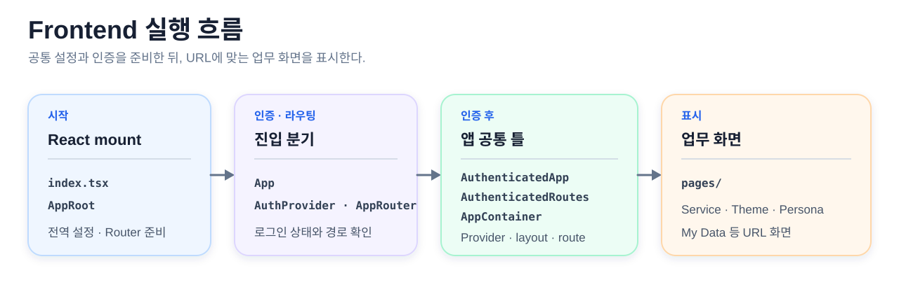
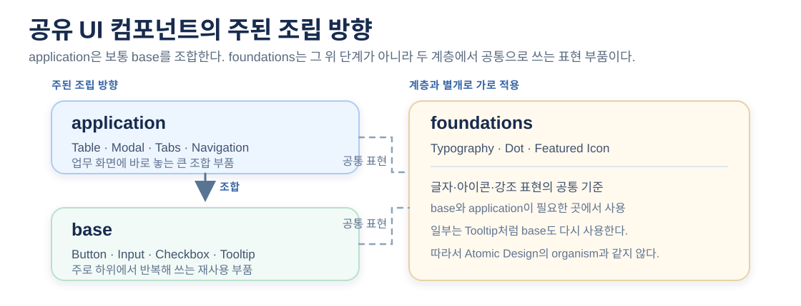
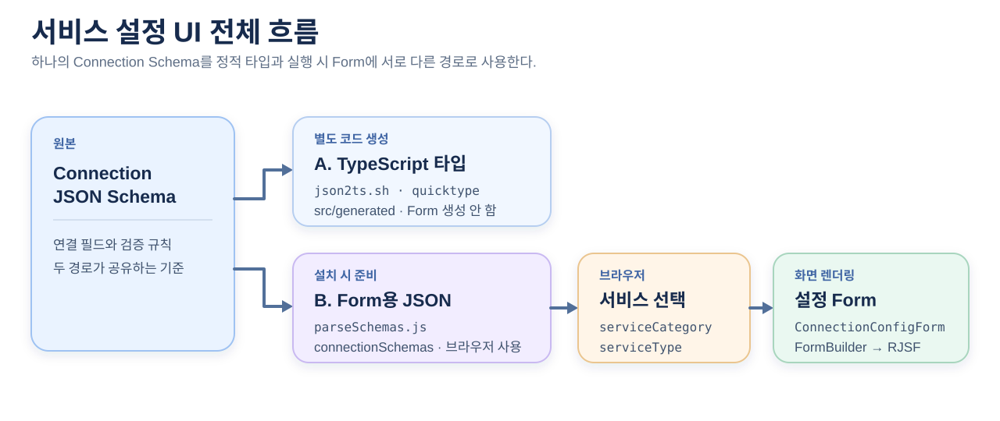
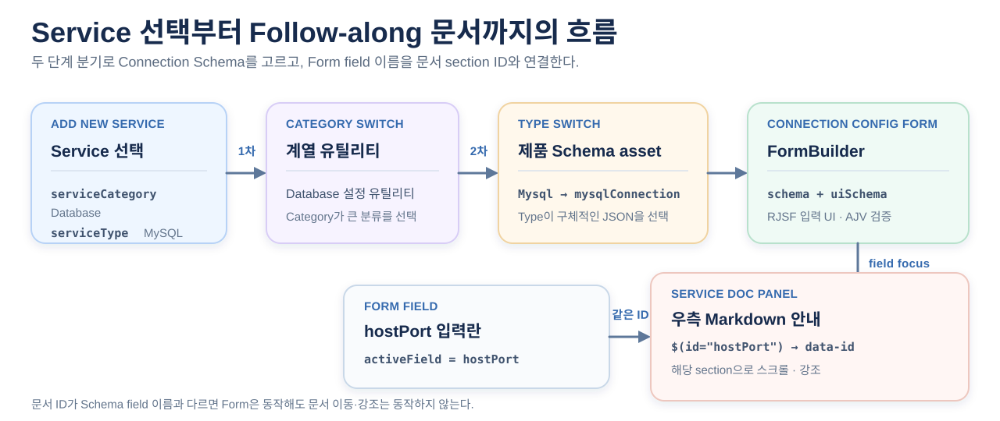
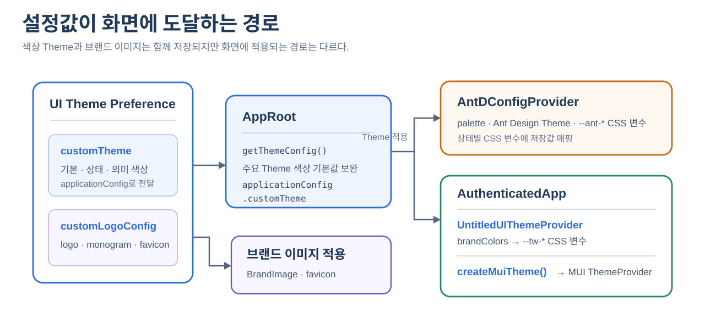
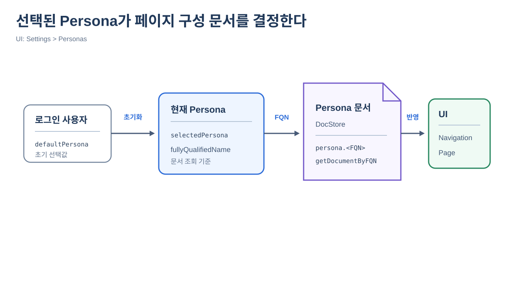
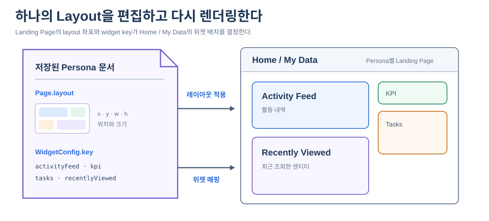

# 9회-2: UI & 디자인 시스템

## 목차

1. Frontend 빌드 체계
2. 커넥터 UI 통합 패턴
3. Theme & 브랜딩 커스터마이징
4. Persona 기반 개인화
5. 커스터마이즈 가능한 Landing Page

---

## 1. Frontend 빌드 체계

OpenMetadata UI는 브라우저에서 실행되는 React 애플리케이션, 이를 보조하는 공유 UI 패키지, 개발 환경을 준비하는 Node·Yarn, 그리고 화면과 타입의 기준이 되는 JSON Schema가 함께 구성한다. 먼저 각 요소가 어디에 있고 어떤 결과를 만드는지 정리한 뒤, 다음 절에서 Service 연결 화면이 이 구조를 어떻게 사용하는지 본다.

### 1.1 Frontend 소스 구조

`openmetadata-ui/src/main/resources/ui/src`는 실제 화면을 실행하는 애플리케이션의 소스 루트다. 폴더는 화면, 재사용 UI, 상태·컨텍스트, API 호출, Schema 산출물처럼 역할에 따라 나뉜다.

```text
src/
├── pages/                  URL에 대응하는 업무 화면
├── components/             화면 안에서 조합하는 도메인·공통 UI
├── context/ · hooks/       인증·Theme·사용자 선택값 같은 공유 상태와 동작
├── rest/                   OpenMetadata Server REST API 호출
└── generated/ · jsons/     Schema에서 준비한 TypeScript 타입과 Form용 JSON
```

- `pages`는 URL에 대응하는 화면 단위다. Service 추가, Theme, Persona, My Data 같은 업무 화면이 이 계층에서 시작한다.
- `components`는 여러 화면에서 조합하는 도메인·공통 UI다. `pages`가 화면의 진입점이라면 `components`는 화면 안의 기능 단위다.
- `context`, `hooks`는 인증, Theme, 사용자 선택값처럼 여러 화면이 공유하는 상태와 동작을 연결한다.
- `rest`는 OpenMetadata Server API 호출을, `generated`와 `jsons`는 JSON Schema에서 준비한 타입·Form용 JSON을 담당한다.

위 트리는 정적인 책임 구분이다. 실제 시작 순서는 `index.tsx → AppRoot → App / AuthProvider / AppRouter → AuthenticatedApp → AuthenticatedRoutes → AppContainer → pages`다. 즉, 공통 설정과 인증을 먼저 준비한 뒤 실제 업무 화면을 표시한다.



### 1.2 `openmetadata-ui-core-components` 구조

`openmetadata-ui-core-components`는 앱과 별도로 빌드되는 공유 UI 패키지다. 반복 사용되는 Button·Input·Table 같은 컴포넌트와 색상·Theme·스타일 규칙을 한 곳에서 제공한다. 앱 전체를 대체하는 프레임워크가 아니라, 여러 화면이 같은 UI 기반을 쓰도록 만드는 공통 계층이다.

```text
src/
├── components/
│   ├── base/               Button, Input, Select 같은 기본 구성요소
│   ├── application/        Table, Modal, DatePicker 같은 조합 구성요소
│   └── foundations/        디자인 토큰을 반영한 기반 구성요소
├── theme/ · colors/        createMuiTheme, palette·색상 유틸리티
├── styles/                 Tailwind tw: 접두사와 공통 스타일
├── utils/ · types/ · hooks/ 공유 유틸리티, 타입, Hook
└── index.ts                앱이 import하는 공개 API
```

`src/index.ts`가 `components`, `theme`, `colors`, `utils`, `types`를 공개 API로 다시 export한다. 앱은 내부 파일 경로가 아니라 패키지 import를 통해 이 API를 사용한다.

```typescript
import { Button, createMuiTheme } from '@openmetadata/ui-core-components';
```

세 폴더는 Atomic Design의 atom → molecule → organism을 그대로 구현한 엄격한 계층은 아니다. **재사용 수준만 보면 `base`와 `foundations`는 비슷한 낮은 수준의 공통 부품이고, `application`이 그보다 큰 조합 부품**이다. `application/Table`이 Badge·Checkbox·Dropdown·Tooltip 같은 `base`를 조합하는 방향은 분명하다.

둘의 차이는 높이가 아니라 관심사다. `base`는 Button·Input처럼 입력·선택·클릭이라는 **기능과 상호작용**을 중심으로 묶고, `foundations`는 Typography·Dot·Featured Icon처럼 글자·아이콘·강조라는 **시각 표현**을 중심으로 묶는다. 실제로 `base/Alert`는 `foundations/FeaturedIcon`을 쓰고, `foundations/Typography`는 `base/Tooltip`을 쓴다. 따라서 두 폴더는 서로 참조할 수 있으며, `foundations`를 base보다 높은 organism으로 보면 틀린다.



| 분류 | 실제 역할 | Atomic Design에 굳이 비유하면 | 주의할 점 |
|---|---|---|---|
| `base` | 여러 화면에서 반복하는 입력·선택·버튼·작은 레이아웃 부품 | atom이 중심이지만 InputGroup·Card·Form처럼 작은 molecule도 섞여 있다. | `foundations`와 비슷한 낮은 재사용 수준이지만, 기능·상호작용 중심이다. |
| `application` | base를 조합해 화면에 바로 놓는 Table·Modal·Navigation·Tabs | organism 또는 화면 패턴에 가장 가깝다. | 전체 Page 자체는 아니며, 특정 업무 화면에서 재사용할 조합이다. |
| `foundations` | 글자·점·강조 아이콘처럼 공통 시각 표현을 의미 있게 만드는 부품 | Atomic Design의 organism에 대응하지 않는다. 디자인 token·표현 규칙에 가깝다. | `base`와 비슷한 낮은 재사용 수준이며, 기능보다 표현 중심이다. |

정리하면 **`base`와 `foundations`는 같은 낮은 재사용 층에서 각각 기능과 표현을 맡고, `application`은 이 부품들을 조합해 화면에 놓는 상위 부품**이다. 이 분류의 목적은 조립 순서를 강제하는 것이 아니라, 새 컴포넌트를 어디에 추가하고 재사용할지 판단하게 하는 것이다. 패키지의 `components/index.ts`는 세 분류를 모두 다시 export하므로 앱에서는 필요한 컴포넌트를 바로 import한다.

저장소 폴더명은 `openmetadata-ui-core-components`, 앱에서 사용하는 패키지명은 `@openmetadata/ui-core-components`다.

### 1.3 UI 라이브러리가 공존하는 이유

현재 UI에는 Ant Design, MUI, 자체 공유 UI 패키지가 함께 남아 있다. 이것을 “Ant Design에서 MUI로 전환하는 중”으로 이해하면 정확하지 않다. 저장소 지침은 Ant Design과 MUI를 새로 늘리지 않고, 새 UI는 `@openmetadata/ui-core-components`를 사용하도록 정한다. 기존 화면은 한 번에 바꾸지 않으므로 세 경로가 공존한다.

| 도구 | 어디에 쓰이나 | 색상 변경은 어떻게 반영되나 | 새 컴포넌트를 만들 때 |
|---|---|---|---|
| Ant Design | 기존 Form·Table·Button 중심 화면 | `AntDConfigProvider`가 색상 palette·CSS 변수를 전달한다. | 새로 추가하지 않는다. 기존 코드를 리팩터링할 때는 공유 UI 패키지의 대응 컴포넌트로 바꾼다. |
| MUI | 이미 남아 있는 일부 MUI 화면·컴포넌트 | MUI `ThemeProvider`가 Theme 객체를 전달한다. | 새 MUI import·의존성은 추가하지 않는다. 코드베이스에서 제거하는 방향이다. |
| `@openmetadata/ui-core-components` | 새 Button·Input·Table·Tabs 등 프로젝트 표준 공유 UI | `UntitledUIThemeProvider`의 CSS token과 패키지의 디자인 기준을 사용한다. | 새 UI는 이 패키지의 컴포넌트·token을 우선 사용한다. |

`@openmetadata/ui-core-components`는 Ant Design이나 MUI를 한 번 더 감싼 패키지가 아니다. 클릭·키보드·focus 같은 동작과 접근성은 `react-aria-components`가 맡고, 스타일은 Tailwind의 `tw:` 접두사로 작성한다.

**Untitled UI는 OpenMetadata가 지은 이름이 아니라, Figma UI kit·디자인 시스템·React 컴포넌트를 제공하는 외부 제품**이다. OpenMetadata는 이 제품의 React 컴포넌트 전체를 설치해 화면을 그대로 만들지 않는다. 현재 공유 UI 패키지의 실제 외부 의존성은 `@untitledui/icons`이고, Button·Input·Table 등의 구현 코드는 OpenMetadata의 `@openmetadata/ui-core-components`에 있다. 이 패키지가 Untitled UI의 색상 단계·간격·둥근 모서리·그림자·아이콘 표현 방식을 참고해, React Aria와 Tailwind로 자체 구현한 구조다.

따라서 이름이 비슷해도 역할은 구분해야 한다.

| 이름 | 실제 정체 | 이 저장소에서 하는 일 |
|---|---|---|
| Untitled UI | 외부 디자인 시스템·React 컴포넌트 제품 | 새 공유 UI가 따르는 디자인 기준 |
| `@untitledui/icons` | 외부 아이콘 React 패키지 | 아이콘을 import해 Button·Featured Icon 등에 표시 |
| `@openmetadata/ui-core-components` | OpenMetadata가 만든 공유 UI 패키지 | Button·Input·Table 등의 실제 컴포넌트 구현 |
| `UntitledUIThemeProvider` | OpenMetadata가 만든 Theme Provider | OpenMetadata Theme 값을 새 공유 UI용 CSS 변수로 변환 |

OpenMetadata는 외부 제품의 이름을 붙인 컴포넌트 라이브러리를 그대로 쓰는 대신, 다음처럼 필요한 디자인 기준을 자체 공유 UI에 반영한다.

| Untitled UI에서 가져온 기준 | 저장소 안의 실제 사용 방식 | Button 예 |
|---|---|---|
| 색상 단계 | `brand-25`부터 `brand-950`까지의 밝기 단계와 `bg-brand-solid` 같은 의미 이름 | 기본 버튼 배경은 `tw:bg-brand-solid`, hover는 `tw:hover:bg-brand-solid_hover` |
| 공통 모양 | 글자 크기·간격·radius·shadow 값 | Button size별 padding·둥근 모서리·그림자가 같은 기준을 따름 |
| 아이콘 | `@untitledui/icons` 패키지에서 아이콘을 import | Button이나 Featured Icon 안에 같은 아이콘 모양을 사용 |
| 동작·접근성 | Untitled UI가 아니라 `react-aria-components` | 버튼의 키보드 조작·focus·disabled 동작을 처리 |

예를 들어 Theme의 `primaryColor`가 바뀌면 `UntitledUIThemeProvider`는 이 값을 `--tw-color-bg-brand-solid` 같은 CSS 변수에 넣는다. 새 Button은 `tw:bg-brand-solid`이라는 의미 이름만 쓰므로, 각 Button 파일의 색상 코드를 고치지 않아도 기본 배경색이 함께 바뀐다. `selectedColor`도 `--tw-color-bg-brand-solid_hover`에 연결되어 hover·선택 상태에 반영된다. 즉, **Untitled UI는 새 공유 UI의 ‘보이는 방식’을 통일하는 외부 기준이고, 실제 컴포넌트 동작은 React Aria·실제 색상 전달은 OpenMetadata의 Theme Provider가 담당한다.**

`createMuiTheme()`은 남아 있는 MUI 화면에 넘길 **MUI 전용 Theme 객체를 만드는 빌더(팩토리)**다. Theme 설정의 기본색·오류색 등을 받아 MUI가 한 번에 읽을 색상표와 스타일 규칙으로 묶는다. `palette`는 그 결과 안의 `primary`, `error`, `grey` 같은 색상 묶음이다. 예를 들어 MUI Button은 `palette.primary.main`을 읽는다. 이 함수와 palette는 MUI 호환용이지, 새 공통 UI를 만들 때 직접 사용할 기준은 아니다.

### 1.4 Node·Yarn과 개발 서버

Node.js는 브라우저 화면을 대신 실행하는 환경이 아니다. 개발자가 Vite 같은 JavaScript 기반 도구를 실행하는 런타임이다. React 화면 자체는 Vite가 제공한 파일을 브라우저가 실행한다.

| 도구 | 이 자료에서의 역할 |
|---|---|
| Node.js | Vite를 포함한 Frontend 개발 도구가 실행되는 런타임이다. |
| Yarn | 필요한 패키지를 설치하고, 프로젝트가 정의한 개발 명령을 실행한다. |
| Vite | `yarn start`로 개발 서버를 열고, 변경한 Frontend 코드를 브라우저에 제공한다. |

개발 시작은 다음 흐름으로 이해하면 충분하다.

1. `make yarn_install_cache`가 앱 UI와 공유 UI 패키지에 필요한 의존성을 준비한다.
2. `make yarn_start_dev_ui`가 앱의 `yarn start`, 즉 Vite 개발 서버를 실행한다.
3. 브라우저가 개발 서버에서 받은 React 코드를 실행하고, 파일 변경을 화면에 반영한다.

```bash
make yarn_install_cache
make yarn_start_dev_ui
```

### 1.5 JSON Schema: JSON 데이터의 계약

JSON Schema는 “어떤 JSON을 유효한 데이터로 볼 것인가”를 선언하는 형식이다. 특정 화면이나 프로그래밍 언어에 묶이지 않으며, 데이터의 형태와 검증 규칙을 함께 적는 계약이다. OpenMetadata에서는 이 계약을 기준으로 타입을 만들고, Service 연결 화면은 필요한 입력 구조를 읽는다.

JSON 값과 JSON Schema는 구분해야 한다. 연결 설정 값은 `{"hostPort":"db:3306"}`처럼 실제 입력 데이터이고, Schema는 `hostPort`가 string이어야 한다는 규칙이다.

**RJSF(React JSON Schema Form)**는 JSON Schema를 React Form으로 바꾸는 라이브러리다. 개발자가 MySQL·PostgreSQL마다 host 입력란과 필수값 검사를 모두 직접 작성하는 대신, RJSF에 다음 세 값을 전달한다.

| RJSF에 주는 값 | 하는 일 | 화면 결과 |
|---|---|---|
| `schema` | 필드 이름·자료형·필수값·선택지를 정의 | host, username, 인증 방식 같은 입력란의 기본 구조 |
| `uiSchema` | 숨김 여부, 위젯 종류, 표시 순서를 보완 | 내부 필드를 숨기거나 Select·Password 입력을 지정 |
| `validator` | Schema 규칙을 실제 입력값에 적용 | 필수값 누락·형식 오류를 저장 전에 표시 |

RJSF는 이 세 값을 받아 Form과 오류 표시를 만들 뿐이다. **어떤 Service Schema를 고를지, 선택값을 어떤 Schema에 연결할지, 우측 문서를 어떻게 따라가게 할지는 RJSF가 아니라 OpenMetadata의 React·TypeScript 코드가 담당한다.** 이 경계는 2절의 커넥터 UI에서 다시 확인한다.

- **구조 정의:** 필드 이름, 자료형, 중첩 object·array 구조를 정한다.
- **검증 기준:** 필수 값, 허용 선택지, 인증 방식처럼 유효한 입력 범위를 정한다.
- **공유 기준:** 공통 인증·SSL 규칙을 `$ref`로 재사용하고, 생성된 타입과 Form이 같은 필드 구조를 보게 한다.

| Schema 키워드 | 의미 | Connection 설정에서의 예 |
|---|---|---|
| `type` | 값의 기본 형태 | `string`, `boolean`, `object` |
| `properties` | object 안에 둘 필드 | `hostPort`, `username`, `authType` |
| `required` | 반드시 받아야 할 필드 | `hostPort`, `username` |
| `enum` | 허용할 값을 제한 | MySQL `scheme`은 `mysql+pymysql`만 허용 |
| `default` | 사용자가 입력하지 않았을 때 쓸 초기값 | MySQL `scheme`은 `mysql+pymysql`, `useSlowLogs`는 `false` |
| `oneOf` | 여러 구조 중 하나를 선택 | Basic·IAM 등 인증 방식 |
| `$ref` | 다른 Schema의 공통 정의를 참조 | SSL, 인증, Filter Pattern |

`enum`과 `array`는 비슷한 선택지 문법이 아니다. `enum`은 **값 하나가 가질 수 있는 후보를 제한**하고, `array`는 **여러 값을 담는 목록이라는 데이터 형태**를 정한다. 그래서 둘은 작성 위치와 화면 결과가 다르다.

| 구분 | `enum` | `array` |
|---|---|---|
| 정하는 것 | 하나의 값으로 허용할 후보 | 값이 여러 개인 목록인지 |
| 기본 작성 | property 안에 `enum: [...]` | property에 `type: "array"`, 그 안에 `items` |
| 값 예 | `"mysql+pymysql"` 하나 | `["Sales", "Marketing"]`처럼 여러 항목 |
| Form에서의 의미 | 정해진 후보 중 하나를 고르는 Select·Radio 등의 근거 | 항목을 여러 개 추가·삭제하거나 여러 값을 입력하는 목록의 근거 |

```json
// enum: 값 하나를 정해진 후보로 제한
"scheme": {
  "type": "string",
  "enum": ["mysql+pymysql"],
  "default": "mysql+pymysql"
},

// array: 문자열을 여러 개 담는 목록
"sobjectNames": {
  "type": "array",
  "items": { "type": "string" },
  "default": null
}
```

둘은 함께 쓸 수도 있다. 예를 들어 여러 개의 Qlik Cloud Space Type을 고르게 하려면 property는 `array`로 두고, `items` 안의 문자열에 `enum: ["Managed", "Shared", "Personal", "Data"]`를 둔다. 이 경우에는 “여러 개를 고를 수 있다”는 것은 `array`, “각 항목은 네 후보 중 하나여야 한다”는 것은 `enum`이 담당한다. `default`도 자료형을 따라야 하므로 enum의 기본값은 허용 후보 하나이고, array의 기본값은 `[]` 또는 값이 든 배열이다.

MySQL Connection Schema는 이 규칙을 실제로 사용한다. `authType`의 각 선택지는 별도 인증 Schema를 참조하고, 필수 항목은 `required`에서 한 번에 선언한다.

```json
"authType": {
  "oneOf": [
    { "$ref": "./common/basicAuth.json" },
    { "$ref": "./common/iamAuthConfig.json" }
  ]
},
"required": ["hostPort", "username"]
```

`enum`과 `default`는 화면에서 특히 쉽게 확인할 수 있다. 아래에서 `scheme` 입력란은 정해진 값만 받을 수 있고, 아무 값도 바꾸지 않으면 `default`가 초기값으로 들어간다.

```json
"scheme": {
  "type": "string",
  "enum": ["mysql+pymysql"],
  "default": "mysql+pymysql"
},
"useSlowLogs": { "type": "boolean", "default": false }
```

OpenMetadata에서 원본 Schema는 `openmetadata-spec`에 있고, 한 정의가 두 방향으로 사용된다.

| 결과 | 목적 | Frontend에서의 위치 |
|---|---|---|
| TypeScript 타입 | API 요청·응답과 props가 같은 필드 구조를 사용하게 하는 정적 타입 | `src/generated` |
| Form용 JSON asset | 브라우저가 Service별 입력 필드와 기본 검증 규칙을 읽게 하는 runtime 데이터 | `src/jsons/connectionSchemas` |

`quicktype`은 첫 번째 TypeScript 타입만 만든다. Form용 JSON은 브라우저가 읽는 별도 asset이며, 공통 Schema 참조를 Form에서 사용할 수 있는 형태로 준비한다. 따라서 Schema가 필드의 구조·검증을 정의해도 화면 전체가 자동으로 결정되지는 않는다. 다음 절의 UI는 `uiSchema`, custom field, 별도 필터 단계로 표시 순서와 추가 동작을 보완한다.



---

## 2. 커넥터 UI 통합 패턴

**UI 페이지:** `Settings > Services > Add New Service`

이 절에서 말하는 커넥터 UI는 OpenMetadata를 MySQL·Kafka·Superset 같은 외부 시스템에 연결하기 위해, 연결 정보를 등록하는 화면이다. 사용자는 이 화면에서 “어느 제품에 연결할지”를 고르고, 이름을 정한 뒤 host·계정·인증 방식 등의 연결 값을 입력한다. 즉, 커넥터는 외부 시스템과 실제로 통신할 수 있도록 Service 연결 정보를 만드는 등록 단위이고, 커넥터 UI는 그 등록 과정을 안내하는 화면이다.

제품마다 필요한 값은 다르다. MySQL에는 host·계정·SSL이 필요하고, Kafka나 Superset에는 다른 인증·연결 값이 필요하다. 그런데 제품마다 선택 화면·저장 버튼·검증·문서 패널을 전부 별도 화면으로 만들면, 화면 구조와 동작이 제각각이 된다. **커넥터 UI 통합 패턴**은 이 문제를 해결하기 위해, 공통 흐름은 한 Add Service 마법사로 유지하고 제품마다 달라지는 입력 규칙만 교체하는 방식이다.

| 모든 Service가 공유하는 부분 | Service마다 바뀌는 부분 |
|---|---|
| 제품 선택 → 이름·설명 → 연결 설정 → 필터 → 저장이라는 단계 | MySQL·Kafka·Superset 등 제품 종류 |
| 공통 Form 컨테이너, 저장 처리, 오류 표시, 우측 안내 문서 영역 | 필드 목록·필수값·허용 선택지·기본값을 담은 Connection Schema |
| 선택값을 전달하고 현재 단계를 관리하는 React·TypeScript 코드 | 선택값을 어떤 Schema·문서로 연결할지 정하는 매핑 |

그래서 1절에서 설명한 JSON Schema가 여기서 필요해진다. JSON Schema는 제품별로 달라지는 **연결 Form의 필드·검증·선택지**를 선언한다. 반면 어떤 제품을 골랐는지, 그 Schema를 어디서 가져올지, Form을 어떤 순서와 위젯으로 보여 줄지, 우측 문서를 어디로 이동할지는 공통 UI와 React·TypeScript 코드가 담당한다. 아래 표와 하위 절은 이 하나의 마법사가 제품별 차이를 어떻게 받아들이는지 분해한 것이다.

| 구성 요소 | 맡는 일 | MySQL을 선택했을 때의 결과 |
|---|---|---|
| Service 선택 UI | 사용자가 계열과 제품을 고른다. | `Database`와 `MySQL` 값을 만든다. |
| 선택 매핑 코드 | 선택값에 맞는 Connection Schema를 찾는다. | Database 유틸리티에서 MySQL Schema를 고른다. |
| JSON Schema + RJSF | 필드·필수값·선택지를 읽어 Form과 검증을 만든다. | host, 인증, SSL 관련 입력란을 표시한다. |
| `uiSchema`와 custom field | Form의 표시 방식·숨김·특수 입력을 보완한다. | 내부 필드를 숨기거나 Select 같은 위젯을 지정한다. |
| Follow-along 문서 | 현재 focus한 필드의 안내 section을 우측에 맞춘다. | `hostPort`를 누르면 `hostPort` 설명으로 이동한다. |

즉, 이 절의 핵심은 “JSON Schema로 화면을 자동 생성한다”가 아니라 **하나의 공통 연결 화면이 선택값에 따라 알맞은 Schema·표시 규칙·문서를 받아 같은 방식으로 동작한다**는 것이다. 다음 2.1절부터는 먼저 이 화면에서 말하는 Service가 무엇인지, 그 뒤에 선택값이 Form으로 이어지는 과정을 본다.

### 2.1 Service는 외부 시스템의 연결 등록 단위

이 문맥의 Service는 일반적인 백엔드 마이크로서비스를 뜻하지 않는다. OpenMetadata가 메타데이터를 수집하거나 연결 설정을 보관할 외부 플랫폼의 등록 단위다. 하나의 Service에는 연결 방식과 그 아래에서 관리할 메타데이터 유형이 함께 정해진다.

| Service Category | Service Type 예시 | OpenMetadata가 연결하는 대상 |
|---|---|---|
| Database | MySQL, PostgreSQL | Database·Schema·Table 같은 데이터 자산 |
| Messaging | Kafka | Topic 같은 메시지 자산 |
| Dashboard | Superset | Dashboard·Chart 같은 BI 자산 |

`serviceCategory`는 Database·Messaging처럼 큰 계열을 고르고, `serviceType`은 MySQL·Kafka·Superset처럼 구체적인 제품을 고른다. 이 두 값이 어떤 Connection Schema와 Form을 읽을지 결정한다.

### 2.2 Service 선택이 연결 설정 Form이 되는 과정

**UI 페이지:** `Settings > Services > Add New Service`

Service 추가는 네 단계로 진행한다. 사용자가 첫 단계에서 `Database > MySQL`을 고르면, 연결 설정 단계가 MySQL Connection Schema를 받아 Form으로 표시한다. 이 과정에서 제품 이름만 보고 파일 경로를 조합하지 않고, 선택 매핑 코드가 어떤 Schema를 쓸지 명시적으로 정한다.

여기서 순서를 먼저 잡으면 다음과 같다.

1. 사용자가 Service Category와 Service Type을 고른다.
2. React·TypeScript의 선택 매핑이 그 두 값으로 MySQL Schema를 찾는다.
3. `ConnectionConfigForm`이 찾은 `schema`·`uiSchema`·validator를 RJSF 기반 `FormBuilder`에 전달한다.
4. RJSF가 연결 Form을 만들고, 사용자가 입력한 값은 해당 Schema 규칙으로 검증한다.

따라서 JSON Schema는 3~4단계에서 강하게 쓰인다. 반면 1단계의 선택 UI와 2단계의 매핑은 Schema 안에 들어 있지 않다. 이 구분을 알고 나면 새 커넥터에서 Schema 파일 외에 왜 `switch/case` 등록이 필요한지 이해할 수 있다.

| 단계 | 화면에서 정하는 값 | 다음 단계에 주는 정보 |
|---|---|---|
| Service 선택 | `serviceCategory`, `serviceType` | 선택할 Connection Schema의 기준 |
| 기본 정보 | Service 이름·설명 | OpenMetadata에 등록할 Service 정보 |
| 연결 설정 | host, 인증 방식, 옵션 등 | 선택 Schema에 맞는 연결 값 |
| 필터 설정 | 포함·제외 패턴 | 수집 대상을 제한하는 규칙 |

브라우저는 먼저 `serviceCategory`로 Service 계열의 설정 유틸리티를 고르고, 그 안에서 `serviceType`으로 구체적인 JSON Schema를 찾는다. `ConnectionConfigForm`은 이 결과에서 연결 Form에 필요한 `schema`와 `uiSchema`를 꺼내 `FormBuilder`에 전달한다. `FormBuilder`는 RJSF가 입력 UI를 만들고 AJV validator가 Schema 규칙을 검사하도록 연결한다.

`schema`가 **무슨 필드와 어떤 값이 가능한지**를 정한다면, `uiSchema`는 **어떤 필드를 숨기고 어떤 입력 위젯·순서로 보일지**를 보완한다. 그래서 JSON Schema만으로 Form의 데이터 계약을 유지하면서도, 연결 화면에 맞는 표시 규칙을 추가할 수 있다.



### 2.3 커넥터별 `switch/case` 등록: 선택값을 Schema에 연결한다

`switch/case`는 **Frontend의 TypeScript 코드**다. JSON Schema·YAML 설정·관리자 UI가 아니다. 사용자는 Add Service 화면에서 Database와 MySQL을 고르고, 이 코드가 그 선택값을 받아 어떤 Schema를 Form에 넘길지 정한다. `switch`에는 판별할 값 하나를 넣고, 각 `case`에는 그 값일 때의 결과를 둔다. 데이터의 유효성을 검사하거나 Form을 그리는 코드가 아니라, 여러 Schema 중 하나를 고르는 코드다.

| 문법 요소 | 이 화면에서의 의미 | 예 |
|---|---|---|
| `switch` | 무엇을 기준으로 고를지 | `serviceCategory` 또는 `serviceType` |
| `case` | 특정 값일 때 사용할 경로 | Database 계열, Mysql 제품 |
| 결과 | 고른 Schema 또는 설정 유틸리티 | Database 설정 유틸리티, `mysqlConnection` |
| 일치하는 case 없음 | 해당 제품용 Form Schema를 찾지 못함 | 연결 Form을 구성할 근거가 없음 |

JSON Schema가 스스로 화면에 등장하는 것이 아니라, 이 매핑을 통과해야 선택된 제품의 Schema가 Form에 전달된다.

MySQL을 예로 들면 `Database`라는 큰 분류를 먼저 고르고, 그 안에서 `Mysql`이라는 제품을 고른다. 이 두 선택값을 한 번에 처리하지 않고 두 단계 `switch`로 나눈다.

| 구분 | 기준 값 | 하는 일 | 예: MySQL |
|---|---|---|---|
| 1차 분기 | `serviceCategory` | Database·Messaging 같은 큰 계열에 맞는 설정 유틸리티를 선택한다. | `DATABASE_SERVICES` → Database 설정 유틸리티 |
| 2차 분기 | `serviceType` | 그 계열 안에서 제품별 JSON Schema asset을 선택한다. | `Mysql` → `mysqlConnection` |

**1차 등록 코드:** `ServiceConnectionUtils.ts`는 Service Category로 해당 계열의 설정 함수를 고른다.

```typescript
switch (serviceCategory) {
  case ServiceCategory.DATABASE_SERVICES:
    return serviceUtilClassBase.getDatabaseServiceConfig(
      serviceType as DatabaseServiceType
    );
}
```

**2차 등록 코드:** Database 계열 함수는 `DatabaseServiceUtils.tsx`에서 Service Type으로 실제 JSON Schema import를 고른다.

```typescript
export const getDatabaseConfig = (type: DatabaseServiceType) => {
  let schema = {};
  switch (type) {
    case DatabaseServiceType.Mysql:
      schema = mysqlConnection;
      break;
  }
  return { schema, uiSchema };
};
```

따라서 Database 계열에 MySQL과 PostgreSQL을 추가하는 일은 같은 1차 경로를 지나고, 2차 분기에서 서로 다른 Schema를 고르는 일이다. 새 **제품**을 기존 계열에 넣을 때는 제품 Schema import와 해당 계열의 2차 `case`를 맞춘다. 새 **계열**을 만들 때에만 `ServiceConnectionUtils`의 1차 Category `case`도 추가한다.

이 연결점이 맞아야 선택 화면의 제품명, runtime Form의 입력 구조, API로 저장할 연결 값이 모두 같은 Service를 가리킨다. JSON 파일만 놓거나 `switch`만 추가하면 한 단계가 끊겨 선택 목록·Form·저장 데이터 중 일부가 어긋날 수 있다.

### 2.4 Follow-along 문서: 입력 중인 필드의 설명을 따라간다

**UI 페이지:** `Settings > Services > Add New Service`

Follow-along은 “입력 중인 항목을 따라 안내 문서도 함께 이동시키는 기능”이다. 연결 설정 단계는 왼쪽에 입력 Form을, 오른쪽에 선택한 Service의 안내 문서를 함께 표시한다. 이것은 발표 자료의 참고 문서 목록이나 일반 tooltip이 아니라, 실제 제품 안에서 사용자가 입력 중인 항목의 설명을 바로 찾게 하는 UI 기능이다.

Form이 먼저 만들어진 뒤에 Follow-along이 동작한다. 핵심은 화면에 보이는 한글 Label이 아니라 Schema property 이름 같은 **안정적인 field ID**를 Form과 문서가 공유한다는 점이다. Label은 번역되거나 바뀔 수 있지만 `hostPort` 같은 property 이름은 Form과 문서를 연결하는 기준으로 유지할 수 있다.

사용자가 `hostPort` 입력란을 focus하면 Form이 `activeField=hostPort`를 전달하고, `ServiceDocPanel`은 현재 언어와 선택된 Service의 Markdown을 읽는다. Markdown 처리 단계는 `$(id="hostPort")`가 포함된 `$$section`을 `data-id="hostPort"`를 가진 HTML section으로 바꾼다. 마지막으로 패널은 같은 `data-id`를 찾아 해당 문단으로 스크롤하고 강조한다.

| 단계 | Form 쪽에서 일어나는 일 | 우측 문서 쪽에서 일어나는 일 |
|---|---|---|
| 1. 화면 준비 | 선택된 Service의 Connection Form을 렌더링 | 언어·Service에 맞는 Markdown 파일을 읽음 |
| 2. 필드 선택 | 사용자가 `hostPort`에 focus, `activeField` 전달 | 아직 문서 전체를 유지 |
| 3. 같은 ID 찾기 | field ID를 `hostPort`로 정리 | `data-id="hostPort"` section을 찾음 |
| 4. 문서 이동 | 입력은 계속 유지 | 해당 section으로 scroll하고 강조 |

```typescript
// Form focus → activeField → 문서의 같은 data-id section
const fieldName = getActiveFieldName(activeField);
document.querySelector(`[data-id="${fieldName}"]`)?.scrollIntoView();
```

문서 작성 시의 최소 단위는 다음처럼 Form property 이름과 문서 ID를 같게 두는 것이다.

```markdown
$$section
$(id="hostPort")
호스트와 포트를 입력한다.
$$
```

이 연결은 “문서가 존재한다”만으로는 완성되지 않는다. 새 커넥터에서는 다음 세 계약을 함께 확인한다.

1. Connection Schema의 property 이름이 예를 들어 `hostPort`인지 확인한다.
2. 해당 Service·언어 경로의 Markdown 파일에 같은 `$(id="hostPort")` section을 둔다.
3. Form의 field focus가 전달한 이름과 문서 section의 `data-id`가 일치하는지 확인한다.

ID가 다르면 Form 입력 자체는 동작하지만 우측 문서는 이동·강조되지 않는다. 번역 문서가 없을 때는 영어 Markdown으로 fallback한다. 즉, Follow-along 문서는 Schema의 필드명과 문서의 설명을 같은 키로 묶어, 사용자가 현재 입력 중인 항목을 기준으로 문서를 읽게 만드는 기능이다.

---

## 3. Theme & 브랜딩 커스터마이징

Theme는 색상만 바꾸는 기능이 아니다. 하나의 Preference에서 만든 값이 기존 Ant Design 화면, MUI 기반 UI, 새 공유 UI의 token으로 나뉘어 전달되고, 브랜드 이미지는 별도 경로로 적용된다.

### 3.1 Theme에서 조정하는 값

**UI 페이지:** `Settings > Preferences > Theme`

| 설정 그룹 | 대표 필드 | 사용자가 보는 영역 |
|---|---|---|
| 기본 강조색 | `primaryColor` | 주요 Button·Link, Navigation·Tab의 강조 기준 |
| 상호작용 상태 | `hoverColor`, `selectedColor` | Button hover, Navigation·Tab·목록의 hover와 선택 상태 |
| 의미 색상 | `errorColor`, `successColor`, `warningColor`, `infoColor` | 오류·성공·경고·정보 상태 |
| 패널 배경 | `panelBackgroundColor` | Landing Page welcome header의 기본 배경색 |
| 브랜드 자산 | logo, monogram, favicon 경로 | 로그인 Logo, 좌측 Navigation monogram, 브라우저 탭 아이콘 |

여기서 `primaryColor`가 모든 header 배경을 같은 색으로 칠하는 값은 아니다. Navigation·Tab·Button처럼 강조 또는 선택 상태를 가진 컴포넌트가 Provider를 통해 이 색상 계열을 소비한다. Landing Page header 배경은 `panelBackgroundColor`를 우선 사용하고, Persona의 Landing 설정이 별도 header 색상을 가지고 있으면 그 값으로 덮어쓴다.

### 3.2 하나의 Preference를 여러 UI 계층에 적용한다

`uiThemePreference.json`은 색상 설정 `customTheme`과 이미지 경로 설정 `customLogoConfig`를 함께 저장한다. 앱 시작 시 `AppRoot`가 이 Preference를 읽어 `applicationConfig`에 둔다.

```typescript
setApplicationConfig({
  ...themeData,
  customTheme: getThemeConfig(themeData.customTheme),
});
```

`getThemeConfig()`은 비어 있는 기본·상태·의미 색상을 보완한다. 그 결과 `customTheme`을 각 UI 계층이 이해하는 색상 값으로 바꾼다. 여기서 palette는 `primary.main`, `primary.light`, `error`처럼 UI 컴포넌트가 읽을 색상을 모아 둔 Theme 내부의 색상표다. 같은 Preference가 세 계층에 닿지만, 실제 적용 방법은 아래처럼 다르다.

| UI 계층 | Theme를 전달하는 방식 | 주로 달라지는 화면 |
|---|---|---|
| 기존 Ant Design | `AntDConfigProvider`가 palette와 `--ant-*` 변수를 만들고 `ConfigProvider`에 전달 | 기존 Form·Table·Button, Navigation·Tab의 강조·hover·선택 상태 |
| 남아 있는 MUI 컴포넌트 | `createMuiTheme()` 결과를 MUI `ThemeProvider`에 전달 | 기존 MUI 화면의 color palette·상태색. 신규 MUI 코드는 추가하지 않는다. |
| 새 공유 UI | `UntitledUIThemeProvider`가 `--tw-color-brand-*` CSS 변수를 생성 | `@openmetadata/ui-core-components`의 Button·Input 등 새 공유 UI |

`createMuiTheme()`은 사용자 Theme 설정과 기본 색상을 받아 MUI가 읽을 Theme 객체를 만든다. MUI 컴포넌트는 이 객체의 `palette.primary.main` 같은 값을 참조한다. 이 경로는 남아 있는 MUI 화면을 유지하기 위한 것이며, 신규 UI의 기준은 아니다.

예를 들어 Ant Design 쪽은 primary·hover·selected 값을 palette의 기본색, hover 상태, active 상태로 나누어 Button과 Navigation·Tab 같은 기존 컴포넌트에 제공한다.

여기서 `UntitledUIThemeProvider`는 외부 Untitled UI 제품이 제공하는 Provider가 아니다. **OpenMetadata가 만든 Provider**이며, 새 공유 UI가 Untitled UI 스타일의 색상 이름을 쓰기 때문에 그렇게 이름 붙었다. 외부 Untitled UI는 실제 제품·디자인 시스템이고, 이 저장소는 `@untitledui/icons`만 직접 의존성으로 가져온다. Button·Input을 포함한 화면 컴포넌트는 OpenMetadata 공유 UI 패키지가 React Aria와 Tailwind로 구현한다.

`UntitledUIThemeProvider`의 역할은 Theme 설정값을 브라우저에서 재사용할 수 있는 이름표로 바꾸는 것이다. CSS 변수는 `--tw-color-brand-600`처럼 이름을 붙인 전역 색상 값이다. 새 공유 UI의 Button·Input은 색상을 각 파일에 직접 적지 않고 이 이름표를 읽는다.

```text
Theme 화면의 primaryColor
  → UntitledUIThemeProvider가 --tw-color-brand-600 값으로 저장
  → 새 공유 UI Button이 그 값을 배경·상태색으로 읽음
  → Theme 설정을 바꾸면 해당 Button도 같은 기준으로 바뀜
```

따라서 “Untitled UI token을 쓴다”는 말은 외부 라이브러리 화면을 그대로 띄운다는 뜻이 아니다. OpenMetadata가 만든 새 공유 UI가 외부 Untitled UI의 표현 규칙에 맞춘 색상·간격·글자 이름을 재사용한다는 뜻이다.

`customLogoConfig`는 색상 token과 다른 경로다. 앱 시작 시 `AppRoot`가 Theme Preference에서 이 설정을 함께 읽는다. 이후 `BrandImage`는 `customLogoUrlPath`를 로그인 Logo에, `customMonogramUrlPath`를 좌측 Navigation의 monogram에 사용한다. `AppRoot`는 `customFaviconUrlPath`를 브라우저 문서의 `rel="icon"` link에 넣어 탭 아이콘을 바꾼다.

| Theme Preference의 브랜드 값 | 전달 주체 | 화면 결과 |
|---|---|---|
| `customLogoUrlPath` | `BrandImage` | 로그인 화면 Logo |
| `customMonogramUrlPath` | `BrandImage` | 좌측 Navigation monogram |
| `customFaviconUrlPath` | `AppRoot` | 브라우저 탭 favicon |



이 구조 때문에 Theme 화면 하나에서 설정해도 기존 화면의 Button·Navigation·Tab, 남아 있는 MUI 컴포넌트, 새 공유 UI, Logo·favicon이 각각 맞는 방식으로 갱신된다.

---

## 4. Persona 기반 개인화

Persona는 **권한을 바꾸는 역할(Role)이 아니라, 같은 제품 안에서 어떤 업무용 화면 구성을 우선 보여줄지 고르는 기준**이다. 조직은 Data Engineer, Data Steward, Data Scientist처럼 업무 단위별 Persona를 만들고, 사용자에게 하나 이상 연결한다. 사용자가 Persona를 고르면 해당 Persona에 저장된 Navigation·Custom Page·Landing Page 구성이 적용된다.

| 구분 | Role | Persona |
|---|---|---|
| 답하는 질문 | 이 사용자는 무엇을 할 수 있는가? | 이 사용자는 어떤 업무용 화면을 볼 것인가? |
| 예 | 편집·관리·조회 권한 | Data Engineer / Data Steward |
| 바뀌는 것 | API·화면의 접근 가능 여부 | 좌측 메뉴·Custom Page·Landing 배치 |

따라서 Persona 이름을 Data Engineer로 정했다고 자동으로 데이터 엔지니어 전용 권한이나 메뉴가 생기지는 않는다. **그 Persona에 연결한 화면 문서가 있을 때** 실제 화면 차이가 생긴다. 이 구분을 먼저 잡아야 “Persona를 바꾸면 권한도 바뀌나요?”라는 질문에 정확히 답할 수 있다.

### 4.1 정의 · 사용자 연결 · 화면 문서는 서로 다른 데이터다

**Persona 정의 UI:** `Settings > Personas > <Persona>`

**사용자 연결 UI:** `Settings > Users > <사용자>`

Persona 개인화에는 세 층의 데이터가 있다. 이름만 있는 Persona, 그 Persona를 쓸 수 있는 사용자, 실제 화면 구성을 담은 문서는 분리되어 있다.

| 데이터 | 무엇을 보관하나 | 왜 분리하나 |
|---|---|---|
| Persona | 이름·설명·기본 Persona 여부 | 업무용 화면 구성의 식별자 |
| User | `personas`, `defaultPersona`, `inheritedPersonas` | 이 사용자가 선택할 수 있는 Persona와 첫 선택값 |
| `persona.<FQN>` 문서 | Navigation·Page·Landing layout | Persona별 화면을 실제로 그릴 데이터 |

`User.personas`는 관리자 등이 사용자에게 직접 연결한 후보 목록이다. `inheritedPersonas`는 팀의 기본 Persona에서 따라온 후보 목록이다. `defaultPersona`는 로그인 후 처음 선택되는 Persona다. 한 사용자가 두 업무를 겸하면 두 Persona를 후보로 받고, 그중 하나를 기본값으로 정할 수 있다.

Persona 엔티티의 `default`는 별도 의미다. 시스템 차원의 기본 Persona로, 사용자에게 Persona도 기본값도 지정되지 않았을 때 적용할 대체값이다. 즉, **사용자별 `defaultPersona`와 시스템 전체의 `Persona.default`는 같은 ‘기본’이라는 말이라도 적용 범위가 다르다.**

### 4.2 화면 구성은 Persona 문서에 저장된다

**UI 페이지:** `Settings > Personas > <Persona> > Customize UI`

Persona를 하나 만들었다고 화면 구성이 Persona 행 자체에 들어가는 것은 아니다. Frontend는 선택된 Persona의 FQN으로 `persona.<FQN>` 문서를 찾고, 그 안의 데이터를 Navigation·Page 화면으로 나누어 읽는다.

```json
{
  "navigation": ["..."],
  "pages": [
    { "pageType": "LandingPage", "layout": ["..."] }
  ],
  "personPreferences": ["..."]
}
```

| 문서 영역 | 무엇을 뜻하나 | 화면 결과 |
|---|---|---|
| `navigation` | Persona가 사용할 좌측 메뉴 정의 | Navigation 구성 변경 |
| `pages` | Persona별 Custom Page와 Landing Page | 요청한 Page를 찾아 렌더링 |
| `pages[].layout` | Landing 위젯의 종류·위치·크기 | `Home / My Data`의 카드 배치 |
| `personPreferences` | Persona별 화면 선호 설정 | Landing 배경색 등 선호값 반영 |

이렇게 사용자 연결과 화면 문서를 분리하므로, 사용자의 후보 목록을 바꾸지 않고도 Persona용 화면을 수정할 수 있고, 반대로 화면 문서를 그대로 둔 채 어떤 사용자가 그 Persona를 쓸지만 바꿀 수도 있다.

### 4.3 Persona 선택은 문서를 다시 읽는 시작점이다

**UI 위치:** 상단 사용자 메뉴의 Persona 선택

로그인 후 Store는 `User.defaultPersona`를 현재 `selectedPersona`의 초기값으로 둔다. 사용자가 상단 사용자 메뉴에서 다른 Persona를 고르면 먼저 현재 선택값만 바뀐다. 이후 Navigation·Custom Page·Landing 화면이 이 값의 변경을 감지해 새 문서를 읽는다.

```typescript
// 선택 자체는 현재 Persona를 바꾸는 한 줄이다.
setSelectedPersona(persona);

// 이후 화면은 선택된 FQN으로 해당 Persona의 문서를 조회한다.
const pageFQN = `persona.${selectedPersona?.fullyQualifiedName}`;
const document = await getDocumentByFQN(pageFQN);
```

전환 순서는 다음과 같다.

1. 사용자가 후보 Persona 중 하나를 선택해 `selectedPersona`를 바꾼다.
2. 화면이 `persona.<선택 Persona FQN>` 문서를 조회한다.
3. Navigation은 `navigation`을 적용하고, Custom Page는 필요한 `pageType`을 찾는다.
4. `Home / My Data`는 `LandingPage.layout`을 읽어 위젯을 다시 배치한다.



여기서 중요한 점은 “선택한 Persona 이름”이 화면을 직접 바꾸는 것이 아니라, **이름으로 찾은 문서 데이터가 화면을 바꾼다**는 것이다. 따라서 같은 Data Engineer Persona라도 문서에 Navigation·Landing 설정이 없으면 그 이름만으로는 보여줄 구성이 없다.

### 4.4 발표에서 설명할 직무별 예시

| Persona 예 | 관리자에게 필요한 설정 | 사용자가 체감하는 변화 |
|---|---|---|
| Data Engineer | 이 Persona 문서에 엔지니어링 업무용 Navigation·Landing layout 저장 | 선택 시 그 문서의 메뉴와 시작 화면을 읽음 |
| Data Steward | 별도 문서에 스튜어드용 Navigation·Landing layout 저장 | 같은 계정으로 Persona를 전환하면 다른 문서를 읽음 |
| Data Scientist | 분석 업무에 맞춘 문서와 layout 저장 | 권한은 그대로 두고 화면 출발점만 달리할 수 있음 |

이 표는 제품이 위 세 Persona를 미리 완성해 둔다는 뜻이 아니다. 조직이 Persona를 정의하고 해당 문서를 구성해야 한다는 예시다. Persona를 활용한 개인화의 핵심은 **권한 복제가 아니라, 하나의 사용자에게 여러 업무 화면 구성을 연결하고 선택하게 하는 것**이다.

---

## 5. 커스터마이즈 가능한 Landing Page

Landing Page 커스터마이즈는 사용자가 임의 React 코드나 외부 플러그인을 넣는 기능이 아니다. 관리자가 Persona의 Landing 화면에서 **제품이 제공하는 위젯을 고르고, 카드의 위치와 크기를 저장**하는 기능이다. 사용자 화면은 저장된 스크린샷을 보여주는 것이 아니라, 저장된 layout 데이터를 읽어 같은 위젯 컴포넌트를 다시 그린다.

| 주체 | 하는 일 | 결과 |
|---|---|---|
| 관리자 | Persona별 Landing을 편집하고 저장 | `persona.<FQN>` 문서의 `LandingPage.layout` 갱신 |
| 문서 | 위젯 키·좌표·크기 보관 | 화면을 재구성할 수 있는 데이터 |
| 사용자 | `Home / My Data`를 열고 Persona 선택 | 선택 Persona의 layout을 읽어 카드 표시 |

### 5.1 Pluggable Panel은 “허용된 위젯을 조합하는 카드 영역”이다

**설정 UI 페이지:** `Settings > Personas > <Persona> > Customize UI > Landing Page`

**렌더링 UI 페이지:** `Home / My Data`

여기서 Pluggable Panel은 브라우저 확장처럼 외부 플러그인을 설치한다는 뜻이 아니다. Landing에 올릴 수 있도록 OpenMetadata가 이미 만든 panel 컴포넌트들의 목록에서 필요한 것을 골라 layout에 넣는 구조다. 즉, ‘플러그 가능’은 **위젯을 layout에 꽂고 빼는 방식으로 확장한다**는 뜻이며, 새 임의 코드를 실행하게 하는 기능은 아니다.

| 위젯 | 사용자에게 보이는 정보 | 배치 방식 |
|---|---|---|
| Activity Feed | 최근 활동·피드 | grid 카드 |
| KPI | 요약 지표 | grid 카드 |
| My Tasks | 내 작업 | grid 카드 |
| Data Assets / My Data / Total Assets / Following | 자산·관심 항목 요약 | 기본 layout의 grid 카드 |
| Announcements | 공지 | Landing header 영역 |
| Recently Viewed | 최근 열어 본 자산 | Landing header 영역 |

Add Widget dialog는 Activity Feed·KPI·My Tasks처럼 grid에 넣는 panel을 선택한다. Announcements와 Recently Viewed도 Landing 경험의 일부지만, 현재 구현에서는 Add Widget 목록에서 제외되고 header가 별도 경로로 렌더링한다. 따라서 “Landing 위젯”이라고 모두 같은 dialog·같은 grid에 저장되는 것은 아니다.

관리자는 이 UI에서 **이미 등록된 위젯을 추가·제거·배치**할 수 있지만, 새 실행 기능을 가진 위젯을 직접 만들 수는 없다. Add Widget dialog는 `KnowledgePanel` 문서를 목록으로 읽어 오고, 사용자가 고른 위젯 키를 layout에 넣는다. 하지만 화면을 실제로 그릴 React 컴포넌트는 코드에 미리 구현되어 있어야 한다.

| 새 위젯을 추가할 때 필요한 것 | 담당 | 빠지면 생기는 결과 |
|---|---|---|
| 위젯 React 컴포넌트 | 개발자 | 표시할 실제 기능이 없음 |
| 위젯 키와 `getWidgetsFromKey()` 매핑 | 개발자 | layout에 키가 있어도 어떤 컴포넌트를 그릴지 모름 |
| `KnowledgePanel` 문서의 이름·설명·허용 grid 크기 | 개발자/운영 데이터 등록 | Add Widget dialog에서 선택할 위젯 정보가 없음 |

즉, 위젯 문서만 새로 만들면 목록에 보일 수는 있어도 렌더러가 해당 키를 모르면 빈 결과가 된다. 반대로 React 컴포넌트만 만들고 KnowledgePanel 등록을 하지 않으면 관리자가 Add Widget dialog에서 고를 수 없다. 이 UI의 ‘커스터마이즈’는 **등록된 위젯을 조합하는 범위**이고, 새 위젯 자체를 만드는 일은 개발 작업이다.

### 5.2 `WidgetConfig` 한 건이 카드 하나를 재현한다

`Page.layout`은 `WidgetConfig[]`다. 배열의 한 항목이 카드 하나를 뜻하며, 그 카드가 **무엇인지와 어디에 놓일지**를 함께 보관한다.

| 필드 | 쉽게 말하면 | 렌더링에서 하는 일 |
|---|---|---|
| `i` | 카드의 고유 이름 | 어떤 위젯 컴포넌트를 보여줄지 찾는 기준 |
| `x`, `y` | grid의 가로·세로 위치 | 카드가 시작할 칸 결정 |
| `w`, `h` | 가로·세로 칸 수 | 카드 크기 결정 |
| `static`, `isDraggable` | 편집 중 고정·이동 여부 | 관리자 편집 동작 제어 |
| `config`, `children` | 카드 전용 추가 데이터 | 위젯마다 필요한 세부 설정 전달 |

예를 들어 `i=KnowledgePanel.KPI`, `x=0`, `y=0`, `w=2`, `h=1`이라면 첫 영역에 KPI 카드를 두 칸 너비로 놓겠다는 데이터다. 같은 KPI 카드라도 다른 Persona의 layout에서는 아예 빼거나 다른 좌표에 둘 수 있다.

`i`는 단순한 표시 문구가 아니다. React Grid Layout에는 카드끼리 겹치지 않도록 구분하는 고유 ID로 전달되고, OpenMetadata 렌더러에는 어떤 React 컴포넌트를 골라야 하는지 알려 주는 키로도 쓰인다. 추가한 카드에는 같은 종류를 구분하기 위한 suffix가 붙을 수 있으므로, 렌더러는 키의 시작값도 확인해 해당 위젯 종류를 판별한다.

### 5.3 편집 화면에서 저장까지: 카드가 아니라 layout 데이터가 바뀐다

**편집 UI 페이지:** `Settings > Personas > <Persona> > Customize UI > Landing Page`

편집 화면은 `react-grid-layout`에 `WidgetConfig`를 전달한다. 관리자는 제공된 카드만 추가·삭제하고 drag로 위치를 옮긴다. 현재 grid는 카드를 이동할 수 있지만 resize는 비활성화되어 있어, 크기는 위젯을 추가할 때의 선택값과 layout 규칙으로 관리한다.

| 편집 동작 | `layout`에서 바뀌는 데이터 | 저장 뒤 사용자 화면 |
|---|---|---|
| 위젯 추가 | 새 위젯 키와 `WidgetConfig` 추가 | 해당 카드가 Landing에 나타남 |
| 카드 이동 | `x`, `y` 갱신 | 같은 카드가 새 위치에 표시됨 |
| 크기 선택 | `w`, `h` 설정 | 카드가 지정한 칸 수를 차지함 |
| 카드 제거 | 해당 `i`의 config 제거 | 카드가 Landing에서 사라짐 |
| 저장 | `LandingPage.layout`을 Persona 문서에 반영 | 선택 Persona의 다음 렌더링에 사용 |



정리하면 관리 화면과 사용자 화면은 같은 layout 데이터를 서로 다르게 사용한다. 관리 화면은 데이터를 고치고, 사용자 화면은 그 데이터를 읽어 렌더링한다. 그래서 Data Engineer용 Landing과 Data Steward용 Landing이 같은 KPI 위젯을 쓰면서도 카드 구성은 다를 수 있다.

### 5.4 사용자 화면은 선택 Persona의 layout을 해석한다

`Home / My Data`는 현재 선택 Persona의 문서에서 `pageType=LandingPage`를 찾고, 그 `layout`을 카드 목록으로 사용한다. 각 카드의 `i`를 위젯 선택 함수에 넘겨 실제 React 컴포넌트를 꺼낸 뒤, `data-grid`에 좌표를 전달한다.

```tsx
layout.map((widget) => (
  <div data-grid={widget} key={widget.i}>
    {getWidgetFromKey({ widgetConfig: widget, currentLayout: layout })}
  </div>
));
```

이 코드에서 `data-grid={widget}`은 위치·크기를 전달하고, `getWidgetFromKey()`는 위젯 키를 보고 Activity Feed·KPI·My Tasks 등의 컴포넌트를 선택한다. 즉, **layout은 배치 정보이고, 위젯 컴포넌트는 이미 구현된 화면 기능**이다. layout만 바꿔서는 새 기능을 만들 수 없지만, 기존 기능을 Persona별로 다른 순서와 조합으로 보여줄 수 있다.

사용자 화면에서는 layout이 존재하더라도 관리자 편집 화면처럼 drag·resize를 허용하지 않는다. 저장된 Persona 구성을 읽기 전용으로 보여 주는 화면이기 때문이다.

### 5.5 같은 layout이 항상 같은 데이터를 뜻하지는 않는다

`layout`에는 위젯 키와 위치·크기(`i`, `x`, `y`, `w`, `h`)만 들어간다. 카드 안에 표시할 실제 업무 데이터는 layout에 저장하지 않고, 선택된 React 위젯이 화면을 열 때 조회한다. 따라서 두 사용자가 완전히 같은 layout을 보더라도 로그인한 사용자와 현재 시스템 데이터가 다르면 카드 내용은 달라질 수 있다.

| 같은 layout에서 달라질 수 있는 것 | 이유 | 예 |
|---|---|---|
| 사용자별 데이터 | 위젯이 현재 로그인 사용자를 기준으로 데이터를 조회 | My Tasks는 현재 사용자의 할 일, My Data·Following은 사용자의 소유·관심 자산 |
| 시간에 따른 데이터 | 위젯이 현재 서버 데이터를 다시 읽음 | Activity Feed의 최근 활동, KPI의 최신 집계 |
| 위젯 전용 설정 | 일부 위젯은 `WidgetConfig.config`를 해석 | Curated Assets처럼 위젯이 지원하는 설정값 |

반대로 **같은 사용자가 Persona만 바꾸고 두 Persona의 layout이 완전히 같다면**, 현재 공통 렌더러는 `selectedPersona`를 각 위젯의 데이터 조회 인자로 넘기지 않는다. 그래서 Persona 이름만으로 카드 내용이 자동 필터링되지는 않는다. Persona별로 같은 위치의 카드에 다른 데이터를 보이게 하려면, 해당 위젯이 지원하는 `config`를 별도로 저장·해석하거나, 개발자가 Persona를 입력으로 받아 다른 데이터를 조회하는 위젯을 구현해야 한다. 관리자 UI에는 모든 위젯에 공통으로 적용하는 임의 데이터 필터 기능은 없다.

### 5.6 기본 layout · 실패 시 대체값 · Persona별 배경색

선택 Persona에 저장된 Landing layout이 있으면 그것이 우선이다. 없거나 비어 있거나 문서를 가져오지 못한 경우에만 `CustomizeMyDataPageClassBase.defaultLayout`을 사용한다. 이 공통 대체 layout에는 Activity Feed, Data Assets, My Data, KPI, Total Assets, Following이 포함된다. 따라서 `defaultLayout`은 모든 Persona의 정답 화면이 아니라, **저장된 구성을 찾지 못했을 때 보여 줄 안전한 기본 화면**이다.

Landing header의 배경색은 카드 layout과 별도인 `personPreferences` 경로에서 관리한다. 사용자별 Persona 배경색 설정이 있으면 그 값이 우선하고, 없으면 Persona 문서에 관리자가 저장한 배경색을 사용한다. 카드의 위치·크기는 `layout`, header의 배경 같은 선호값은 `personPreferences`에 두는 이유는 서로 다른 종류의 설정이기 때문이다.

발표에서는 Landing 커스터마이즈를 다음 한 문장으로 정리할 수 있다. **“관리자가 Persona 문서에 허용된 위젯의 layout을 저장하면, 사용자의 My Data 화면이 선택 Persona에 맞는 위젯 컴포넌트를 그 위치에 다시 렌더링한다.”**
