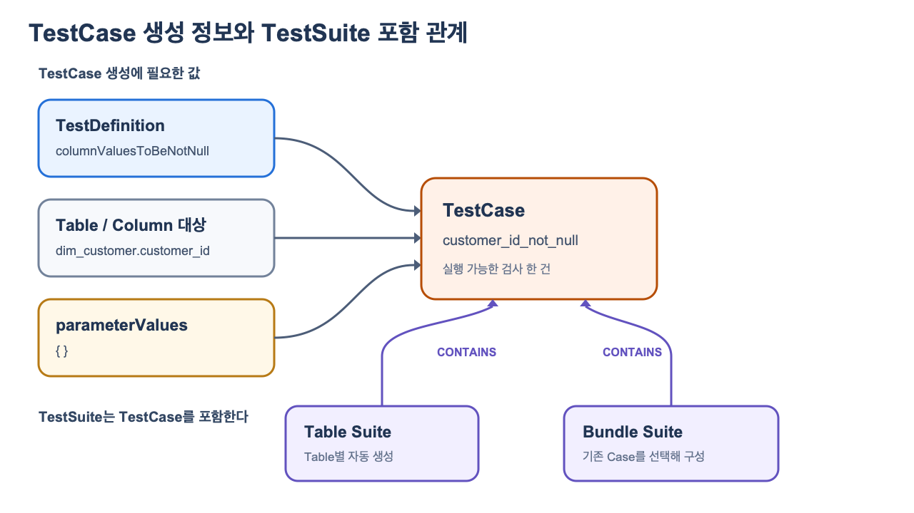
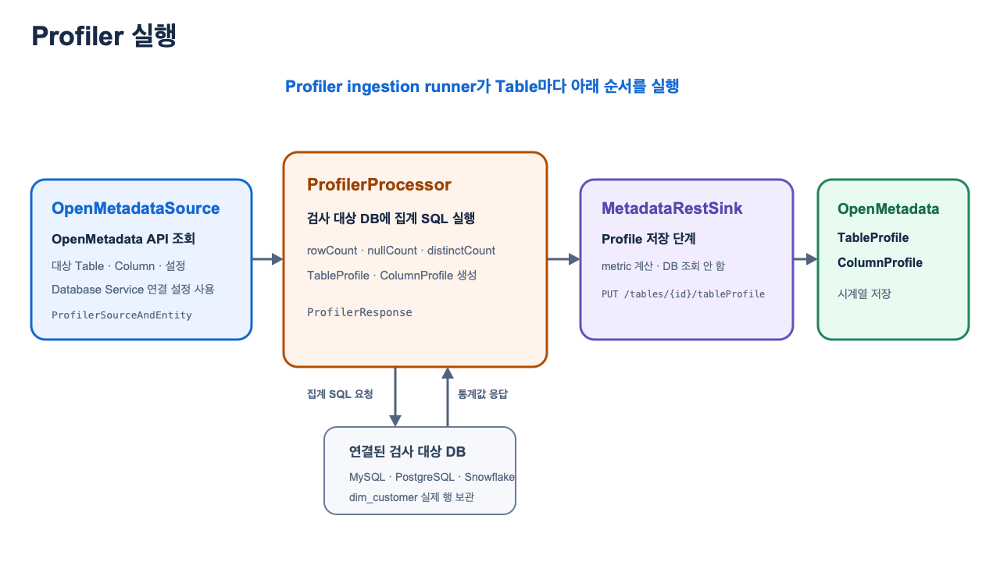
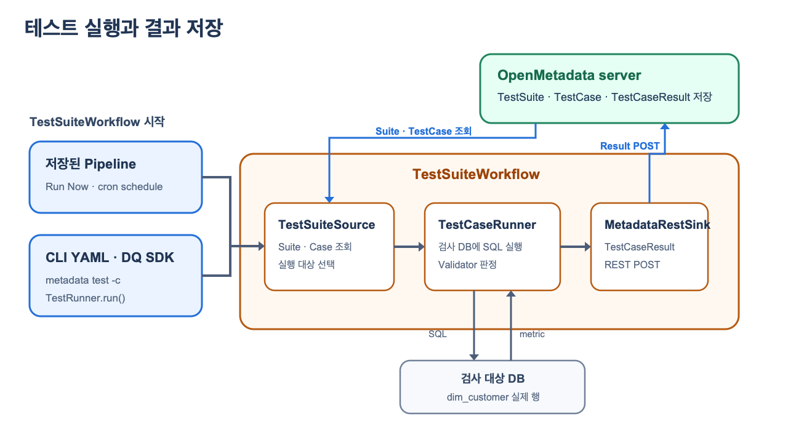
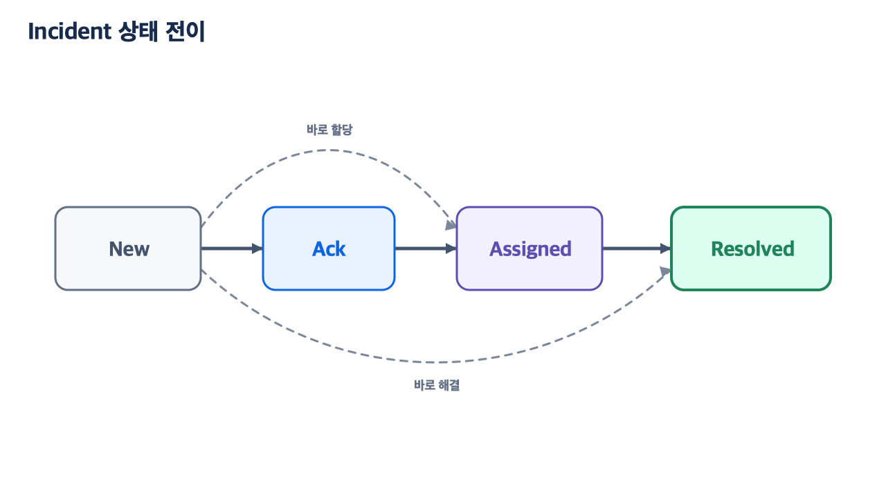
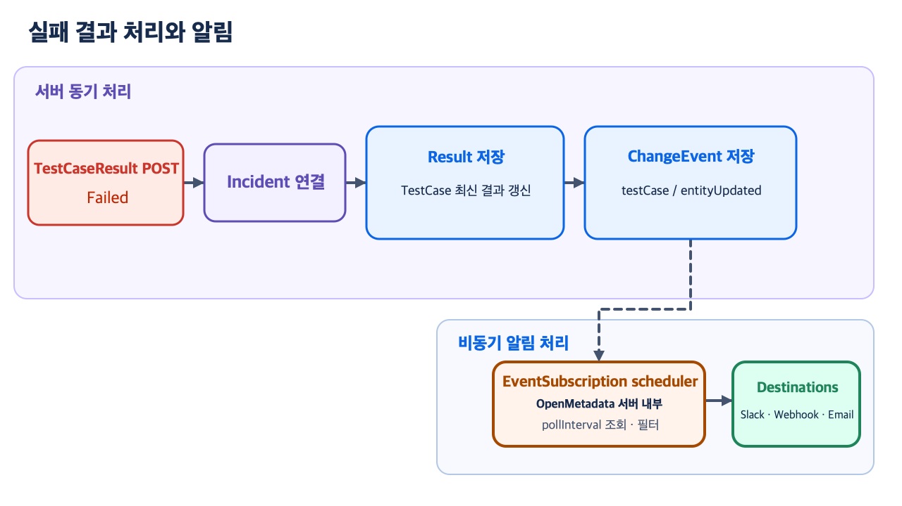

# Data Quality & Observability

이 문서는 품질 모델, Profiler와 샘플링, 테스트 실행과 결과, Incident, Alert를 설명한다. 예시는 하나의 Table과 Column으로 통일한다.

- Table: `sample_data.ecommerce_db.shopify.dim_customer`
- Column: `customer_id`
- TestCase: `customer_id_not_null`

**목차**

1. 품질 프레임워크
2. Profiler & Data Profile
3. 테스트 실행 & 결과
4. Incident Manager
5. Alert & Notification

이 범위의 실행 주체는 세 가지다.

- **OpenMetadata server**: TestSuite·TestCase 메타데이터, Profile·Result·Incident, ChangeEvent와 Alert 설정을 저장한다.
- **Python 실행 프로세스**: Profiler 또는 TestSuite workflow를 실행한다. UI·스케줄은 배포된 pipeline runner가, CLI·SDK는 호출한 Python 프로세스가 시작한다.
- **검사 대상 DB(Source database)**: `dim_customer`의 실제 행이 들어 있는 MySQL·PostgreSQL·Snowflake 같은 업무 DB다. Python 실행 프로세스가 Database Service의 연결 설정으로 이 DB에 `COUNT(*)`, `IS NULL`, `COUNT(DISTINCT ...)` 등을 포함한 집계 SQL을 보내고 결과 숫자를 받는다. TestSuite·TestCase·Profile은 이 DB가 아니라 OpenMetadata server에 저장된다.

---

## 1. 품질 프레임워크

> **담당 화면**: Test Library · Data Quality → Test Cases · Data Quality → Test Suites
>
> **경로**: `/test-library` · `/data-quality/test-cases` · `/data-quality/test-suites`

`TestDefinition + 검사 대상 + parameterValues`로 `TestCase`를 만들고, `TestSuite`는 만들어진 TestCase를 포함한다. `TestDefinition → TestSuite → TestCase`는 생성 순서가 아니다. 실제로 TestCase가 TestDefinition을 참조하고, TestSuite가 TestCase를 포함한다.



- `TestDefinition`: 재사용할 판정 로직과 파라미터 형식. 예: `columnValuesToBeNotNull`
- `TestCase`: Definition, 대상, 기준값을 결합한 실행 가능한 검사 한 건. 예: `customer_id_not_null`
- `TestSuite`: 관련 TestCase를 포함하는 OpenMetadata 엔터티

### TestDefinition과 Test Library

기본 제공 TestDefinition은 25개이며 Table 9개, Column 16개로 나뉜다.

| 적용 수준 | 대표 Definition |
|---|---|
| `TABLE` | `tableRowCountToBeBetween`, `tableCustomSQLQuery`, `tableDiff` |
| `COLUMN` | `columnValuesToBeNotNull`, `columnValuesToBeUnique`, `columnValuesToMatchRegex` |

**Test Library는 TestDefinition 목록 화면**이다. Definition은 검사 템플릿이며, 검사 대상과 파라미터를 지정해 TestCase를 만들어야 실제 검사 단위가 된다.

### TestCase 생성·등록

UI에서는 **Data Quality → Test Cases → Add Test Case** 또는 Table의 **Data Observability → Data Quality → Add Test**에서 TestCase를 만든다.

| 입력값 | 예시 |
|---|---|
| Test Definition | `columnValuesToBeNotNull` |
| 검사 대상 | `dim_customer.customer_id` |
| TestCase 이름 | `customer_id_not_null` |
| parameterValues | 이 Definition은 별도 기준값 없음 |

Submit하면 브라우저가 TestCase 생성 요청을 Server에 보낸다. 이 요청은 메타데이터를 등록하며 검사 대상 DB에 SQL을 실행하지 않는다.

#### UI Add Test Case → REST POST

소스:

- `openmetadata-ui/src/main/resources/ui/src/components/DataQuality/AddDataQualityTest/components/TestCaseFormV1.tsx:824-830`
- `openmetadata-ui/src/main/resources/ui/src/rest/index.ts:17-21`
- `openmetadata-ui/src/main/resources/ui/src/rest/testAPI.ts:138, 184-190`

```typescript
// [1] Form 값을 name, testDefinition, entityLink, parameterValues로 변환한다.
const testCaseObj = createTestCaseObj(values);

// [2] createTestCase()가 Server의 생성 API를 호출한다.
const createdTestCase = await createTestCase(testCaseObj);

const testCaseUrl = '/dataQuality/testCases';
const response = await APIClient.post<CreateTestCase, AxiosResponse<TestCase>>(
  testCaseUrl,
  data
);
```

`APIClient`의 base URL이 `/api/v1`이므로 실제 endpoint는 `POST /api/v1/dataQuality/testCases`다.

#### Python CRUD SDK → REST PUT

UI를 사용하지 않고 TestCase 메타데이터를 먼저 등록할 수도 있다. 다음은 SDK import와 `configure(...)`를 마친 뒤의 핵심 호출이다.

소스:

- `ingestion/src/metadata/sdk/entities/testcases.py:6-16`
- `ingestion/src/metadata/sdk/entities/base.py:144-148`
- `ingestion/src/metadata/ingestion/ometa/ometa_api.py:521-538`

```python
TestCases.create(CreateTestCaseRequest(
    name="customer_id_not_null",
    testDefinition=FullyQualifiedEntityName("columnValuesToBeNotNull"),
    entityLink=EntityLink(
        "<#E::table::sample_data.ecommerce_db.shopify.dim_customer::columns::customer_id>"
    ),
))  # create_or_update()가 PUT으로 등록하며 Test SQL은 실행하지 않는다.
```

UI POST와 CRUD SDK PUT 모두 Server에서 Definition·파라미터·대상을 검증하고 TestCase를 저장한다.

### Table Suite와 Bundle Suite

| UI 명칭 | 생성 방식 | TestCase 포함 방식 |
|---|---|---|
| `Table Suite` (`basic=true`) | Table의 첫 TestCase를 만들 때 Server가 자동 생성 | 해당 Table의 Table·Column TestCase가 자동으로 속함 |
| `Bundle Suite` (`basic=false`) | Data Quality → Test Suites → **Add Bundle Suite**에서 사용자가 생성 | 하나 또는 여러 Table의 기존 TestCase를 선택해 추가 |

`sample_data.ecommerce_db.shopify.dim_customer.testSuite`는 DB 객체가 아니라 OpenMetadata 엔터티다. Table Suite의 FQN을 `<Table FQN>.testSuite`로 만들기 때문에 Table 이름처럼 보인다. TestCase는 Table Suite 하나에 기본 소속되고, 필요한 Bundle Suite에 추가로 속할 수 있다.

### 실제 코드: TestCase → Table Suite 관계 저장

소스:

- `openmetadata-service/src/main/java/org/openmetadata/service/jdbi3/TestCaseRepository.java:686-697`
- `openmetadata-service/src/main/java/org/openmetadata/service/jdbi3/TestCaseRepository.java:710-724`
- `openmetadata-service/src/main/java/org/openmetadata/service/jdbi3/TestCaseRepository.java:939-951`

```java
// [1] 요청의 parameterValues가 TestDefinition 형식과 맞는지 먼저 검증한다.
validateTestParameters(
    test.getParameterValues(),
    testDefinition.getParameterDefinition(),
    testDefinition.getTestPlatforms(),
    testDefinition);

// [2] 이 helper가 대상 Table의 Table Suite를 반환하며, 없으면 생성한다.
var testSuite = getOrCreateTestSuite(test, table);
test.setTestSuite(testSuite);

// [3] 실제 관계 방향은 TestSuite --CONTAINS--> TestCase다.
addRelationship(
    test.getTestSuite().getId(), test.getId(), TEST_SUITE, TEST_CASE, Relationship.CONTAINS);

// [4] 선택한 TestDefinition ID와 새 TestCase ID의 연결도 저장한다.
addRelationship(
    test.getTestDefinition().getId(), test.getId(),
    TEST_DEFINITION, TEST_CASE, Relationship.CONTAINS);
```

여기서 `TestDefinition → TestCase 관계 저장`은 UI에 새 트리를 만든다는 뜻이 아니다. OpenMetadata 내부 관계 테이블에 두 엔터티의 ID를 연결해 두는 것이다. TestCase API에 `fields=testDefinition`을 요청하면 이 관계를 다시 읽어 `testDefinition` 필드로 돌려주며, UI는 이를 **Test Type** 또는 `columnValuesToBeNotNull` 같은 Definition 이름으로 표시한다.

> **주의**: 위 코드는 TestCase를 만들 때 Table Suite에 자동 연결하는 경로다. 검증이 실패하면 TestCase와 Table Suite 모두 생성되지 않는다.

### 실제 코드: Bundle Suite 생성 → 기존 TestCase 추가

소스:

- `openmetadata-ui/src/main/resources/ui/src/components/DataQuality/BundleSuiteForm/BundleSuiteForm.tsx:280-295`
- `openmetadata-ui/src/main/resources/ui/src/rest/testAPI.ts:139, 389-395`
- `openmetadata-ui/src/main/resources/ui/src/rest/testAPI.ts:228-246`
- `openmetadata-service/src/main/java/org/openmetadata/service/jdbi3/TestCaseRepository.java:1091-1111`

```typescript
// [1] UI가 Bundle Suite를 먼저 생성한다.
const testSuite = await createTestSuites(testSuitePayload);

// [2] 이어서 화면에서 선택한 기존 TestCase들을 생성된 Suite에 추가한다.
await addTestCasesToLogicalTestSuiteBulk(testSuite.id ?? '', {
  selectAll: testCaseSelectionPayload.selectAll,
  includeIds: testCaseSelectionPayload.includeIds,
  excludeIds: testCaseSelectionPayload.excludeIds,
});

// createTestSuites() 내부: POST /api/v1/dataQuality/testSuites
const response = await APIClient.post<CreateTestSuite, AxiosResponse<TestSuite>>(
  testSuiteUrl,
  data
);
```

```java
// [3] Server는 기존 TestCase와 Bundle Suite의 CONTAINS 관계를 추가한다.
bulkAddToRelationship(
    testSuite.getId(), testCaseIds,
    TEST_SUITE, TEST_CASE, Relationship.CONTAINS);
```

`addTestCasesToLogicalTestSuiteBulk()`는 `PUT /api/v1/dataQuality/testCases/logicalTestCases/bulk`를 호출한다. UI의 Bundle Suite를 백엔드 API에서는 `logical test suite`라고 부르므로 경로에 `logicalTestCases`가 사용된다. Bundle Suite에 추가해도 TestCase의 기본 Table Suite는 그대로 유지되며, 같은 TestCase가 여러 Bundle Suite에 들어갈 수 있다. Bundle에서 제거할 때도 TestCase 자체를 지우지 않고 이 `CONTAINS` 관계만 삭제한다.

---

## 2. Profiler & Data Profile

> **결과 화면**: Table → Data Observability → Table Profile / Column Profile
>
> **경로**: `/table/<Table FQN>/profiler/table-profile` · `/table/<Table FQN>/profiler/column-profile`
>
> **실행 관리**: Settings → Services → Databases → Service → Agents

Database Service 기준으로 `Profiler`는 검사 대상 DB에 SQL을 보내 Table과 Column의 숫자 요약값을 계산하고 그 결과를 OpenMetadata server에 저장하는 Python 작업이다. 여기서 `metric`은 `rowCount`, `nullCount`, `distinctCount`처럼 데이터 상태를 나타내는 숫자 한 항목을 뜻한다.

`workflow`라는 말은 이 작업을 `Source → Processor → Sink` 세 단계로 나누어 순서대로 실행한다는 뜻이다. `Table Profile`·`Column Profile` 화면은 저장된 결과를 조회할 뿐이며, 화면을 여는 동작 자체가 Profiler를 실행하지는 않는다.

`OpenMetadataSource`는 Python workflow의 컴포넌트이고, **검사 대상 DB(Source database)**는 실제 행이 저장된 외부 DB다. 이름에 `Source`가 함께 들어가지만 서로 다른 대상이다.



| 단계 | 실제로 하는 일 | 출력 또는 저장 결과 |
|---|---|---|
| `OpenMetadataSource` | OpenMetadata API에서 실행 대상 Table·Column·Profiler 설정을 조회하고, workflow에 준비된 Database Service 연결 설정으로 `ProfilerSource`를 구성 | `ProfilerSourceAndEntity`: 대상 Table과 검사 대상 DB에 접속할 객체 |
| `ProfilerProcessor` | Profiler runner를 만들고 `process()`를 호출한다. 내부 `ProfilerInterface`가 검사 대상 DB에 집계 SQL을 실행해 Profile 요청 객체를 만듦 | `ProfilerResponse`: Table 정보와 `CreateTableProfileRequest` |
| `MetadataRestSink` | Processor가 만든 Profile을 OpenMetadata REST API에 PUT | Profile 저장 완료. 갱신된 `Table`을 반환하며 workflow 종료 |

`Sink`는 workflow의 **마지막 저장 단계**를 뜻한다. `MetadataRestSink`는 metric을 계산하지 않고, 앞 단계가 만든 결과를 받아 `PUT /api/v1/tables/{tableId}/tableProfile`로 저장한다. 이름에 `Metadata`가 붙은 이유는 저장 대상이 검사 대상 DB가 아니라 OpenMetadata server이기 때문이다.

### metric을 계산할 때 DB에서 일어나는 일

아래 SQL은 동작을 단순화한 개념형이다. `rowCount`는 전체 Table을 대상으로 한다. Column metric의 `<profile 대상 범위>`는 샘플링 미설정 시 전체 Table, 설정 시 Profiler 설정으로 선택한 샘플 범위다. 실제 쿼리는 DB 종류에 따라 합쳐지거나 달라질 수 있다.

| metric | 개념 SQL | 반환값 예시 |
|---|---|---|
| `rowCount` | `SELECT COUNT(*) FROM dim_customer` | `12430` |
| `nullCount` | `SELECT COUNT(*) FROM <profile 대상 범위> WHERE customer_id IS NULL` | `3` |
| `distinctCount` | `SELECT COUNT(DISTINCT customer_id) FROM <profile 대상 범위>` | `12427` |

### 실제 코드: Source → Processor → Sink

소스:

- `ingestion/src/metadata/workflow/profiler.py:67-75`
- `ingestion/src/metadata/profiler/source/fetcher/fetcher_strategy.py:320-339`
- `ingestion/src/metadata/profiler/processor/processor.py:75-103`
- `ingestion/src/metadata/workflow/ingestion.py:169-176`
- `ingestion/src/metadata/ingestion/sink/metadata_rest.py:990-1002`
- `ingestion/src/metadata/ingestion/ometa/mixins/table_mixin.py:376-389`

```python
# [1] workflow는 Processor 다음에 Sink가 실행되도록 순서를 정한다.
self.steps = (profiler_processor, sink)

# [2] Source 내부 EntityFetcher가 Table마다 작업 단위를 만든다.
yield Either(
    right=ProfilerSourceAndEntity(
        profiler_source=profiler_source,  # 검사 대상 DB용 Profiler를 만들 객체
        entity=table,                     # 이번에 처리할 Table
    ),
)

# [3] Processor가 그 record를 받아 검사 대상 DB에서 metric을 계산한다.
profiler_runner = record.profiler_source.get_profiler_runner(
    record.entity, self.profiler_config)
profile = profiler_runner.process()
return Either(right=profile)  # ProfilerResponse를 반환

# [4] 공통 loop가 Source 결과를 받아 Processor → Sink 순서로 전달한다.
processed_record = record
for step in self.steps:
    # 앞 단계가 결과를 만들지 못했다면 다음 단계는 호출하지 않는다.
    if processed_record is not None and isinstance(step, (Processor, Stage, Sink)):
        processed_record = step.run(processed_record)

# [5] Sink가 ProfilerResponse의 Table과 Profile을 OpenMetadata API에 저장한다.
table = self.metadata.ingest_profile_data(
    table=record.table,
    profile_request=record.profile,
)

# [6] ingest_profile_data()가 실제 Profile endpoint를 호출한다.
resp = self.client.put(
    f"{self.get_suffix(Table)}/{table.id.root}/tableProfile",
    data=profile_request.model_dump_json(),
)
return Table(**resp)
```

> **코드 읽는 법**: `Either(right=...)`의 `right`는 정상 결과를 담아 공통 workflow에 넘기는 값이다. 실제 `dim_customer` 행은 검사 대상 DB에 그대로 있고, Processor 내부 Profiler runner가 그 DB에 집계 SQL을 보낸다. 정상 경로는 `ProfilerSourceAndEntity → ProfilerResponse → REST 저장`이다. 해당 Table을 처리하다 오류가 발생해 앞 단계가 정상 결과를 만들지 못하면 `processed_record`가 `None`이므로 다음 `MetadataRestSink`를 호출하지 않는다.

### 저장되는 Profile

주요 저장값은 다음과 같다.

- `TableProfile.rowCount`: Table 전체 행 수
- `ColumnProfile.nullCount`, `nullProportion`: NULL 개수와 비율
- `ColumnProfile.distinctCount`: 서로 다른 값의 수

### 프로파일링 범위를 정하는 `profileSampleConfig`

`profileSampleConfig`는 Profiler가 Column metric을 계산할 때 읽을 행 범위를 정하는 설정이다. 행 데이터를 저장하는 필드가 아니라 Processor가 실행할 쿼리 범위에 적용된다.

다음은 workflow 설정의 필요한 부분만 남긴 예시다.

```yaml
sourceConfig:
  config:
    type: Profiler
    profileSampleConfig:
      sampleConfigType: STATIC       # [1] 고정 크기 사용
      config:
        profileSample: 10            # [2] 크기 10
        profileSampleType: PERCENTAGE # [3] 전체 행의 10%로 해석
```

- `STATIC`: `PERCENTAGE` 또는 `ROWS`로 고정 범위를 사용한다.
- `DYNAMIC`: Table 행 수에 따라 샘플 크기를 자동으로 선택하며, 필요하면 `rowCountThreshold`별 크기를 지정한다.
- 적용 순서: Table 설정을 먼저 사용하고, 없으면 Schema → Database → workflow 기본 설정 순서로 확인한다.

> **주의**: 샘플링해도 `TableProfile.rowCount`는 전체 Table에서 계산한다. `ColumnProfile.nullCount`, `distinctCount`는 선택된 샘플 범위를 기준으로 해석한다.

---

## 3. 테스트 실행 & 결과

> **담당 화면**: Table → Data Observability → Data Quality · Data Quality → Test Cases
>
> **경로**: `/table/<Table FQN>/profiler/data-quality` · `/data-quality/test-cases`

`TestSuiteWorkflow`는 실행할 TestCase를 조회하고, 검사 대상 DB에서 SQL을 실행한 뒤, `TestCaseResult`를 OpenMetadata server에 저장하는 Python workflow다.



TestSuiteWorkflow는 두 경로로 시작할 수 있다.

| 시작 방법 | 누가 시작하는가 | 설정은 어디에 있는가 |
|---|---|---|
| `Pipeline runner` | UI의 **Run Now** 또는 저장된 cron schedule | OpenMetadata server에 등록된 TestSuite pipeline |
| `CLI YAML` / `TestRunner.run()` | 터미널 명령을 실행한 사용자 또는 Python 애플리케이션 | YAML 파일 또는 Python 코드 |

두 시작 경로는 아래의 같은 Source → Processor → Sink 단계를 사용한다.

| 컴포넌트 | 실제 역할 |
|---|---|
| `TestSuiteSource` | Server의 Suite에서 실행할 TestCase와 대상 Table을 조회하고 Database Service 연결 설정을 준비 |
| `TestCaseRunner` | 검사 대상 DB에 Test SQL을 실행하고 Validator로 상태를 판정 |
| `MetadataRestSink` | 판정이 끝난 `TestCaseResult`를 OpenMetadata REST API에 POST하여 저장 |

### Run Now와 예약 실행

일정은 TestCase나 TestSuite 엔터티가 아니라 **TestSuite 타입 Ingestion Pipeline**에 저장된다. UI의 **Run Now**는 이 pipeline을 즉시 시작하고, cron schedule은 `airflowConfig.scheduleInterval` 시각에 시작한다.

`TestSuiteSource`는 기본적으로 Suite의 TestCase 전체를 조회한다. `source.sourceConfig.config.testCases`는 그중 이번 pipeline에서 실행할 TestCase 이름만 고르는 선택 필터다.

| Pipeline의 TestCase 선택 | 실행 범위 |
|---|---|
| `testCases` 미지정 | 실행 시점에 Suite에 속한 모든 TestCase |
| `testCases: [customer_id_not_null]` | 이름 목록에 적힌 TestCase만 실행 |

```yaml
source:
  sourceConfig:
    config:
      type: TestSuite
      entityFullyQualifiedName: sample_data.ecommerce_db.shopify.dim_customer
      testCases: [customer_id_not_null] # 선택 필터. 생략하면 Suite 전체
```

UI에서 TestCase 하나에 설정한 일정도 내부적으로는 이 이름 필터를 가진 TestSuite pipeline이다.

### CLI YAML로 workflow 시작

CLI YAML은 Server에 저장된 TestCase를 실행할 수 있고, `processor.config.testCases`에 실행할 TestCase 정의를 직접 작성할 수도 있다. Processor는 Source가 조회한 목록에 같은 이름이 없으면 이 정의를 Server에 create-or-update로 반영하고 같은 workflow의 실행 목록에 포함한다.

아래는 설정에 직접 작성한 TestCase 한 건을 실행하는 데 필요한 핵심 필드다.

```yaml
source:
  sourceConfig:
    config:
      type: TestSuite
      entityFullyQualifiedName: sample_data.ecommerce_db.shopify.dim_customer

processor:
  type: orm-test-runner
  config:
    forceUpdate: false
    testCases:
      # [1] workflow 설정에 직접 작성한 TestCase 정의
      - name: customer_id_not_null
        testDefinitionName: columnValuesToBeNotNull
        columnName: customer_id
        computePassedFailedRowCount: true
```

생략한 `source.type`, `source.serviceName`, `sink.config`, 서버 주소와 인증까지 포함한 완전한 파일은 `metadata test -c test-suite.yaml`로 실행한다.

### 실제 코드: 설정의 TestCase 정의 → Server 반영·실행 목록 추가

소스: `ingestion/src/metadata/data_quality/processor/test_case_runner.py:155-202`의 핵심 발췌

```python
# [1] Source가 조회한 실행 목록에 같은 이름이 없는 설정 정의를 고른다.
test_cases_to_create = [
    cli_test_case_definition for cli_test_case_definition in cli_test_cases_definitions
    if cli_test_case_definition.name not in test_case_names
]

for test_case_to_create in test_cases_to_create:
    # [2] Definition·대상·파라미터를 PUT create-or-update로 Server에 반영한다.
    test_case = self.metadata.create_or_update(
        CreateTestCaseRequest(
            name=test_case_to_create.name,
            testDefinition=FullyQualifiedEntityName(test_case_to_create.testDefinitionName),
            entityLink=EntityLink(entity_link.get_entity_link(...)),
            parameterValues=(
                list(test_case_to_create.parameterValues)
                if test_case_to_create.parameterValues else None
            ),
            computePassedFailedRowCount=test_case_to_create.computePassedFailedRowCount,
            # ... description, displayName, owners 생략
        )
    )
    test_cases.append(test_case)  # [3] 반환된 Case를 이번 실행 목록에 병합한다.
```

Source가 조회한 실행 목록에 같은 이름의 Case가 있으면 `forceUpdate: false`에서 기존 설정을 유지한다. `true`일 때도 갱신 범위는 `entityLink`, 비어 있지 않은 `parameterValues`, `computePassedFailedRowCount`이며 이름·Definition·설명은 바꾸지 않는다.

### DQ SDK로 같은 workflow 시작

참고 위치:

- `ingestion/src/metadata/sdk/examples/dq_as_code_example.py:19-60`
- `ingestion/src/metadata/sdk/data_quality/runner.py:240-258`
- `ingestion/src/metadata/sdk/data_quality/workflow_config_builder.py:83-90, 191-194`

```python
from metadata.sdk.data_quality import ColumnValuesToBeNotNull, TestRunner

runner = TestRunner.for_table("sample_data.ecommerce_db.shopify.dim_customer")
runner.add_test(
    ColumnValuesToBeNotNull(column="customer_id")
    .with_name("customer_id_not_null")
    .with_compute_row_count(True)
)
results = runner.run()  # [1] TestCase 정의 반영 → SQL 실행 → 결과 반환
```

`TestRunner.add_test()`가 Python 코드의 TestCase 정의를 workflow 설정에 넣고, `run()`이 TestSuiteWorkflow를 시작한다. 기본값에서는 같은 이름의 기존 Case도 제한된 필드를 갱신하며, 이를 끄려면 `add_test()` 전에 `runner.setup(force_test_update=False)`를 호출한다.

시작 경로와 관계없이 `TestCaseRunner`는 각 TestDefinition에 연결된 통과·실패 판정 코드인 Validator를 실행한다.

### 실제 코드: Runner → REST Sink → Result POST

소스:

- `ingestion/src/metadata/workflow/data_quality.py:42-48`
- `ingestion/src/metadata/data_quality/processor/test_case_runner.py:101-107`
- `ingestion/src/metadata/ingestion/sink/metadata_rest.py:1019-1027`
- `ingestion/src/metadata/ingestion/ometa/mixins/tests_mixin.py:78-81`

```python
# [1] Workflow가 Processor 다음에 Sink가 오도록 순서를 정한다.
self.steps = (test_runner_processor, sink)

# [2] Processor가 각 Case의 SQL·판정을 실행해 Result 목록을 반환한다.
test_results = [
    test_case_result for test_case in openmetadata_test_cases
    if (test_case_result := self._run_test_case(test_case, test_suite_runner))
]
return Either(right=TestCaseResults(test_results=test_results))

# [3] 다음 단계인 MetadataRestSink가 각 Result와 TestCase FQN을 받는다.
for result in record.test_results or []:
    self.metadata.add_test_case_results(
        test_results=result.testCaseResult,
        test_case_fqn=result.testCase.fullyQualifiedName.root,
    )

# [4] 마지막으로 Server의 해당 TestCase 결과 endpoint에 POST한다.
self.client.post(
    f"{self.get_suffix(TestCaseResult)}/{quote(test_case_fqn)}",
    test_results.model_dump_json(),
)
```

> **주의**: TestCase 정의는 OpenMetadata server에 있지만, 실제 SQL은 Python Runner가 `dim_customer` 행이 있는 검사 대상 DB에 보낸다. `MetadataRestSink`는 SQL을 실행하지 않고 판정이 끝난 Result만 Server에 저장한다.

### 판정 코드

`columnValuesToBeNotNull` TestDefinition은 등록·실행 경로와 관계없이 같은 Validator로 판정된다.

소스: `ingestion/src/metadata/data_quality/validations/column/base/columnValuesToBeNotNull.py:129-141`

```python
null_count = metric_values[Metrics.nullCount.name]     # [1] SQL로 계산된 NULL 수
total_rows = metric_values.get(Metrics.rowCount.name) # [2] 실제 실행 범위의 행 수

matched = null_count == 0                             # [3] Definition의 통과 조건
failed_count = null_count
passed_count = total_rows - null_count if total_rows else 0

return {
    "matched": matched,
    "passed_rows": passed_count,
    "failed_rows": failed_count,
    "total_rows": total_rows,
}
```

`matched=True`이면 `Success`, `False`이면 `Failed`다. 쿼리는 정상 실행됐지만 조건이 거짓인 상태가 `Failed`이고, 쿼리나 metric 계산을 끝내지 못한 상태가 `Aborted`다. `Queued`는 실행 대기 상태다.

### TestCaseResult 읽기

`TestCaseResult`는 TestCase 한 번의 실행 상태와 판정에 사용한 값을 저장한다. 다음은 이번 실행에서 처리한 1,243행 중 NULL이 3개인 예시다.

```yaml
timestamp: 1763078400000       # [1] 실행 시각, epoch milliseconds
testCaseStatus: Failed         # [2] 실행 완료, 판정 조건은 거짓
result: "Found nullCount=3. It should be 0"
testResultValue:
  - name: nullCount            # [3] 판정에 사용한 metric
    value: "3"
passedRows: 1240               # [4] 실행 범위에서 통과한 행
failedRows: 3                  # [5] 실행 범위에서 실패한 행
passedRowsPercentage: 99.76
failedRowsPercentage: 0.24
```

`passedRows`와 `failedRows`는 `computePassedFailedRowCount: true`이고 해당 Definition이 지원할 때만 채워진다. 샘플링했다면 행 수와 비율의 분모는 전체 Table이 아니라 실행한 샘플 범위다.

### 실패 행을 확인하는 `failedRowsSample`

지원하는 Validator가 `Failed`를 반환하면 원인 확인용 실패 행을 최대 50개까지 OpenMetadata server에 저장할 수 있다. `failedRowsSample`은 실패 원인을 확인하기 위한 데이터이며, `Success / Failed` 판정 기준으로 사용되지는 않는다.

---

## 4. Incident Manager

> **담당 화면**: Incident Manager · Table → Data Observability → Incidents
>
> **경로**: `/incident-manager` · `/table/<Table FQN>/profiler/incidents`

Incident는 실패 상태와 해결 이력을 관리한다. 최초 `New`에서는 담당 Task가 없고, 사용자가 `Ack`하거나 담당자를 `Assigned`할 때 해결 Task가 생성된다. Python Runner가 Incident를 만드는 것이 아니라, OpenMetadata server가 **결과 POST 요청을 저장하는 중에 동기적으로** 연결한다.



### 실제 코드 1: MetadataRestSink → Result POST

Incident 생성은 `MetadataRestSink`가 `TestCaseResult`를 Server에 POST하는 요청에서 시작된다.

소스:

- `ingestion/src/metadata/ingestion/sink/metadata_rest.py:1019-1027`
- `ingestion/src/metadata/ingestion/ometa/mixins/tests_mixin.py:64-81`

```python
# [1] Sink가 Runner 결과에서 body와 URL에 넣을 TestCase FQN을 꺼낸다.
for result in record.test_results or []:
    self.metadata.add_test_case_results(
        test_results=result.testCaseResult,                    # POST body
        test_case_fqn=result.testCase.fullyQualifiedName.root, # URL의 {fqn}
    )

# [2] OMetaTestsMixin.add_test_case_results()가 실제 Server endpoint로 POST한다.
self.client.post(
    f"{self.get_suffix(TestCaseResult)}/{quote(test_case_fqn)}",
    test_results.model_dump_json(),
)
```

실제 요청은 `POST /api/v1/dataQuality/testCases/testCaseResults/{testCaseFQN}`이다. Server의 `TestCaseResultResource.addTestCaseResult()`가 요청을 받은 뒤 아래 `TestCaseResultRepository.addTestCaseResult()`에 위임하고, Repository가 같은 HTTP 요청 안에서 Incident 연결과 Result 저장을 처리한다.

### 실제 코드 2: Result POST → Incident → 시계열 저장

소스:

- `openmetadata-service/src/main/java/org/openmetadata/service/resources/dqtests/TestCaseResultResource.java:90-135`
- `openmetadata-service/src/main/java/org/openmetadata/service/jdbi3/TestCaseResultRepository.java:86-112`
- `openmetadata-service/src/main/java/org/openmetadata/service/jdbi3/TestCaseResultRepository.java:220-228`
- `openmetadata-service/src/main/java/org/openmetadata/service/jdbi3/TestCaseResolutionStatusRepository.java:507-542`

```java
TestCase testCase = Entity.getEntityByName(TEST_CASE, fqn, "", Include.ALL);

// [1] Result를 insert하기 전에 Incident ID를 동기적으로 결정한다.
setTestCaseResultIncidentId(testCaseResult, testCase, updatedBy);

// ... dimension result 처리 생략

// [2] helper가 넣은 incidentId를 TestCaseResult와 함께 시계열 저장한다.
((CollectionDAO.TestCaseResultTimeSeriesDAO) timeSeriesDao)
    .insert(
        testCase.getFullyQualifiedName(), TESTCASE_RESULT_EXTENSION,
        TEST_CASE_RESULT_FIELD, JsonUtils.pojoToJson(testCaseResult),
        testCaseResult.getIncidentId());
```

호출된 `setTestCaseResultIncidentId()` 내부는 다음과 같다.

```java
// helper 내부: Failed면 미해결 Incident를 재사용하고, 없으면 New를 만든다.
if (TestCaseStatus.Failed.equals(testCaseResult.getTestCaseStatus())) {
  UUID incidentStateId =
      TestCaseResolutionStatusRepository.getOrCreateIncident(testCase, updatedBy);
  testCaseResult.setIncidentId(incidentStateId);
} else {
  testCaseResult.setIncidentId(null);
}
```

`getOrCreateIncident()`는 같은 TestCase의 미해결 Incident ID가 있으면 반환하고, 없거나 이미 `Resolved`면 `New` 상태를 만든다. `Success`, `Aborted`, `Queued` 결과에는 새 Incident ID를 넣지 않는다.

### Incident 상태와 담당자

| 상태 | 변경 주체 | 동작 |
|---|---|---|
| `New` | Server | 담당자 없이 Incident 시작 |
| `Ack` | `EditTests` 또는 `EditAll` 권한 사용자 | 누른 사용자를 해결 Task 담당자로 연결 |
| `Assigned` | `EditTests` 또는 `EditAll` 권한 사용자 | 선택한 User에게 해결 Task 할당 |
| `Resolved` | `EditTests` 또는 `EditAll` 권한 사용자 | Incident 완료 |

정상 UI 흐름에서 `New` Incident는 실패 결과 저장 시 자동 생성되며 사용자가 별도로 만드는 단계는 없다. 이후 상태 변경과 담당자 지정은 대상 Table 또는 TestCase에 대해 `EditTests`나 `EditAll` 중 하나의 권한이 있는 사용자가 수행할 수 있다.

> **주의**: 같은 TestCase의 미해결 Incident가 있으면 재실패해도 같은 ID를 사용한다. 다음 실행이 `Success`여도 기존 Incident는 자동으로 `Resolved`되지 않는다.

---

## 5. Alert & Notification

> **담당 화면**: Observability → Alerts
>
> **경로**: `/observability/alerts`

`Alert`, `ChangeEvent`, `Notification`은 서로 다른 것이다.

| 용어 | 생성 시점 | 역할 |
|---|---|---|
| `Alert` / `EventSubscription` | 사용자가 Alert UI에서 미리 한 번 등록 | 어떤 이벤트를 어떤 조건으로 검사해 누구에게 보낼지 저장한 규칙 |
| `ChangeEvent` | TestCaseResult 저장이나 Incident 해결 Task 변경이 발생할 때 Server가 생성 | “무슨 일이 발생했는가”를 기록한 이벤트 |
| `Notification` | ChangeEvent가 기존 Alert 조건을 통과할 때 | Email·Slack·Webhook·인앱으로 실제 전송되는 메시지 |

테스트 결과 알림은 다음 순서로 동작한다.

1. 사용자가 `Source=Test Case`, `Result=Failed`, Destination을 가진 Alert를 미리 등록한다.
2. `Failed TestCaseResult`가 저장되면 Server가 `testCase / entityUpdated / testCaseResult` ChangeEvent를 만든다.
3. EventSubscription job이 이 이벤트를 읽어 기존 Alert의 Source·Result 조건과 비교한다.
4. 조건이 맞을 때만 설정된 Destination으로 Notification을 전송한다.

따라서 Incident가 생성되거나 해결될 때 새 Alert 규칙이 자동으로 생기는 것은 아니다. 실패 결과와 Incident 생성은 같은 Result POST 요청에서 일어나지만, **TestCase 결과 Alert는 Failed Result의 ChangeEvent를 감시**한다.

`Ack`·`Assigned`에서는 해결 Task의 ChangeEvent 저장과 담당자 WebSocket 인앱 알림 전송이 별도로 일어난다. Incident Task를 Email·Slack 같은 외부 채널로 보내려면 **Settings → Notifications** (`/settings/notifications/alerts`)에서 그 이벤트를 대상으로 한 별도 EventSubscription을 설정해야 한다.

`Resolved`는 Incident 처리 상태 변경일 뿐 `Success TestCaseResult`가 아니다. 따라서 해결 동작만으로 TestCase 결과 Alert의 `Success` 조건이 실행되지는 않는다.



그림에서 `Incident 연결`은 같은 POST 안의 동기 처리이고, 실제 알림 경로는 `Result 저장 → ChangeEvent 저장 → EventSubscription scheduler`다.

### 실제 코드 1: TestCaseResult → TestCase ChangeEvent

소스: `openmetadata-service/src/main/java/org/openmetadata/service/formatter/util/FormatterUtil.java:317-358`의 핵심 발췌

```java
if (entityTimeSeries instanceof TestCaseResult) {
  // [1] POST로 저장한 Result를 testCase의 entityUpdated 이벤트로 표현한다.
  eventType = EventType.ENTITY_UPDATED;
  TestCaseResult testCaseResult =
      JsonUtils.readOrConvertValue(entityTimeSeries, TestCaseResult.class);
  TestCase testCase =
      Entity.getEntityByName(TEST_CASE, testCaseResult.getTestCaseFQN(), "*", Include.ALL);

  // ... 알림 템플릿용 inherited fields와 failedRowsSample 로딩 생략

  ChangeEvent changeEvent = getChangeEvent(
      updateBy, eventType, testCase.getEntityReference().getType(),
      testCase.withUpdatedAt(testCaseResult.getTimestamp()));

  // [2] Alert의 Result 조건이 읽을 변경 필드 이름은 testCaseResult다.
  return changeEvent.withChangeDescription(
      new ChangeDescription().withFieldsUpdated(
          List.of(new FieldChange().withName(TEST_CASE_RESULT)
              .withNewValue(testCase.getTestCaseResult()))))
      .withEntity(testCase)
      .withEntityFullyQualifiedName(testCase.getFullyQualifiedName());
}
```

### 실제 코드 2: ChangeEvent 저장 → 필터 → Destination

소스:

- `openmetadata-service/src/main/java/org/openmetadata/service/events/ChangeEventHandler.java:75-79`
- `openmetadata-service/src/main/java/org/openmetadata/service/apps/bundles/changeEvent/AbstractEventConsumer.java:231-264, 403-409`
- `openmetadata-service/src/main/java/org/openmetadata/service/events/scheduled/EventSubscriptionScheduler.java:249-255`

```java
// [1] ChangeEvent를 server의 change_event 테이블에 넣는다.
if (!changeEvent.getEventType().equals(EventType.ENTITY_NO_CHANGE)) {
  Entity.getCollectionDAO().changeEventDAO().insert(JsonUtils.pojoToJson(changeEvent));
}

// [2] AbstractEventConsumer.execute(): 자신의 offset 이후 이벤트를 조회한다.
ResultList<ChangeEvent> batch = pollEvents(offset, eventSubscription.getBatchSize());
eventsWithReceivers.putAll(createEventsWithReceivers(batch.getData()));
// ... batch 크기와 alert metrics 기록 생략
if (!eventsWithReceivers.isEmpty()) {
  publishEvents(eventsWithReceivers);
}

// [3] publishEvents(): 미리 저장된 Source·Result 조건에 맞는 이벤트만 남긴다.
Map<ChangeEvent, Set<UUID>> filteredEvents =
    getFilteredEvents(eventSubscription, events);

// ... 통과한 이벤트의 수신자 계산 생략

// [4] 설정된 Destination publisher가 실제 전송한다.
publisher.sendMessage(event, recipients);
```

결과 저장과 알림 발송은 한 HTTP 호출 안에서 끝나지 않는다. EventSubscription job이 설정된 `pollInterval`마다 ChangeEvent를 읽고 규칙을 평가한 뒤 비동기로 전송한다.

### Failed TestCase Alert 설정값

| 구분 | 실제 값 | 결정 위치 |
|---|---|---|
| Source | `Test Case` | Alert UI |
| Action | `Get Test Case Status Updates` | Alert UI |
| Result | `Failed` | Alert UI. `Success`, `Aborted`, `Queued`도 선택 가능 |
| Destination | Users, Teams, Owners, Followers, Admins 또는 외부 채널 | Alert UI |
| ChangeEvent | `entityType=testCase`, `eventType=entityUpdated` | Server 내부 |
| 변경 필드 | `testCaseResult` | Server 내부 |

Test 결과 상태 `Success / Failed / Aborted / Queued`와 Incident 처리 상태 `New / Ack / Assigned / Resolved`는 서로 다르다. 정상 완료 알림은 `Success`, 판정 실패 알림은 `Failed`, 실행 중단 알림은 `Aborted`를 선택한다.

### 누구에게 알리는가

| Destination | 수신 대상 |
|---|---|
| `Users`, `Teams` | Alert에 지정한 사용자 또는 팀 |
| `Owners`, `Followers` | 이벤트 대상 TestCase 또는 자산의 소유자·팔로워 |
| `Admins` | OpenMetadata admin 사용자 |
| External | 지정한 Email 주소, Slack·MS Teams·GChat 채널 또는 Webhook endpoint |

> **주의**: Alert 설정이 없거나 조건이 맞지 않으면 테스트가 실행돼도 알림은 전송되지 않는다. Incident의 `Ack`·`Assigned` 때 Task 담당자에게 가는 인앱 알림은 EventSubscription Alert와 별개다.
