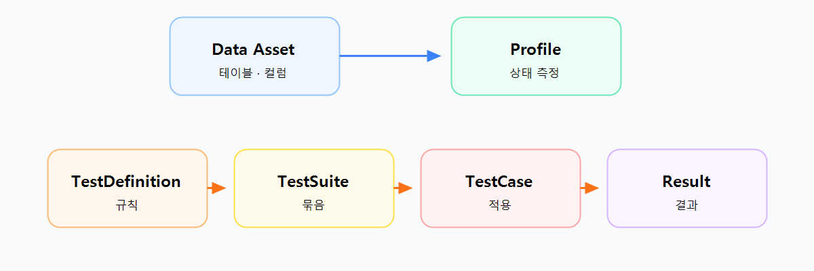
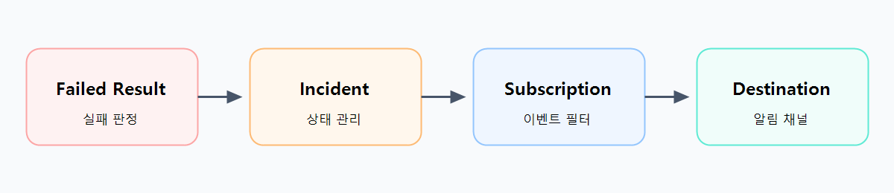

# Data Quality & Observability

OpenMetadata에서는 데이터 품질 정보를 한 종류의 결과로 다루지 않는다. **Profile**은 데이터가 현재 어떤 모습인지 수치로 남기고, **TestCase**는 정한 기준을 통과했는지 판정한다. 실패한 판정은 **Incident**로 관리할 수 있고, 필요한 이벤트만 **Alert**로 전달한다.



`TestDefinition`은 재사용하는 검사 규칙이고, `TestSuite`는 함께 실행할 검사 묶음이다. `TestCase`는 이 둘을 실제 테이블 또는 컬럼, 그리고 기준값과 연결한 한 건의 검사다. 실행이 끝나면 그 TestCase에 대한 `TestCaseResult`가 남는다.

## Profile: 데이터 상태 측정

Profile은 테이블과 컬럼을 읽어 현재 상태를 메트릭으로 기록한다. 이 메트릭은 데이터가 **얼마나 있고**, **비어 있는 값이 어느 정도이며**, **값이 얼마나 다양하게 분포하는지**를 빠르게 파악하게 해 준다.

- `rowCount`는 행 수다. 데이터 양의 급격한 증감은 이 값에서 드러난다.
- `nullProportion`은 NULL 비율이다. 값이 비기 시작하는 변화를 보는 지표다.
- `distinctCount`는 서로 다른 값의 수다. 코드값·식별자·범주형 값의 변화에 특히 유용하다.

Profile의 값 자체는 통과·실패가 아니다. 예를 들어 `nullProportion`이 0.1이라는 기록은 “NULL이 10%다”라는 관찰이고, “NULL을 허용하지 않는다”는 판단은 별도의 TestCase가 맡는다. 따라서 Profile은 상태를 읽는 정보이고, TestCase는 기준을 적용한 결과다.

**Sample Data**는 원본의 일부 행을 예시로 수집해 값의 형태를 확인하는 정보다. 테스트 대상을 그 일부 행으로 제한한다는 뜻은 아니다. 실제 검사 범위와 판정 방식은 TestDefinition과 TestCase의 구현·설정으로 정해진다.

### 짚고 갈 질문

**Profile의 메트릭이 기준을 넘으면 자동으로 실패할까?**  
아니다. Profile과 TestCase는 연결해서 볼 수 있지만, 자동 변환 관계는 아니다. NULL 비율을 실패 조건으로 쓰려면 그 기준을 가진 TestCase를 명시해야 한다.

## TestDefinition · TestSuite · TestCase: 검사 연결

OpenMetadata는 검사 방법과 적용 대상을 분리한다. `TestDefinition`에는 “컬럼 값이 NULL이 아니어야 한다”, “행 수가 범위 안에 있어야 한다”처럼 여러 자산에서 재사용할 수 있는 검증 방법이 들어 있다. `TestSuite`는 관련된 TestCase를 한 흐름으로 묶는다. `TestCase`가 비로소 **어느 테이블 또는 컬럼에**, **어떤 정의를**, **어떤 파라미터로** 적용할지 결정한다.

예를 들어 `username` 컬럼에 `columnValuesToBeNotNull` 정의를 연결하면, 그 결합 자체가 TestCase다. 같은 TestDefinition을 사용해도 대상 컬럼이나 최소·최대값이 다르면 서로 다른 TestCase가 된다. 규칙을 복제하지 않고도 자산별 기준을 유지할 수 있는 이유다.

YAML에서는 이 연결을 `entityFullyQualifiedName`, `entityLink`, `testDefinitionName`, `parameterValues`로 표현한다.

파일: `ingestion/src/metadata/examples/workflows/test_suite.yaml` 1–23행

```yaml
source:
  type: TestSuite
  sourceConfig:
    config:
      entityFullyQualifiedName: my.service.db.schema.columns
processor:
  type: orm-test-runner
  config:
    testCases:
      - name: test case name
        testDefinitionName: name of the test definition for this test case
        entityLink: "<#E::table::fqn> or <#E::table::fqn::columns::column_name>"
        parameterValues:
          - name: parameter name
            value: value
sink:
  type: metadata-rest
```

여기서 `entityFullyQualifiedName`은 실행할 자산을 찾는 기준이고, `entityLink`는 TestCase가 가리키는 테이블 또는 컬럼이다. `testDefinitionName`과 `parameterValues`가 검사 방법과 기준값을 정한다. 마지막 `metadata-rest`는 실행 결과를 OpenMetadata 서버에 저장하는 Sink다.

Python SDK도 같은 연결을 코드로 만든다. 아래는 실제 통합 테스트에서 테이블 FQN과 네 개의 검사를 등록한 뒤 실행하는 부분이다.

파일: `ingestion/tests/integration/sdk/test_dq_as_code_integration.py` 270–283행

```python
table_fqn = f"{db_service.fullyQualifiedName.root}.dq_test_db.public.users"

runner = TestRunner.for_table(table_fqn, client=metadata)

tests = (
    TableRowCountToBeBetween(min_count=1, max_count=10),
    TableColumnCountToBeBetween(min_count=3),
    ColumnValuesToBeUnique(column="username"),
    ColumnValuesToBeNotNull(column="username"),
)

runner.add_tests(*tests)
results = runner.run()
```

`table_fqn`이 대상 테이블을 지정하고, 각 테스트 객체가 검사 방법과 파라미터를 담는다. `runner.run()`의 반환값은 사람이 읽는 로그가 아니라 다음 단계로 전달할 결과 묶음이다.

### 짚고 갈 질문

**기준값을 바꾸면 TestDefinition도 새로 만들어야 할까?**  
아니다. 재사용되는 검증 방법은 TestDefinition에 두고, 최소·최대값처럼 자산별로 달라지는 값은 TestCase의 `parameterValues`에 둔다. 같은 정의를 여러 기준으로 적용할 수 있다.

## Test 실행: 설정에서 결과까지

UI·YAML·Python SDK는 TestCase를 만드는 입구가 다를 뿐이다. 실행 단계에서는 `TestSuiteSource`가 대상과 TestCase를 모으고, `TestCaseRunner`가 실제 검사하며, `metadata-rest` Sink가 결과를 서버에 기록한다.


Data Quality Workflow는 이 세 구성 요소를 순서대로 설정한다.

파일: `ingestion/src/metadata/workflow/data_quality.py` 42–60행

```python
def set_steps(self):
    self.source = TestSuiteSource.create(self.config.model_dump(), self.metadata)

    test_runner_processor = self._get_test_runner_processor()
    sink = self._get_sink()

    self.steps = (test_runner_processor, sink)

def _get_test_runner_processor(self) -> Processor:
    return TestCaseRunner.create(self.config.model_dump(), self.metadata)
```

실행 엔진은 Source가 꺼낸 레코드를 첫 단계에 넘기고, 그 단계의 반환값을 다음 단계에 전달한다.

파일: `ingestion/src/metadata/workflow/ingestion.py` 169–176행

```python
for record in self.source.run():
    processed_record = record
    for step in self.steps:
        if processed_record is not None and isinstance(
            step, (Processor, Stage, Sink)
        ):
            processed_record = step.run(processed_record)
```

이 흐름에서 전달되는 값은 다음처럼 바뀐다. Source는 `TableAndTests` 형태로 테이블과 선택된 TestCase들을 준비한다. Runner는 각 TestCase를 실행해 `TestCaseResults`를 만들고, 그 안의 각 항목은 `TestCaseResultResponse`다. 이 응답에는 판정 결과(`testCaseResult`), 어떤 검사였는지(`testCase`), 필요하면 실패 행 표본(`failedRowsSample`)도 함께 담긴다.

Runner가 TestCase별 실행 결과를 모으는 부분은 다음과 같다.

파일: `ingestion/src/metadata/data_quality/processor/test_case_runner.py` 101–107행

```python
test_results = [
    test_case_result
    for test_case in openmetadata_test_cases
    if (test_case_result := self._run_test_case(test_case, test_suite_runner))
]

return Either(right=TestCaseResults(test_results=test_results))
```

Sink는 결과 본문을 TestCase의 FQN과 함께 서버 API에 저장하고, 실패 행 표본이 있으면 뒤이어 처리한다.

파일: `ingestion/src/metadata/ingestion/sink/metadata_rest.py` 741–751행

```python
def write_test_case_results(self, record: TestCaseResultResponse):
    res = self.metadata.add_test_case_results(
        test_results=record.testCaseResult,
        test_case_fqn=record.testCase.fullyQualifiedName.root,
    )
    self._ingest_failed_rows_sample(record)
    return Either(right=res)
```

### 짚고 갈 질문

**실패 행 표본이 있으면 그 행만 검사한 것일까?**  
아니다. `failedRowsSample`은 실패를 이해하기 위해 결과와 함께 남길 수 있는 표본이다. 검사 범위 자체는 실행한 TestCase와 그 검증기의 쿼리가 결정한다.

## Incident Manager: 실패 이슈 처리

실패한 TestCaseResult는 품질 판정이고, Incident는 그 판정을 해결할 이슈로 관리하는 단위다. Incident Manager는 이미 해결되지 않은 같은 문제가 있으면 그 `stateId`를 이어받고, 새로 만들 필요가 있는지 판단한다. 그래서 반복 실패가 매번 독립된 이슈로 쌓이는 것을 피할 수 있다.



해결 상태가 바뀌면 관련 작업도 달라진다. `New`는 새 이슈의 시작이고, `Ack`와 `Assigned`는 작업을 열거나 담당자를 지정한다. `Resolved`는 연결된 작업을 종료한다.

파일: `openmetadata-service/src/main/java/org/openmetadata/service/jdbi3/TestCaseResolutionStatusRepository.java` 223–254행

```java
if (Boolean.TRUE.equals(unresolvedIncident(lastIncident))) {
  recordEntity.setStateId(lastIncident.getStateId());
  recordEntity.setSeverity(
      recordEntity.getSeverity() == null
          ? lastIncident.getSeverity()
          : recordEntity.getSeverity());
}

switch (recordEntity.getTestCaseResolutionStatusType()) {
  case New -> {
    if (Boolean.TRUE.equals(unresolvedIncident(lastIncident))) {
      return;
    }
  }
  case Ack, Assigned -> openOrAssignTask(recordEntity);
  case Resolved -> {
    resolveTask(recordEntity, lastIncident);
    return;
  }
}
```

코드에서 `stateId`를 유지하는 부분은 “이전 미해결 Incident와 이어지는가”를 나타낸다. 새로 들어온 심각도가 비어 있으면 이전 심각도를 이어받고, 상태에 따라 작업 생성·할당·종료로 분기한다.

### 짚고 갈 질문

**같은 TestCase가 연속해서 실패하면 Incident가 계속 새로 생길까?**  
직전 Incident가 미해결이면 코드가 그 `stateId`를 유지하고, `New` 상태에서도 바로 반환한다. 즉 미해결 문제를 이어서 관리하도록 설계되어 있다.

## Alert & Notification: 이벤트 전달

Alert는 실패 자체를 다시 판정하지 않는다. Event Subscription에서 **어떤 이벤트를 보낼지** 고르고, 조건에 맞으면 설정한 채널로 전달한다. `Entity`, `EventType`, `Status` 필터를 조합하면 “어떤 자산의 어떤 변화가 어떤 상태일 때” 알릴지를 제한할 수 있다.

Event Subscription의 구조도 알림 유형, 트리거, 필터, 목적지를 분리한다.

파일: `openmetadata-spec/src/main/resources/json/schema/events/eventSubscription.json` 297–315행

```json
"alertType": {
  "$ref": "#/definitions/alertType"
},
"trigger": {
  "$ref": "#/definitions/trigger"
},
"filteringRules": {
  "$ref": "#/definitions/filteringRules"
},
"destinations": {
  "type": "array",
  "items": {
    "$ref": "#/definitions/destination"
  }
}
```

`destinations`에는 Slack, Webhook, Email 같은 전달 채널을 둔다. 같은 이벤트라도 필터가 맞지 않으면 보내지 않으며, 하나의 이벤트를 여러 목적지로 보낼 수도 있다.

### 짚고 갈 질문

**TestCase가 실패하면 모든 알림 채널로 바로 전송될까?**  
아니다. 실패 또는 Incident 관련 이벤트가 발생해도 Event Subscription의 `filteringRules`를 통과해야 한다. 통과한 이벤트만 해당 Subscription의 destination으로 전달된다.

Profile은 데이터 상태를 남기고, TestCase는 기준에 따라 결과를 남긴다. 실패 결과는 Incident로 해결 상태를 관리할 수 있으며, Alert는 그 과정에서 필요한 이벤트만 팀에 전달한다.
